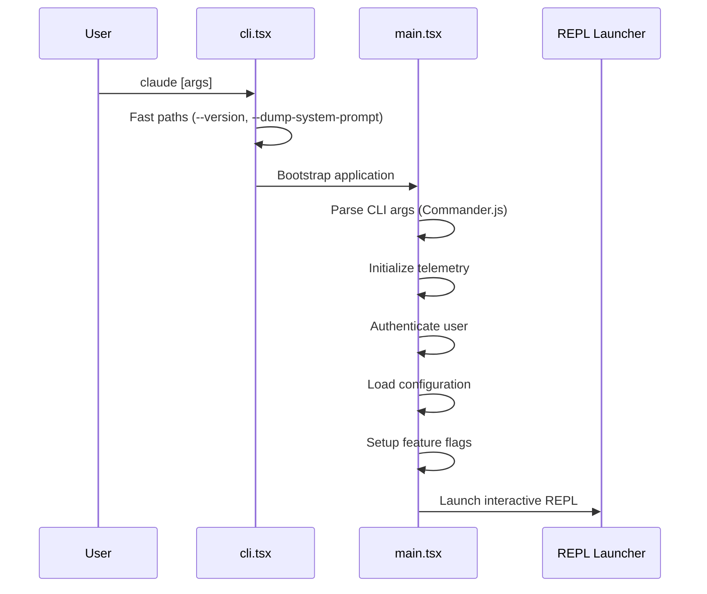

# Entry Point

**Source**: `src/main.tsx` (4,683 lines) and `src/entrypoints/cli.tsx`

## Bootstrap Flow

## CLI Entry (`src/entrypoints/cli.tsx`)

The outermost entry point handles:

- `--version` — Print version and exit immediately
- `--dump-system-prompt` — Output system prompt for debugging
- MCP server mode — Start as an MCP server
- Daemon worker mode — Run as a background daemon
- Default — Proceed to full application bootstrap

## Main Entry (`src/main.tsx`)

The main entry point (4,683 lines) orchestrates:

### 1. CLI Argument Parsing
Uses Commander.js to define the command-line interface with options for:
- Model selection
- Permission modes
- Session resume
- Output format
- Feature flag overrides

### 2. Service Initialization
- **Telemetry** — Analytics and error reporting setup
- **Authentication** — API key or OAuth token validation
- **Configuration** — Load settings from `~/.claude/`
- **Feature Flags** — Evaluate build-time and runtime flags

### 3. REPL Launch
The interactive Read-Eval-Print Loop is launched via `src/replLauncher.tsx`, which initializes the React/Ink rendering tree and enters the interactive mode.

### 4. Command Execution
If a specific command is provided (e.g., `claude commit`), the command registry (`src/commands.ts`) resolves and executes it directly without entering the REPL.

## Other Entry Points

| Entry | Path | Purpose |
|-------|------|---------|
| MCP Server | `src/entrypoints/mcp.ts` | Run as MCP tool server |
| Init | `src/entrypoints/init.ts` | First-time initialization |
| REPL Launcher | `src/replLauncher.tsx` | Interactive UI bootstrap |
