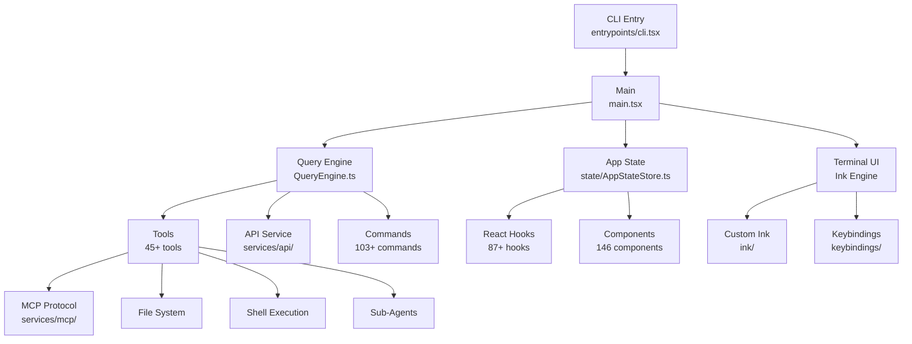

# Architecture Overview

Claude Code is a large-scale TypeScript application with a React-based terminal UI. The codebase is organized into 39 top-level modules under `src/`.

## High-Level Architecture

## Core Modules

| Module | Path | Description |
|--------|------|-------------|
| Entry Point | `src/main.tsx` | CLI parsing, initialization, REPL launch |
| Query Engine | `src/QueryEngine.ts` | Core AI query execution and tool orchestration |
| State | `src/state/` | Central application state (AppState, 23K+ lines) |
| Terminal UI | `src/ink/` | Custom Ink rendering engine (50+ files) |
| Commands | `src/commands/` | 103+ CLI commands |
| Tools | `src/tools/` | 45+ development tools |
| Services | `src/services/` | API, MCP, analytics, LSP, OAuth |
| Hooks | `src/hooks/` | 87+ React hooks |
| Components | `src/components/` | 146 React terminal UI components |
| Utils | `src/utils/` | 298+ utility modules |

## Data Flow

1. User input is captured by the Ink-based terminal UI
2. Input is processed by the Query Engine, which sends it to the Claude API
3. The AI response may include tool calls, which are executed by the tool system
4. Tool results are fed back to the AI for further processing
5. Final output is rendered through the Ink rendering pipeline
6. State changes are managed centrally through AppState

## Key Design Decisions

- **Custom Ink Engine**: A fork/reimplementation of Ink for precise terminal rendering control
- **Feature Flags**: Build-time code elimination for shipping different feature sets
- **MCP Protocol**: Extensibility through the Model Context Protocol standard
- **React State Model**: Central AppState with hooks for component access
