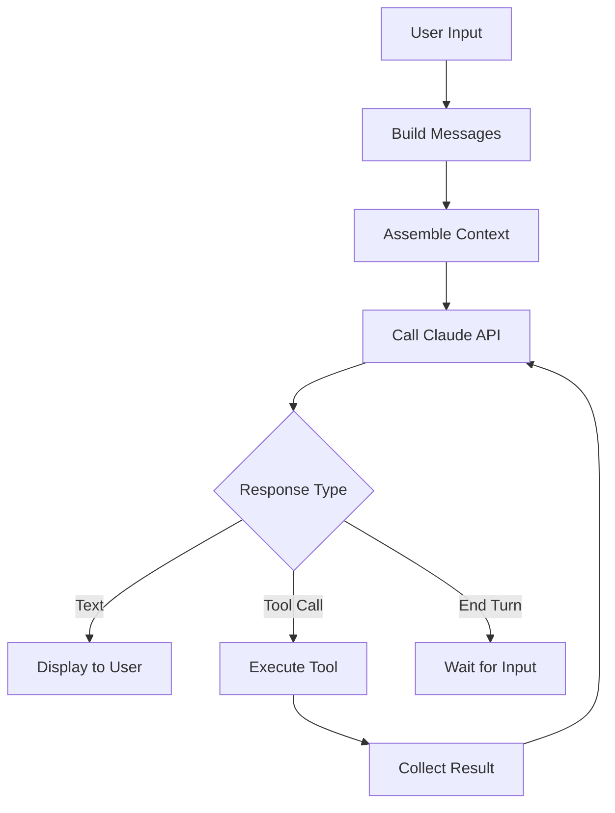

# Query Engine

**Source**: `src/QueryEngine.ts` (1,295 lines) and `src/query.ts` (1,729 lines)

The Query Engine is the core orchestration layer that manages the conversation loop between the user, Claude AI, and tools.

## Responsibilities

1. **Message Management** — Build and maintain the conversation history
2. **API Communication** — Send queries to the Claude API with streaming
3. **Tool Call Handling** — Execute tool calls from AI responses and feed results back
4. **Context Assembly** — Gather system prompts, user context, and tool definitions
5. **Error Recovery** — Handle API errors, rate limits, and tool failures

## Query Lifecycle

## Context Assembly

The query engine assembles context from multiple sources:

- **System Prompt** — Base instructions for Claude (from `src/constants/`)
- **User Context** — CLAUDE.md files, memory files
- **Tool Definitions** — Available tools with their JSON schemas
- **Conversation History** — Previous messages in the session
- **Project Context** — Git status, file structure, environment info

## Streaming

Responses from the Claude API are streamed token-by-token. The Query Engine processes streaming events to:

- Render partial text responses in real-time
- Detect tool call blocks as they are streamed
- Track token usage for cost estimation
- Handle stop reasons (end_turn, tool_use, max_tokens)

## Tool Call Loop

When the AI response includes tool calls:

1. Parse tool call parameters from the response
2. Check permissions (may prompt user)
3. Execute the tool
4. Collect the result (success or error)
5. Append tool result to conversation
6. Re-query the API with updated conversation

This loop continues until the AI produces a final text response without tool calls.

## Key Types

The query system uses types defined in `src/types/message.ts`:

- `UserMessage` — User text input
- `AssistantMessage` — AI response (text and/or tool calls)
- `SystemMessage` — System-level context
- `ProgressMessage` — Tool execution progress updates
