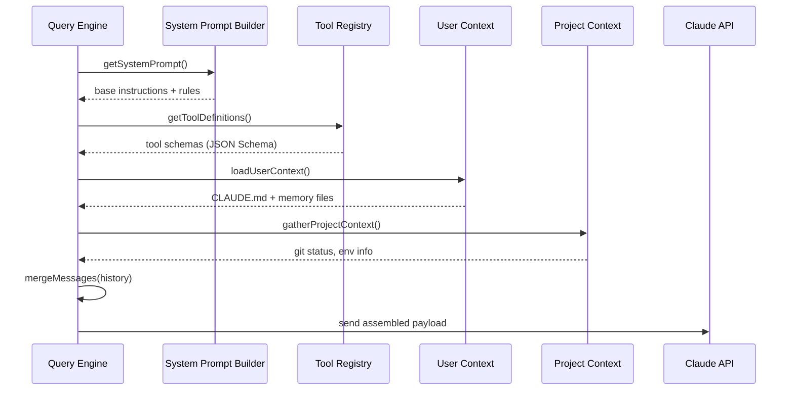
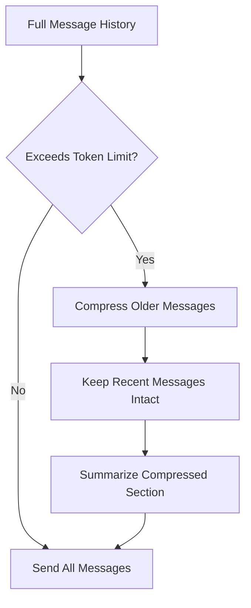

# Context Assembly

**Source**: `src/query.ts` — `assembleContext()` and related functions

## Overview

Before every API call, the Query Engine assembles a rich context payload from multiple sources. This process determines what Claude "knows" during each turn — the system prompt, available tools, conversation history, and project-specific context.

## Assembly Pipeline



## System Prompt Composition

The system prompt is not a static string — it is dynamically composed from multiple layers:

```
┌─────────────────────────────┐
│  Base System Prompt         │  ← src/constants/systemPrompt.ts
│  (core agent instructions)  │
├─────────────────────────────┤
│  Tool Instructions          │  ← per-tool usage guidelines
├─────────────────────────────┤
│  Project Context            │  ← CLAUDE.md, .claude/ config
├─────────────────────────────┤
│  Environment Info           │  ← OS, shell, git branch, cwd
├─────────────────────────────┤
│  Active Features            │  ← feature flags, experiments
└─────────────────────────────┘
```

Each layer is conditionally included based on the current session state and configuration.

## Tool Definition Injection

Tools are registered with JSON Schema parameter definitions. During context assembly:

1. **Filter** — Only include tools available in the current permission mode
2. **Transform** — Convert internal tool specs to Claude API format
3. **Annotate** — Add cache control markers for prompt caching optimization
4. **Order** — Place frequently-used tools first for cache efficiency

## User Context Loading

User context files are loaded with a priority chain:

| Source | Priority | Scope |
|--------|----------|-------|
| `~/.claude/CLAUDE.md` | 1 (lowest) | Global |
| Project root `CLAUDE.md` | 2 | Project |
| `.claude/settings.json` | 3 | Project config |
| Memory files (`~/.claude/memory/`) | 4 (highest) | Session-persistent |

Files are read at session start and cached. Changes during the session are detected via file watchers.

## Message History Management

The conversation history requires careful management to stay within context limits:



Key behaviors:
- Recent messages are never compressed — they contain active context
- Tool results are truncated before message text
- System reminders are injected at compression boundaries

## Cache Control Strategy

Context assembly marks specific content blocks with `cache_control` to leverage Claude's prompt caching:

- System prompt → cached (rarely changes)
- Tool definitions → cached (static within session)
- User context → cached (changes infrequently)
- Conversation history → not cached (changes every turn)

This can reduce API costs by up to 90% for cached content on subsequent turns.

## Design Patterns

- **Builder Pattern** — Context is assembled step-by-step through a builder chain
- **Priority Chain** — Multiple context sources are merged with priority resolution
- **Lazy Loading** — Project context is gathered only when needed, not precomputed

## Related

- [Overview](./index) — Query Engine overview
- [Streaming Pipeline](./streaming-pipeline) — What happens after context is sent to the API
