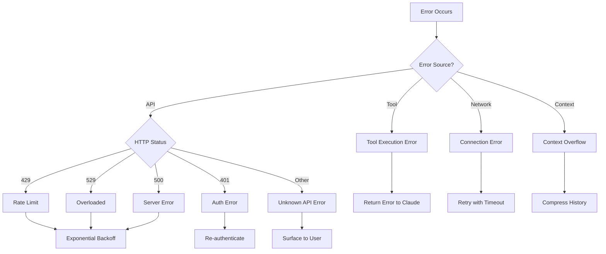
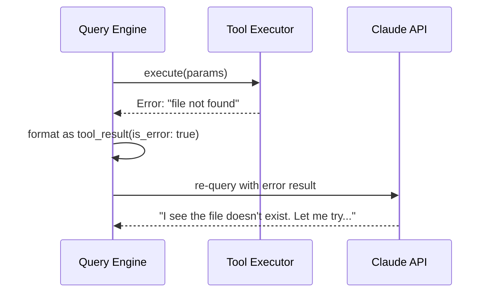
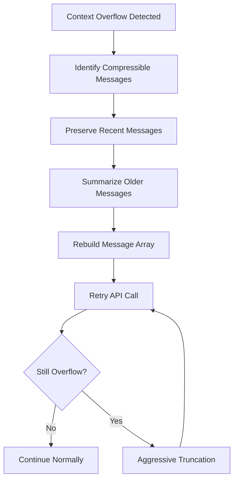

# Error Recovery

**Source**: `src/query.ts` — error handling and `src/services/claude.ts` — API error classification

## Overview

The Query Engine handles errors at multiple levels — API failures, rate limits, tool execution errors, and context overflow. The recovery strategy varies by error type, with the goal of maintaining the conversation flow whenever possible.

## Error Classification



## API Error Handling

### Rate Limiting (429 / 529)

Rate limit errors trigger an exponential backoff retry strategy:

```typescript
// Simplified retry logic
const retryDelays = [1000, 2000, 4000, 8000, 16000]; // ms

async function retryWithBackoff(fn, maxRetries = 5) {
  for (let i = 0; i < maxRetries; i++) {
    try {
      return await fn();
    } catch (err) {
      if (!isRetryable(err)) throw err;
      const delay = retryDelays[i] + jitter();
      await sleep(delay);
    }
  }
  throw new MaxRetriesError();
}
```

Key behaviors:
- The `Retry-After` header is respected when present
- Random jitter prevents thundering herd effects
- The user sees a "Retrying..." indicator during backoff
- After max retries, the error is surfaced to the user

### Authentication Errors (401)

Authentication failures trigger:
1. Token refresh attempt (OAuth flow)
2. If refresh fails, prompt user to re-authenticate
3. Session state is preserved for retry after auth

### Server Errors (500)

Server errors are treated as transient and retried with backoff. The conversation state is preserved across retries.

## Tool Execution Errors

When a tool fails, the error is **not** fatal — it becomes part of the conversation:



This is a critical design decision: tool errors are **information for Claude**, not crashes. Claude can:
- Try an alternative approach
- Ask the user for clarification
- Skip the failed operation and continue

## Context Overflow Recovery

When the conversation exceeds the context window:



Compression priority (what gets removed first):
1. Large tool results (file contents, command output)
2. Older assistant messages
3. Older user messages
4. System context (last resort)

## Network Error Recovery

Connection failures (timeouts, DNS errors, etc.) are handled with:

- Immediate retry for transient errors
- Connection health check before retry
- Graceful degradation message to user
- Session state preservation

## Error Boundaries

The Query Engine uses error boundaries to prevent cascading failures:

| Boundary | Catches | Recovery |
|----------|---------|----------|
| API call | HTTP errors, timeouts | Retry with backoff |
| Tool execution | Runtime errors, crashes | Return error to Claude |
| Stream processing | Parse errors, malformed events | Skip event, continue stream |
| Context assembly | File read errors, missing config | Use defaults, warn user |

## User-Facing Error Messages

Errors are translated into user-friendly messages:

- Technical details are logged but not displayed
- Actionable suggestions are provided when possible
- The user always knows when something failed and what to do next

## Design Patterns

- **Circuit Breaker** — Repeated failures trigger cooldown periods to prevent API abuse
- **Graceful Degradation** — Errors in non-critical paths don't crash the session
- **Error as Data** — Tool errors become conversation context, not exceptions

## Related

- [Overview](./index) — Query Engine overview
- [Tool Call Loop](./tool-call-loop) — The loop that generates tool errors
- [Streaming Pipeline](./streaming-pipeline) — Stream-level error handling
