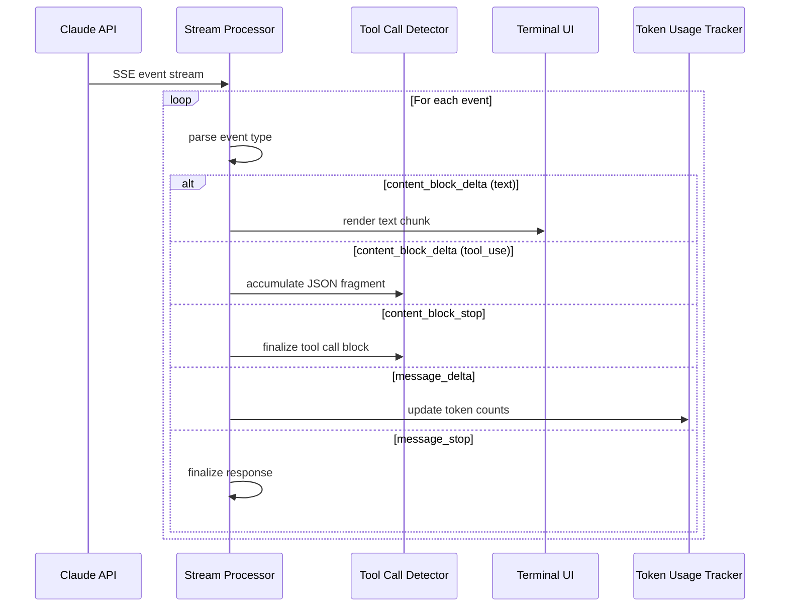
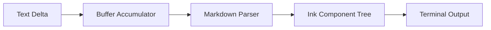
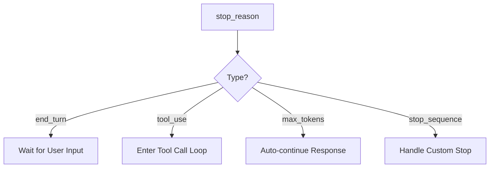

# Streaming Pipeline

**Source**: `src/query.ts` — streaming event handlers and `src/services/claude.ts`

## Overview

Claude Code processes API responses as a real-time stream rather than waiting for complete responses. This enables immediate text rendering, progressive tool call detection, and responsive cancellation — critical for an interactive terminal agent.

## Stream Event Flow



## Event Types

The Claude API sends Server-Sent Events (SSE) with these key event types:

| Event | Purpose | Handler Action |
|-------|---------|----------------|
| `message_start` | Begin new response | Initialize response buffer |
| `content_block_start` | New text or tool block | Create block accumulator |
| `content_block_delta` | Incremental content | Append to current block |
| `content_block_stop` | Block complete | Finalize and dispatch |
| `message_delta` | Stop reason + usage | Record stop reason |
| `message_stop` | Response complete | Trigger post-processing |

## Text Rendering Pipeline

Text deltas flow through a rendering pipeline before reaching the terminal:



Key behaviors:
- Text is buffered briefly to avoid excessive re-renders on rapid deltas
- Markdown is parsed incrementally — partial bold/code blocks are handled gracefully
- The Ink rendering engine batches updates to minimize terminal flicker

## Tool Call Detection

Tool calls arrive as incremental JSON fragments within `content_block_delta` events:

1. **Accumulation** — JSON fragments are concatenated into a buffer
2. **Type Detection** — `content_block_start` identifies the block as `tool_use` type
3. **Parameter Parsing** — When `content_block_stop` fires, the full JSON is parsed
4. **Validation** — Parameters are validated against the tool's JSON Schema
5. **Dispatch** — Valid tool calls enter the [Tool Call Loop](./tool-call-loop)

```typescript
// Simplified tool call accumulation
interface ToolCallAccumulator {
  id: string;
  name: string;
  inputJson: string; // accumulated JSON fragments
}
```

## Stop Reasons

The `message_delta` event carries a `stop_reason` that determines what happens next:



- `end_turn` — Claude finished its response naturally
- `tool_use` — Claude wants to execute one or more tools
- `max_tokens` — Response hit the token limit; may need continuation
- `stop_sequence` — A configured stop sequence was hit

## Token Usage Tracking

Every response includes token usage data tracked for:

- **Cost estimation** — Display running cost to the user
- **Context window management** — Determine when to compress history
- **Cache hit tracking** — Monitor prompt caching effectiveness

```typescript
interface TokenUsage {
  input_tokens: number;
  output_tokens: number;
  cache_creation_input_tokens: number;
  cache_read_input_tokens: number;
}
```

## Cancellation

Users can cancel a streaming response with Ctrl+C:

1. The SSE connection is aborted
2. Partial text is preserved in conversation history
3. Any in-progress tool calls are discarded
4. The session returns to input mode

## Design Patterns

- **Observer Pattern** — Stream events are dispatched to multiple handlers (UI, token tracker, tool detector)
- **Accumulator Pattern** — Partial JSON fragments are accumulated until complete
- **Backpressure** — Text rendering buffers deltas to prevent overwhelming the terminal

## Related

- [Overview](./index) — Query Engine overview
- [Context Assembly](./context-assembly) — What happens before the stream begins
- [Tool Call Loop](./tool-call-loop) — What happens when a tool call is detected
