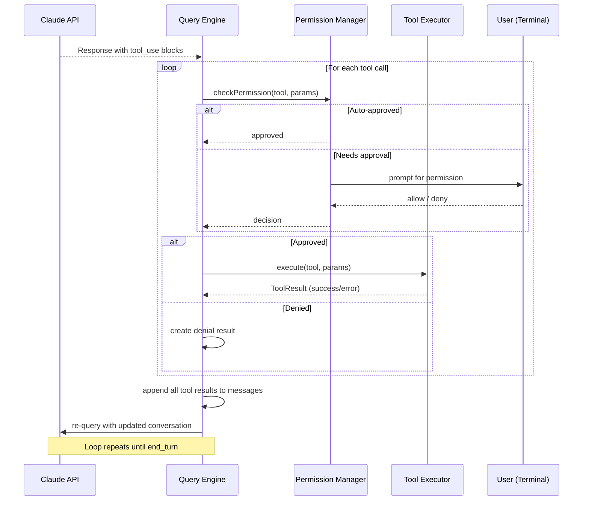
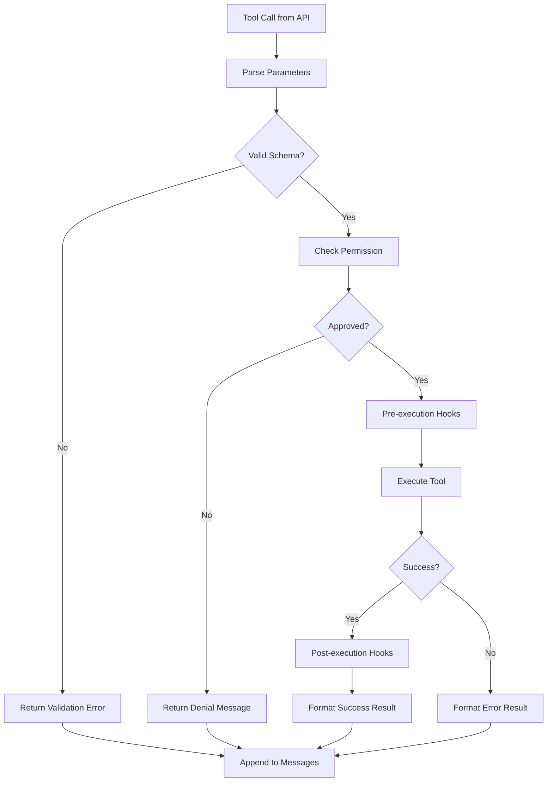

# Tool Call Loop

**Source**: `src/query.ts` — main loop and `src/tools/` — tool execution

## Overview

The Tool Call Loop is the heart of Claude Code's agentic behavior. When Claude's response includes tool calls, this loop handles permission checking, execution, result collection, and re-querying — repeating until Claude produces a final text response.

## Complete Loop Sequence



## Tool Execution Pipeline

Each tool call goes through a multi-stage pipeline:



## Concurrency Model

Claude Code uses a **single-writer / multiple-reader** model for tool execution:

- **Write tools** (Edit, Write, Bash) execute sequentially — only one at a time
- **Read tools** (Read, Glob, Grep) can execute in parallel
- When multiple tool calls arrive in one response, they are batched:

```
Response contains: [Read A, Read B, Edit C, Read D]
Execution order:
  1. Read A + Read B (parallel)  ← read tools batched
  2. Edit C (sequential)          ← write tool waits
  3. Read D (sequential)          ← after write
```

## Tool Result Format

Tool results are appended to the conversation as `tool_result` content blocks:

```typescript
interface ToolResult {
  type: "tool_result";
  tool_use_id: string;  // matches the tool call ID
  content: string | ContentBlock[];
  is_error?: boolean;
}
```

Key behaviors:
- Success results include the tool's output (file contents, command output, etc.)
- Error results include the error message with `is_error: true`
- Large results are truncated to prevent context overflow
- Binary outputs (images) are encoded as base64 content blocks

## Re-query Decision

After collecting all tool results, the Query Engine must decide whether to re-query:

| Stop Reason | Action |
|-------------|--------|
| `tool_use` | Always re-query with tool results |
| `end_turn` | Stop — final response received |
| `max_tokens` | Re-query to continue the response |

## Loop Termination

The loop terminates when:
1. Claude responds with `end_turn` and no tool calls
2. The user cancels with Ctrl+C
3. An unrecoverable error occurs
4. A maximum iteration limit is reached (safety guard)

## Performance Optimizations

- **Prompt caching** — Tool results don't invalidate the cached system prompt
- **Parallel reads** — Multiple read-only tools execute simultaneously
- **Streaming re-query** — The next API call starts streaming immediately after tool results are ready
- **Result truncation** — Large tool outputs are intelligently truncated

## Design Patterns

- **Command Pattern** — Each tool call is an encapsulated command with execute/result
- **Pipeline Pattern** — Tool calls flow through parse → validate → permit → execute → format
- **Batch Processing** — Multiple tool calls from one response are grouped by type for optimal execution

## Related

- [Overview](./index) — Query Engine overview
- [Streaming Pipeline](./streaming-pipeline) — How tool calls are detected in the stream
- [Error Recovery](./error-recovery) — What happens when tools fail
