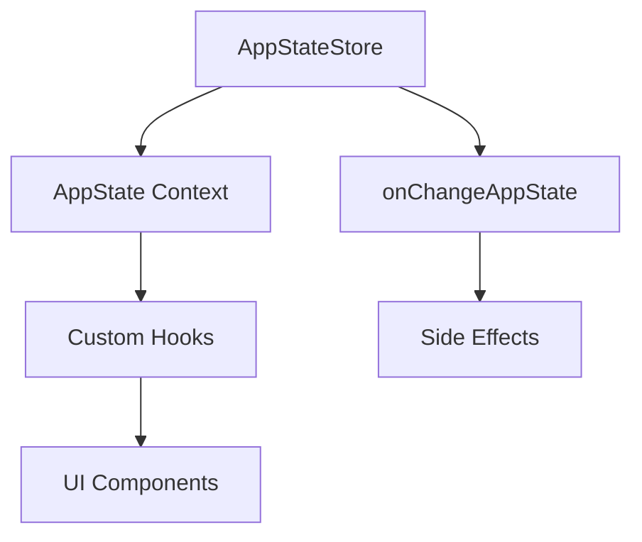

# State Management

**Source**: `src/state/AppState.tsx` (23,480 lines) and `src/state/AppStateStore.ts` (21,847 lines)

## Overview

Claude Code uses a centralized state management pattern built on React context and a custom store implementation. The `AppState` is one of the largest modules in the codebase.

## Architecture



## AppStateStore

The central store (`src/state/AppStateStore.ts`) manages:

- **Messages** — Full conversation history
- **Tasks** — Background task state and progress
- **Agents** — Sub-agent definitions and status
- **Permissions** — Tool permission decisions
- **Notifications** — User notification queue
- **Overlays** — Modal and overlay state
- **UI State** — Sidebar, input focus, scroll position

## React Integration

`AppState.tsx` wraps the store in React context providers:

```
AppStateProvider
  └── provides AppState context
      └── consumed by useAppState() hook
```

Components access state through custom hooks rather than directly reading the store. This pattern ensures proper React re-rendering on state changes.

## Change Detection

`src/state/onChangeAppState.ts` implements a change detection system that triggers side effects when specific state properties change. This is used for:

- Persisting state to disk
- Triggering notifications
- Updating derived state
- Syncing with external services

## Key State Slices

| Slice | Description |
|-------|-------------|
| `messages` | Conversation history (user, assistant, system messages) |
| `tasks` | Background tasks (bash, agents, remote sessions) |
| `permissions` | Tool permission cache and pending approvals |
| `agents` | Sub-agent definitions and their state |
| `notifications` | Notification queue and display state |
| `overlays` | Modal dialogs, menus, and overlays |

## Selectors

`src/state/selectors.ts` provides memoized selectors for deriving computed values from state, avoiding unnecessary re-computations in the rendering cycle.
