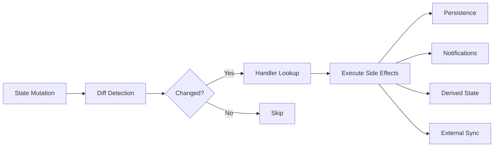
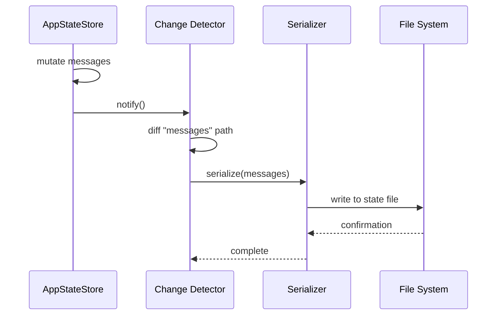

import { Callout } from "nextra/components";

# Change Detection

## Overview

`onChangeAppState` (`src/state/onChangeAppState.ts`) implements a **side-effect system** that watches for changes to specific state properties and executes handlers in response. While React integration handles UI updates, this module handles everything else — disk persistence, notifications, external service communication, and derived-state recomputation.

<Callout type="info">
Change detection is separate from React's rendering cycle. It runs synchronously after each store mutation, before any component re-renders occur.
</Callout>

## Change Detection Pipeline



After every state mutation, the system captures a snapshot of the previous state, compares it against the current state on registered property paths, and dispatches matching handlers.

## Handler Registration

Change handlers are registered for specific state paths. Each registration binds a property path to a callback:

```typescript
onChangeAppState("messages", (prev, next) => {
  if (prev.length !== next.length) {
    persistMessages(next);
  }
});

onChangeAppState("permissions.pending", (prev, next) => {
  if (next.length > prev.length) {
    notifyNewPermissionRequest(next[next.length - 1]);
  }
});
```

Handlers receive the previous and current value of the watched property, enabling fine-grained comparison logic within each handler.

## Diff Algorithm

Change detection uses **shallow comparison** on the registered property paths:

1. Before a mutation, snapshot the current value at each registered path.
2. After the mutation, compare each path's new value against its snapshot.
3. If `Object.is(prev, next)` returns `false`, the path is considered changed.
4. Invoke all handlers registered for changed paths.

This approach is efficient for primitive values and reference-checked objects. For arrays and nested objects, handlers must perform their own deep comparison if needed.

## Side Effect Categories

| Category | Purpose | Example |
|----------|---------|---------|
| **Persistence** | Write state to disk for session recovery | Save conversation history after new messages |
| **Notifications** | Alert the user of important events | Show permission request toast |
| **Derived State** | Recompute values that depend on changed state | Update unread count after message changes |
| **External Sync** | Communicate with background services | Notify agent orchestrator of task completion |

## Persistence Flow



Persistence is the most common side effect. Conversation history, user preferences, and task state are all persisted through this pipeline.

## Debouncing

Rapid state changes (e.g., streaming tokens arriving every few milliseconds) would cause excessive side effects without debouncing:

```typescript
onChangeAppState("messages", debounce((prev, next) => {
  persistMessages(next);
}, 500));
```

The debounce window varies by handler:

| Handler Type | Debounce Window | Rationale |
|-------------|-----------------|-----------|
| Persistence | 500ms | Batch rapid writes, avoid disk thrashing |
| Notifications | 100ms | Quick feedback, but deduplicate bursts |
| Derived state | 0ms (synchronous) | Must be immediately consistent |
| External sync | 1000ms | Network calls are expensive |

## Error Handling

Side-effect handlers are wrapped in try-catch blocks to prevent a failing handler from breaking the notification chain:

```typescript
for (const handler of matchedHandlers) {
  try {
    handler(prevValue, nextValue);
  } catch (error) {
    logError("Change handler failed", { path, error });
    // Continue to next handler — do not propagate
  }
}
```

<Callout type="warning">
A failing persistence handler means state may not be saved to disk. The system logs the error but does not retry automatically — the next successful mutation will overwrite the file with the latest state.
</Callout>

## Design Patterns

- **Observer Pattern** — Handlers observe specific state paths and react to changes.
- **Pub/Sub** — The change-detection system acts as a publish-subscribe bus where state paths are topics.
- **Debounce** — Rapid mutations are batched to prevent excessive side-effect execution.

## Related Pages

- [Store Architecture](/en/architecture/state-management/store-architecture) — The store whose mutations trigger change detection.
- [React Integration](/en/architecture/state-management/react-integration) — The parallel system that handles UI updates.
- [Selectors](/en/architecture/state-management/selectors) — Memoized computations that may be recomputed as derived-state side effects.
