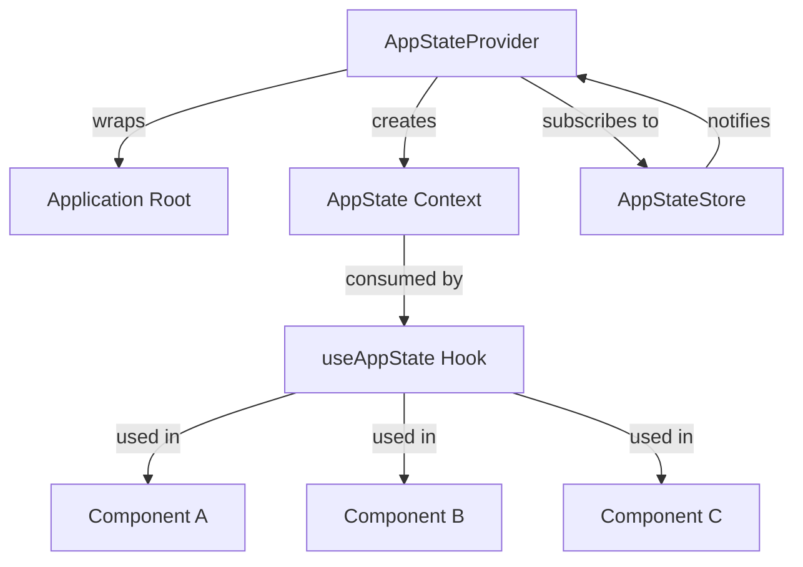
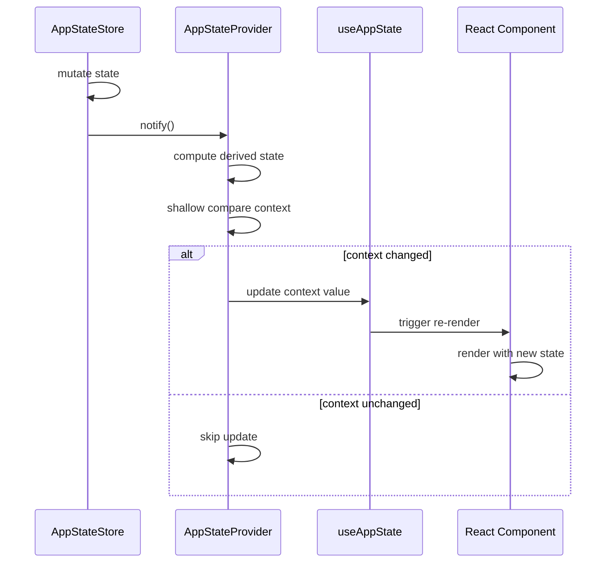

import { Callout } from "nextra/components";

# React Integration

## Overview

`AppState.tsx` (`src/state/AppState.tsx`, ~23,480 lines) is the bridge between the imperative `AppStateStore` and React's declarative component model. It defines the context provider, the `useAppState` hook, and all derived-state computations that components consume.

<Callout type="warning">
At ~23K lines this is one of the largest files in the codebase. The size stems from co-locating every provider, context definition, and derived-state computation in a single module to avoid circular-dependency issues common in state layers.
</Callout>

## Provider Architecture



`AppStateProvider` sits at the top of the component tree. It subscribes to the store, and whenever the store notifies, the provider evaluates whether the context value should update and re-render consuming components.

## Context Structure

The context value exposed to consumers contains both raw state slices and pre-computed derived values:

```typescript
interface AppStateContext {
  // Raw state access
  messages: Message[];
  permissions: PermissionState;
  notifications: Notification[];

  // Derived / computed values
  activeMessages: Message[];
  pendingPermissionCount: number;
  isStreaming: boolean;

  // Dispatch helpers
  grantPermission: (id: string) => void;
  dismissNotification: (id: string) => void;
}
```

Bundling derived values into the context means components can consume pre-computed data without running selectors themselves.

## useAppState Hook

`useAppState` is the primary API for components to access state:

```typescript
function MessageList() {
  const { activeMessages, isStreaming } = useAppState();

  return (
    <Box flexDirection="column">
      {activeMessages.map(msg => (
        <MessageRow key={msg.id} message={msg} />
      ))}
      {isStreaming && <StreamingIndicator />}
    </Box>
  );
}
```

The hook returns the full context value. Components destructure only the fields they need, but re-renders are triggered whenever **any** part of the context value changes.

## Re-render Optimization

Several strategies keep re-renders manageable in Ink's terminal rendering environment:

- **Selective subscription** — The provider only updates the context value when a shallow comparison detects a meaningful change.
- **Shallow comparison** — Top-level context properties are compared with `Object.is`; unchanged references are preserved.
- **Memoization** — Derived values are memoized so that identical inputs produce referentially equal outputs, preventing downstream re-renders.

## State Change Propagation



The shallow comparison step is critical — without it, every store notification would cascade into a full component-tree re-render.

## Hook Composition

`useAppState` is the foundation, but domain-specific hooks build on top of it for ergonomics:

```typescript
function useMessages() {
  const { activeMessages, isStreaming } = useAppState();
  return { messages: activeMessages, isStreaming };
}

function usePermissions() {
  const { permissions, grantPermission, pendingPermissionCount } = useAppState();
  return { permissions, grantPermission, pendingPermissionCount };
}
```

These focused hooks narrow the surface area, making component code cleaner and intent more explicit.

## Performance Considerations

The 23K-line file size is a trade-off driven by practical constraints:

| Concern | Approach |
|---------|----------|
| Circular dependencies | All state logic lives in one module, avoiding import cycles |
| Derived state co-location | Selectors and memoized computations sit next to the data they derive from |
| Provider consolidation | A single provider avoids nested-provider performance issues in Ink |
| Type safety | One module means one consistent type surface with no seams |

## Design Patterns

- **Provider Pattern** — A single context provider at the root distributes state to the entire tree.
- **Hook Composition** — Domain-specific hooks compose on top of `useAppState` for focused APIs.
- **Derived State** — Pre-computed values in the context reduce per-component computation.

## Related Pages

- [Store Architecture](/en/architecture/state-management/store-architecture) — The underlying store that this module wraps.
- [Change Detection](/en/architecture/state-management/change-detection) — Side-effect handlers triggered by state changes.
- [Selectors](/en/architecture/state-management/selectors) — Memoized state derivations used inside the provider.
