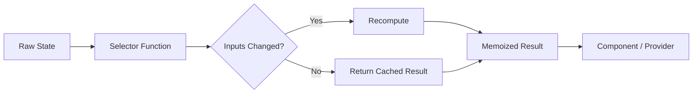
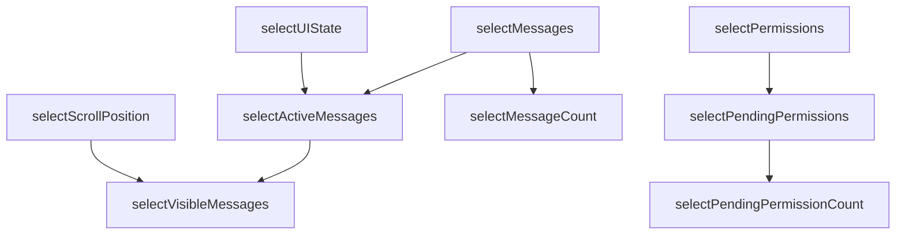

import { Callout } from "nextra/components";

# Selectors

## Overview

Selectors (`src/state/selectors.ts`) are **memoized functions** that derive computed values from raw application state. They sit between the store and consumers, ensuring that expensive computations run only when their inputs change and that referentially equal outputs prevent unnecessary React re-renders.

<Callout type="info">
Selectors follow the same pattern popularized by Redux's Reselect library, but are implemented as a lightweight custom solution tailored to the `AppStateStore` mutation model.
</Callout>

## Selector Architecture



Each selector checks whether its input values have changed since the last invocation. If inputs are identical (by reference), the previously computed result is returned immediately.

## Why Selectors

Selectors solve two problems that are especially acute in a terminal UI rendered by Ink:

1. **Prevent redundant computation** — Filtering, sorting, and aggregating large arrays (e.g., thousands of messages) on every render is expensive. Selectors ensure this work happens only when the source data actually changes.
2. **Ensure referential equality** — React (and Ink) skip re-renders when props are referentially equal. Without memoization, a new array or object is created on every access, forcing re-renders even when the underlying data has not changed.

## Selector Composition

Selectors compose naturally — base selectors feed into derived selectors, forming a dependency graph:



When `selectMessages` recomputes (because the raw messages array changed), `selectActiveMessages` and `selectVisibleMessages` also recompute — but `selectPendingPermissions` does not, because its input (`selectPermissions`) has not changed.

## Common Selectors

| Selector | Input | Output |
|----------|-------|--------|
| `selectActiveMessages` | `messages` | Messages not marked as hidden |
| `selectPendingPermissions` | `permissions` | Permission requests awaiting user approval |
| `selectVisibleNotifications` | `notifications` | Non-dismissed, non-expired notifications |
| `selectIsStreaming` | `messages` | Whether any message is currently streaming |
| `selectTaskProgress` | `tasks` | Aggregated completion percentage across tasks |
| `selectAgentTree` | `agents` | Hierarchical tree of active sub-agents |

## Memoization Strategy

The `createSelector` utility implements a **single-entry cache** — it remembers only the most recent input and output:

```typescript
function createSelector<TInput, TResult>(
  inputFn: (state: AppState) => TInput,
  computeFn: (input: TInput) => TResult
): (state: AppState) => TResult {
  let lastInput: TInput;
  let lastResult: TResult;

  return (state: AppState) => {
    const input = inputFn(state);
    if (!Object.is(input, lastInput)) {
      lastInput = input;
      lastResult = computeFn(input);
    }
    return lastResult;
  };
}
```

This approach works well because the store is a singleton — each selector is called with the same state reference in a given notification cycle, so a single cache entry is sufficient.

## Selector Example

A typical selector filters and transforms raw state:

```typescript
const selectActiveMessages = createSelector(
  (state) => state.messages,
  (messages) => messages.filter(m => !m.hidden)
);

const selectVisibleMessages = createSelector(
  (state) => ({
    active: selectActiveMessages(state),
    scroll: state.uiState.scrollPosition,
  }),
  ({ active, scroll }) => active.slice(scroll.start, scroll.end)
);
```

`selectVisibleMessages` depends on `selectActiveMessages`. If messages have not changed, `selectActiveMessages` returns its cached array, and `selectVisibleMessages` also returns its cached result — zero computation, zero new object allocation.

## Performance Impact

In Ink's terminal rendering engine, every re-render repaints the entire terminal viewport. Selectors directly reduce the frequency of these repaints:

| Without Selectors | With Selectors |
|-------------------|----------------|
| Every store notification triggers `Array.filter` | Filter runs only when `messages` reference changes |
| New array on every call forces component re-render | Same reference returned, Ink skips repaint |
| O(n) per notification for each consuming component | O(1) for cache hit, O(n) only on actual change |

<Callout type="warning">
Selectors rely on **reference equality** of their inputs. If a store mutation replaces an array with a new array of identical content, selectors will recompute. This is an intentional trade-off — deep equality checks would negate the performance benefit.
</Callout>

## Design Patterns

- **Memoization** — Single-entry cache keyed by input reference, avoiding redundant computation.
- **Selector Pattern** — Inspired by Reselect, providing composable derived-state functions.
- **Derived State** — Computed values that are kept consistent with their source data without manual synchronization.

## Related Pages

- [Store Architecture](/en/architecture/state-management/store-architecture) — The raw state that selectors read from.
- [React Integration](/en/architecture/state-management/react-integration) — The provider layer that invokes selectors to build the context value.
- [Change Detection](/en/architecture/state-management/change-detection) — The side-effect system that may trigger derived-state recomputation.
