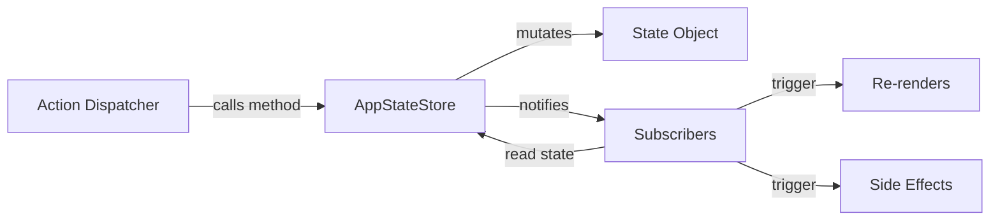

import { Callout } from "nextra/components";

# Store Architecture

## Overview

`AppStateStore` (`src/state/AppStateStore.ts`, ~21,847 lines) is a **custom, purpose-built store** that manages all application state in a single centralized object. Rather than relying on third-party libraries like Redux or Zustand, Claude Code implements its own store with direct mutation methods and a synchronous subscriber notification model.

<Callout type="info">
The store is intentionally **not** immutable. State is mutated in-place through class methods, which simplifies the programming model but requires careful change-detection logic downstream.
</Callout>

## Mutation Flow



Actions originate from user interactions, tool responses, or background processes. Each action calls a mutation method on the store, which updates the internal state object and then synchronously notifies all registered subscribers.

## State Shape

The top-level state object contains clearly separated slices:

```typescript
interface AppState {
  messages: Message[];
  tasks: TaskState;
  agents: AgentState;
  permissions: PermissionState;
  notifications: Notification[];
  overlays: OverlayState;
  uiState: UIState;
  // ... additional slices
}
```

Each slice owns a distinct domain of the application and is accessed through typed property paths on the store.

## Mutation Patterns

State is updated through **direct mutation methods** defined on the `AppStateStore` class. There is no action-reducer indirection:

```typescript
class AppStateStore {
  addMessage(message: Message): void {
    this.state.messages.push(message);
    this.notify();
  }

  updatePermission(id: string, granted: boolean): void {
    const perm = this.state.permissions.pending.find(p => p.id === id);
    if (perm) {
      perm.granted = granted;
      this.notify();
    }
  }
}
```

Every mutation method ends with a call to `this.notify()`, which fans out to all subscribers.

## Slice Organization

| Slice | Purpose | Complexity |
|-------|---------|------------|
| `messages` | Conversation history, streaming tokens, tool results | Very High |
| `tasks` | Background task tracking, progress, cancellation | High |
| `agents` | Sub-agent lifecycle, spawning, completion | High |
| `permissions` | Tool-use approvals, auto-grant rules | Medium |
| `notifications` | User-facing alerts, toasts, banners | Low |
| `overlays` | Modals, dialogs, menus | Low |
| `uiState` | Scroll position, focus, input state | Medium |

## Subscription Model

The store implements a straightforward **observer pattern**. Subscribers register a callback and are notified on every state change:

```typescript
const unsubscribe = store.subscribe(() => {
  // Called on ANY state mutation
  const currentState = store.getState();
  // Decide locally whether to act
});
```

Because subscribers are notified on every mutation (not per-slice), downstream consumers must implement their own filtering to avoid unnecessary work. This is where [selectors](/en/architecture/state-management/selectors) and [change detection](/en/architecture/state-management/change-detection) become critical.

## Initialization

At application startup the store goes through a defined initialization sequence:

1. **Load persisted state** — Read previously saved state from disk (conversation history, user preferences).
2. **Apply defaults** — Fill in any missing slices with default values.
3. **Register side-effect handlers** — Wire up persistence, notification, and sync handlers via `onChangeAppState`.
4. **Signal ready** — Mark the store as initialized so the UI can begin rendering.

## Design Patterns

The store architecture relies on three core patterns:

- **Singleton** — A single `AppStateStore` instance exists for the entire application lifetime. All consumers share the same reference.
- **Observer** — Subscribers register callbacks that are invoked on state changes, decoupling the store from its consumers.
- **Mediator** — The store mediates communication between otherwise unrelated components (e.g., the permission system and the message list).

## Related Pages

- [React Integration](/en/architecture/state-management/react-integration) — How the store connects to React components.
- [Change Detection](/en/architecture/state-management/change-detection) — Side-effect system that reacts to property changes.
- [Selectors](/en/architecture/state-management/selectors) — Memoized derived-state computations.
