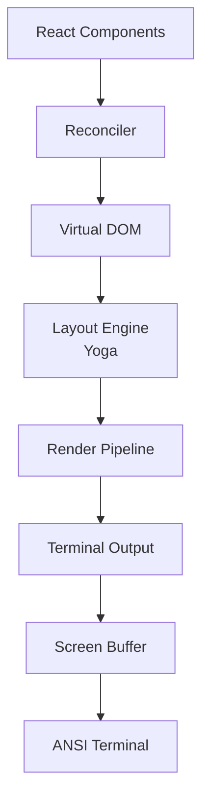

# Terminal UI

**Source**: `src/ink/` (50+ files)

Claude Code uses a custom terminal UI engine based on Ink (React for CLIs). The `src/ink/` directory contains a comprehensive rendering system for building rich terminal interfaces.

## Architecture

## Core Components

### Renderer (`ink/renderer.ts`)
The main rendering coordinator that manages the React reconciler and triggers layout/paint cycles.

### Reconciler (`ink/reconciler.ts`)
A custom React reconciler that maps React elements to terminal DOM nodes.

### DOM (`ink/dom.ts`)
Virtual DOM implementation for terminal elements. Each node represents a terminal UI element with properties like text content, styles, and layout constraints.

### Layout Engine (`ink/layout/`)
- `engine.ts` — Layout computation orchestrator
- `yoga.ts` — Integration with Yoga (Facebook's flexbox layout engine)
- `geometry.ts` — Position and size calculations
- `node.ts` — Layout node abstraction

### Rendering Pipeline (`ink/render-node-to-output.ts`, `ink/render-to-screen.ts`)
Converts the laid-out DOM tree into ANSI-escaped text for terminal display.

### Text Processing
- `wrap-text.ts` — Word wrapping for terminal width
- `measure-text.ts` — Text dimension measurement
- `stringWidth.ts` — Unicode-aware string width calculation
- `widest-line.ts` — Multi-line width computation

## Terminal I/O (`ink/termio/`)

Low-level terminal communication:

- **ANSI Parsing** — Parse ANSI escape sequences from input
- **CSI** — Control Sequence Introducer handling
- **OSC** — Operating System Command sequences
- **SGR** — Select Graphic Rendition (colors, styles)
- **Tokenization** — Input stream tokenization

## Features

- **Search Highlighting** (`searchHighlight.ts`) — Text search with highlighting
- **Selection** (`selection.ts`) — Text selection support
- **Hit Testing** (`hit-test.ts`) — Click/cursor position mapping
- **Keypress Parsing** (`parse-keypress.ts`) — Raw input to key event conversion

## Ink-specific Hooks (`ink/hooks/`)

Custom hooks for terminal UI state:
- Focus management
- Stdin/stdout access
- Cursor position tracking
- Component lifecycle in terminal context
