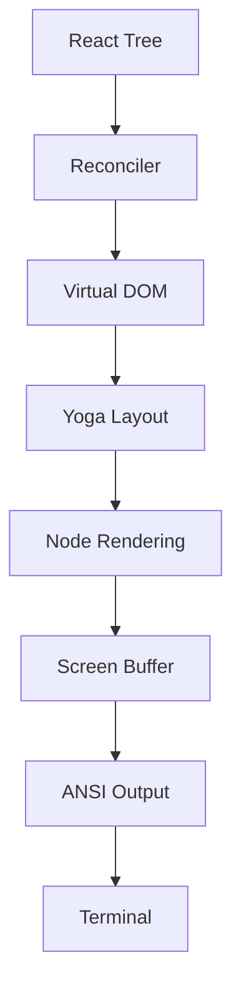

# Ink Rendering Engine

**Source**: `src/ink/` (50+ files)

## Overview

Claude Code uses a custom Ink-based rendering engine for its terminal UI. This is not the standard Ink library — it is a comprehensive reimplementation tailored for Claude Code's needs.

## Rendering Pipeline

## Core Modules

### Reconciler (`reconciler.ts`)
Custom React reconciler that translates React elements into terminal DOM nodes.

### Virtual DOM (`dom.ts`)
A lightweight DOM implementation for terminal elements with:
- Text nodes
- Box/frame elements
- Style properties (color, bold, underline, etc.)

### Layout (`layout/`)
- **engine.ts** — Layout computation coordinator
- **yoga.ts** — Yoga flexbox integration for terminal layout
- **geometry.ts** — Position and dimension calculations
- **node.ts** — Layout tree node abstraction

### Rendering
- **render-node-to-output.ts** — Convert DOM nodes to output cells
- **render-to-screen.ts** — Assemble cells into screen buffer
- **output.ts** — Final output assembly
- **frame.ts** — Frame-by-frame rendering coordination

## Text Processing

| Module | Purpose |
|--------|---------|
| `wrap-text.ts` | Word wrapping at terminal width |
| `measure-text.ts` | Text dimension measurement |
| `stringWidth.ts` | Unicode-aware character width |
| `widest-line.ts` | Multi-line width computation |

## Terminal I/O (`termio/`)

Low-level terminal input/output:

- **ANSI** — ANSI escape sequence parsing
- **CSI** — Control Sequence Introducer
- **OSC** — Operating System Commands
- **SGR** — Select Graphic Rendition (colors/styles)
- **Tokenizer** — Input stream tokenization

## Interactive Features

- **searchHighlight.ts** — Search result highlighting
- **selection.ts** — Text selection
- **hit-test.ts** — Cursor position to element mapping
- **parse-keypress.ts** — Raw input to keypress events
