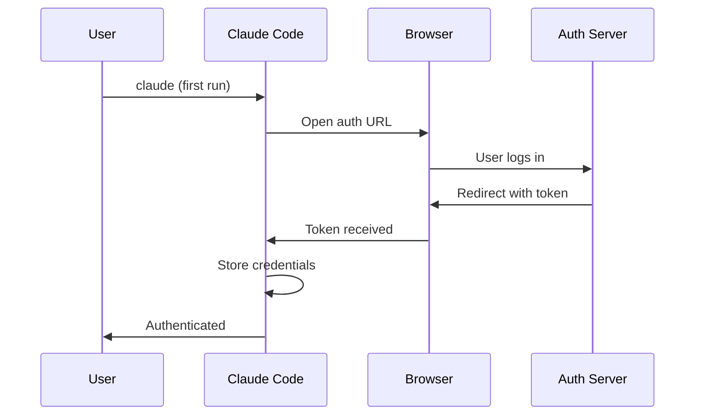

# OAuth

**Source**: `src/services/oauth/`

## Overview

The OAuth service handles browser-based authentication flows for users with Claude Pro, Team, or Enterprise subscriptions.

## Flow

## Authentication Methods

| Method | Use Case |
|--------|----------|
| API Key | Direct API access via `ANTHROPIC_API_KEY` |
| OAuth | Claude Pro/Team/Enterprise users |
| Bedrock | AWS Bedrock credentials |
| Vertex | Google Cloud credentials |

## Token Storage

OAuth tokens are stored securely in the user's home directory and refreshed automatically when expired.

## Commands

- `/login` — Initiate authentication flow
- `/logout` — Clear stored credentials
