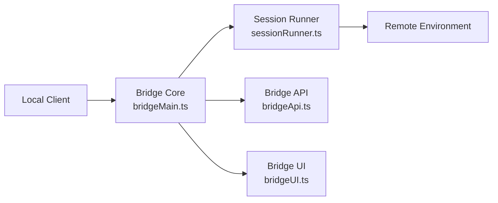

# Remote Bridge

**Source**: `src/bridge/` (32 files)

## Overview

The bridge system enables remote session management, allowing Claude Code to forward sessions to cloud execution environments. This is feature-gated with `BRIDGE_MODE`.

## Architecture

## Key Files

| File | Purpose |
|------|---------|
| `bridgeMain.ts` | Main bridge orchestrator |
| `bridgeApi.ts` | API for bridge communication |
| `bridgeMessaging.ts` | Message protocol |
| `createSession.ts` | Session creation |
| `sessionRunner.ts` | Session execution management |
| `RemoteSessionManager.ts` | Remote session lifecycle |
| `bridgeConfig.ts` | Bridge configuration |
| `bridgeUI.ts` | User interface for bridge status |

## Security

The bridge implements multiple security layers:

- **JWT Tokens** (`jwtUtils.ts`) — Session authentication
- **Trusted Devices** (`trustedDevice.ts`) — Device verification
- **Work Secrets** (`workSecret.ts`) — Encrypted session data
- **HTTPS Transport** — Encrypted communication

## Session Lifecycle

1. **Create** — Initialize a remote session with credentials
2. **Connect** — Establish secure connection to remote environment
3. **Forward** — Route user interactions to remote execution
4. **Sync** — Keep local and remote state in sync
5. **Disconnect** — Gracefully close the session
