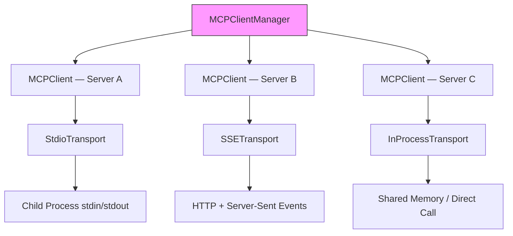
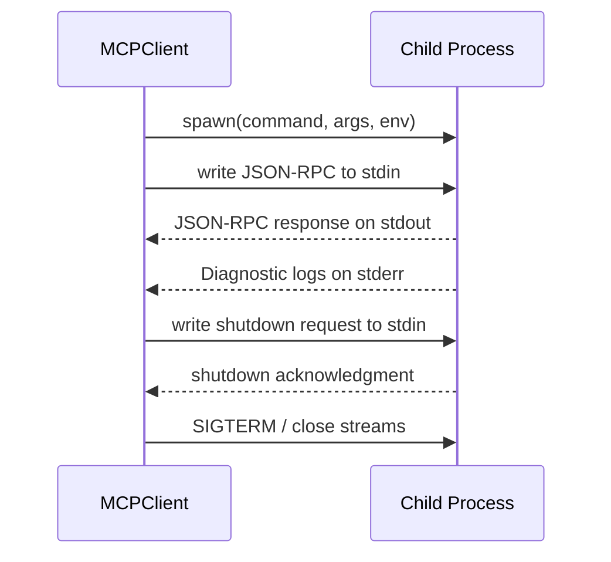

# Client Architecture

**Source**: `src/services/mcp/client.ts`, transport files

## Overview

The MCP client manages connections to multiple MCP servers simultaneously, each potentially using a different transport protocol. The `MCPClientManager` acts as the top-level coordinator, spawning individual `MCPClient` instances per configured server. Each client owns a transport layer that abstracts the underlying communication mechanism, allowing protocol-agnostic logic throughout the rest of the codebase.

## Architecture Diagram

## Transport Abstraction

All transports implement a unified `Transport` interface:

- **`send(message)`** — Serialize and deliver a JSON-RPC message to the server
- **`onMessage(handler)`** — Register a callback for incoming messages
- **`close()`** — Tear down the connection and release resources

This abstraction means every higher-level operation (initialize, tool call, shutdown) is written once and works identically regardless of whether the server lives in a child process, a remote HTTP endpoint, or in-memory.

## Transport Types

| Transport | Mechanism | Use Case | Locality |
|-----------|-----------|----------|----------|
| **Stdio** | Subprocess stdin/stdout | Most common; local CLI-based servers | Local |
| **SSE** | Server-Sent Events over HTTP | Remote or long-running servers | Remote |
| **StreamableHTTP** | Bidirectional HTTP streaming | Newer MCP protocol variant | Remote |
| **InProcess** | Shared memory / direct call | Built-in servers bundled with Claude Code | In-process |

## Stdio Transport

The stdio transport is the most widely used. It launches a child process and communicates over standard I/O streams.

**Key details:**

- Each message is a newline-delimited JSON-RPC object written to the child's stdin.
- Responses arrive on stdout in the same format.
- stderr is captured separately for logging and diagnostics; it never carries protocol messages.

## SSE Transport

The SSE (Server-Sent Events) transport uses HTTP for communication with remote servers:

- The client opens a long-lived `GET` connection to the server's SSE endpoint.
- The server pushes events (responses, notifications) over this stream.
- The client sends requests via `POST` to the server's message endpoint.
- Automatic reconnection handles transient network failures.

This transport is ideal for cloud-hosted MCP servers or scenarios where the server runs on a different machine.

## StreamableHTTP Transport

A newer protocol variant that uses bidirectional HTTP streaming:

- Single HTTP connection carries both requests and responses.
- Lower overhead than SSE for high-frequency interactions.
- Supports server-initiated messages without a separate event stream.

## Connection Multiplexing

The `MCPClientManager` coordinates multiple server connections:

- **Independent lifecycle** — Each `MCPClient` starts, runs, and shuts down independently. A crash in Server A does not affect Server B.
- **Shared event bus** — Capability changes (tools added/removed) are broadcast to a central event bus so the rest of Claude Code can react.
- **Parallel initialization** — Servers are started concurrently at launch to minimize startup latency.
- **Indexed by name** — Each server is keyed by its configuration name, enabling targeted operations (restart one server, query a specific server's tools).

## Error Handling

| Scenario | Behavior |
|----------|----------|
| **Connection failure** | Transport reports error; client marks server as unavailable |
| **Server crash** | Process exit detected; triggers automatic restart with backoff |
| **Transport timeout** | Pending requests are rejected after a configurable deadline |
| **Malformed response** | JSON-RPC parsing failure logged; message discarded |
| **Network interruption** (SSE) | SSE transport reconnects automatically; pending requests retried |

Error events propagate up through the client manager so that the tool system can present meaningful messages to the user when a server-provided tool fails.

## Design Patterns

### Adapter Pattern

Each transport adapts a different communication protocol (stdio, HTTP, in-memory) to the same `Transport` interface. The client code never knows which protocol is in use.

### Factory Pattern

Transport instances are created from server configuration objects. A factory function inspects the config (`command` implies stdio, `url` implies SSE/StreamableHTTP, built-in flag implies InProcess) and returns the correct transport.

### Connection Pool

The `MCPClientManager` functions as a connection pool — it maintains a set of open connections indexed by server name, provides lookup and lifecycle management, and ensures orderly cleanup on application exit.
