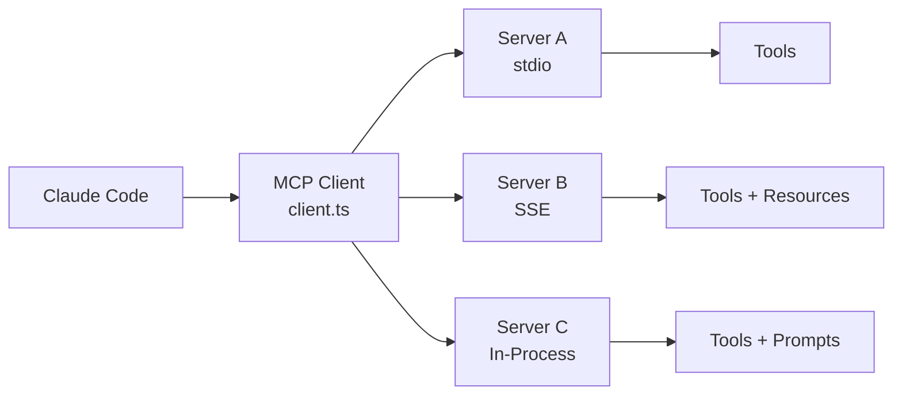

# MCP Integration

**Source**: `src/services/mcp/` (24 files)

## Overview

The Model Context Protocol (MCP) is an open standard for AI tool interoperability. Claude Code implements a full MCP client that connects to external MCP servers to extend its tool capabilities.

## Architecture



## Key Files

| File | Purpose |
|------|---------|
| `client.ts` | Core MCP client implementation |
| `config.ts` | Server configuration loading |
| `auth.ts` | Authentication handling |
| `channelPermissions.ts` | Permission management for MCP tools |
| `elicitationHandler.ts` | Interactive prompts from MCP servers |
| `InProcessTransport.ts` | In-process server transport |
| `SdkControlTransport.ts` | SDK-based transport |

## Server Configuration

MCP servers are defined in settings with:

```json
{
  "mcpServers": {
    "server-name": {
      "command": "npx",
      "args": ["-y", "@org/mcp-server"],
      "env": { "API_KEY": "..." }
    }
  }
}
```

## Capabilities

MCP servers can provide:

- **Tools** — Executable functions with JSON Schema parameters
- **Resources** — Readable data sources (files, APIs, databases)
- **Prompts** — Pre-defined prompt templates for common tasks

## Connection Lifecycle

1. **Discovery** — Load server configs from settings
2. **Launch** — Start server processes (or connect to running servers)
3. **Handshake** — Exchange capabilities via MCP protocol
4. **Registration** — Register server tools as available Claude Code tools
5. **Execution** — Forward tool calls to servers, return results
6. **Cleanup** — Gracefully shut down servers on exit

## Deep Dive

- [Client Architecture](./client-architecture) — MCP client internals, transport abstractions (stdio, SSE, in-process)
- [Server Lifecycle](./server-lifecycle) — Discovery, launch, handshake, capability exchange, and cleanup
- [Tool Registration](./tool-registration) — How MCP server tools become Claude Code tools, schema mapping, and permission integration
