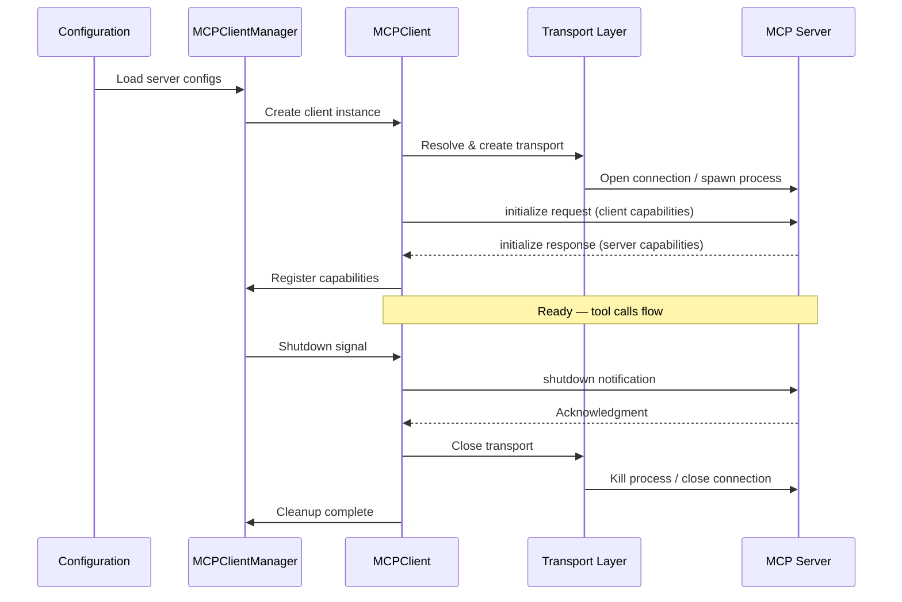
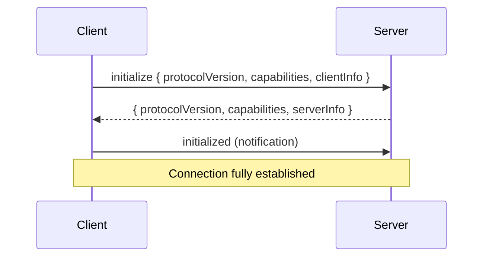
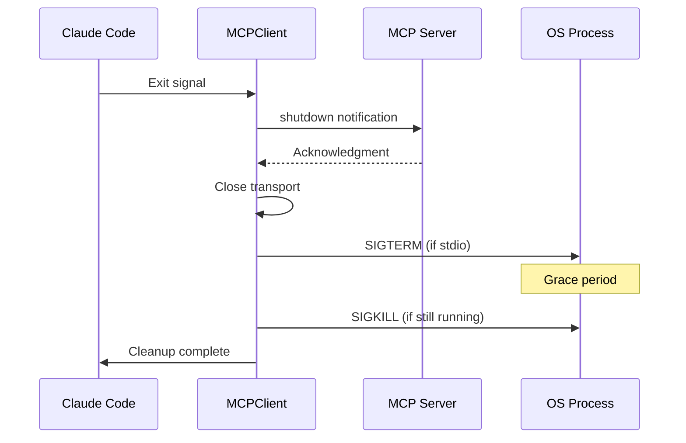

# Server Lifecycle

**Source**: `src/services/mcp/client.ts`, `src/services/mcp/config.ts`

## Overview

Every MCP server connection follows a well-defined lifecycle: configuration is loaded, a transport is created, an initialization handshake establishes capabilities, and the connection enters a ready state where tool calls flow freely. On exit, a graceful shutdown sequence ensures resources are released cleanly.

## Full Lifecycle



## Discovery Phase

Server configurations are loaded from multiple sources, merged in priority order:

1. **CLI flags** — `--mcp-server` arguments (highest priority)
2. **Project settings** — `.claude/settings.json` in the workspace
3. **User settings** — `~/.claude/settings.json` global config
4. **Extension configs** — Settings contributed by installed extensions

When the same server name appears in multiple sources, higher-priority sources override lower ones. Environment variables in config values are expanded at load time (`$HOME`, `$PATH`, etc.).

### Configuration Shape

Each server entry specifies how to launch or connect:

```json
{
  "command": "npx",
  "args": ["-y", "@org/mcp-server"],
  "env": { "API_KEY": "..." },
  "cwd": "/optional/working/dir"
}
```

For remote servers, a `url` field replaces `command`/`args`.

## Launch Phase

Once configuration is resolved, the client creates the appropriate transport:

- **Stdio servers** — The command is resolved against `PATH`, arguments are passed, environment variables are merged with the current process env, and the child process is spawned.
- **SSE/HTTP servers** — An HTTP connection is opened to the configured URL.
- **In-process servers** — The server module is loaded directly into the Claude Code process.

The working directory defaults to the project root but can be overridden per server.

## Handshake Phase

After transport connection, the MCP protocol initialization handshake runs:



- The client declares its supported protocol version and capabilities.
- The server responds with its own version and capabilities.
- If versions are incompatible, the connection is aborted.
- A final `initialized` notification confirms the handshake is complete.

## Capability Exchange

| Capability | Direction | Description |
|-----------|-----------|-------------|
| **Tools** | Server declares | Executable functions the server provides |
| **Resources** | Server declares | Readable data sources (URIs) |
| **Prompts** | Server declares | Pre-defined prompt templates |
| **Logging** | Server declares | Server can send log messages to the client |
| **Experimental** | Either side | Opt-in to non-stable protocol features |
| **Sampling** | Client declares | Client can handle model sampling requests from server |

After the handshake, the client queries the server for its full tool, resource, and prompt listings.

## Health Monitoring

Claude Code monitors server health continuously:

- **Heartbeat pings** — Periodic `ping` requests verify the server is responsive.
- **Timeout detection** — If a server does not respond within the configured timeout, the connection is marked unhealthy.
- **Crash detection** — For stdio servers, an unexpected process exit triggers the restart flow.
- **Capability polling** — The client can re-fetch tool lists to detect dynamic changes.

## Graceful Shutdown



All pending requests are rejected before the shutdown notification is sent.

## Restart Recovery

When a server crashes unexpectedly:

1. The transport detects the disconnection (process exit or connection close).
2. After a backoff delay (1s, doubling to 30s max), launch and handshake are repeated.
3. On success, capabilities are re-registered and tools become available again.
4. After repeated failures (default: 5 attempts), the server is marked **failed**.

## Design Patterns

- **State Machine** — Each connection moves through discrete states: `configuring` -> `launching` -> `handshaking` -> `ready` -> `shutting_down` -> `stopped`. Invalid transitions are rejected.
- **Observer** — Lifecycle events are published to observers (tool registry, UI, diagnostics), decoupling the MCP client from consumers.
- **Retry with Exponential Backoff** — Restart recovery uses exponential backoff with jitter to avoid thundering-herd problems.
