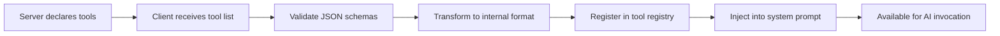
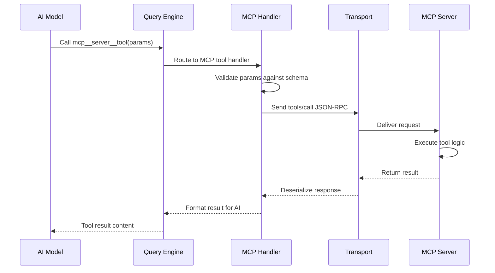

# Tool Registration

**Source**: `src/services/mcp/`, tool system integration

## Overview

When an MCP server declares tools, those tools must be transformed and registered into Claude Code's internal tool system so the AI model can discover and invoke them. This pipeline handles schema mapping, namespacing, permission integration, and runtime updates.

## Registration Pipeline



After the MCP handshake completes and the client fetches the server's tool list, each tool passes through this pipeline before the AI can use it.

## Schema Mapping

MCP tools declare their parameters using JSON Schema. Claude Code transforms these into its internal tool format:

| MCP Field | Internal Field | Transformation |
|-----------|---------------|----------------|
| `name` | `name` | Prefixed with namespace (see below) |
| `description` | `description` | Passed through; used in system prompt |
| `inputSchema` | `parameters` | JSON Schema validated and normalized |
| `inputSchema.properties` | `parameters.properties` | Property types mapped to supported set |
| `inputSchema.required` | `parameters.required` | Required fields preserved |

**Type mapping** covers standard JSON Schema types (`string`, `number`, `boolean`, `array`, `object`). Complex schemas with `oneOf`, `anyOf`, or `$ref` are flattened where possible and passed through otherwise — the model handles most schema shapes natively.

## Tool Naming

MCP tools are namespaced to prevent collisions with built-in tools and tools from other servers:

```
mcp__{serverName}__{toolName}
```

For example, a tool called `search` on a server named `github` becomes `mcp__github__search`.

**Naming rules:**

- Server names come from the configuration key in settings.
- Special characters in server or tool names are replaced with underscores.
- The double-underscore separator is reserved and cannot appear in server or tool names.
- Built-in tool names (e.g., `Read`, `Write`, `Bash`) are never shadowed.

## Permission Integration

MCP tools integrate with Claude Code's permission system:

| Permission Level | Behavior |
|-----------------|----------|
| **Default** | MCP tools require user approval on first use per session |
| **Allowed** | Tools from trusted servers can be pre-approved in settings |
| **Denied** | Specific tools or entire servers can be blocked |
| **Channel permissions** | Per-server permission overrides via `channelPermissions.ts` |

Permission checks happen at invocation time, not at registration. This means a tool can be visible in the system prompt but still require approval when actually called.

### Server-Level Trust

Servers can be marked as trusted in settings, which auto-approves all their tools:

```json
{
  "mcpServers": {
    "trusted-server": {
      "command": "...",
      "trust": true
    }
  }
}
```

## Tool Execution Flow



Results from MCP servers can include text, images, or structured data. The MCP handler normalizes these into the content format the AI expects.

## Resource Registration

MCP servers can also expose **resources** — readable data sources identified by URIs:

- Resources are registered separately from tools.
- Each resource has a URI, name, description, and MIME type.
- The client can `read` a resource to fetch its content.
- Resources support `subscribe` for change notifications.
- Common resource types include files, database records, and API responses.

Resources appear in the system context but are accessed differently from tools — they are read-only data sources rather than executable functions.

## Prompt Registration

MCP prompts are pre-defined templates that servers provide:

- Each prompt has a name, description, and optional argument definitions.
- Arguments use the same JSON Schema format as tool parameters.
- When invoked, the prompt returns a list of messages (user/assistant turns).
- Prompts are useful for encapsulating complex multi-step instructions.

Prompts are registered in a separate prompt registry and can be invoked by the user through slash commands or other UI affordances.

## Dynamic Updates

Tool lists are not static. Servers can add or remove tools at runtime:

1. The server sends a `notifications/tools/list_changed` notification.
2. The client re-fetches the full tool list from the server.
3. The registration pipeline runs again — new tools are added, removed tools are unregistered.
4. The system prompt is regenerated to reflect the current tool set.
5. The next AI turn sees the updated tools.

This supports servers that conditionally expose tools based on authentication state or loaded projects.

## Design Patterns

- **Registry Pattern** — A central tool registry maintains all available tools. MCP tools are added/removed through the same interface as built-in tools.
- **Adapter Pattern** — The schema transformation layer adapts MCP JSON Schema definitions to Claude Code's internal format, isolating the system from protocol details.
- **Namespace Pattern** — The `mcp__server__tool` convention creates a flat, collision-free namespace without hierarchical registry complexity.
