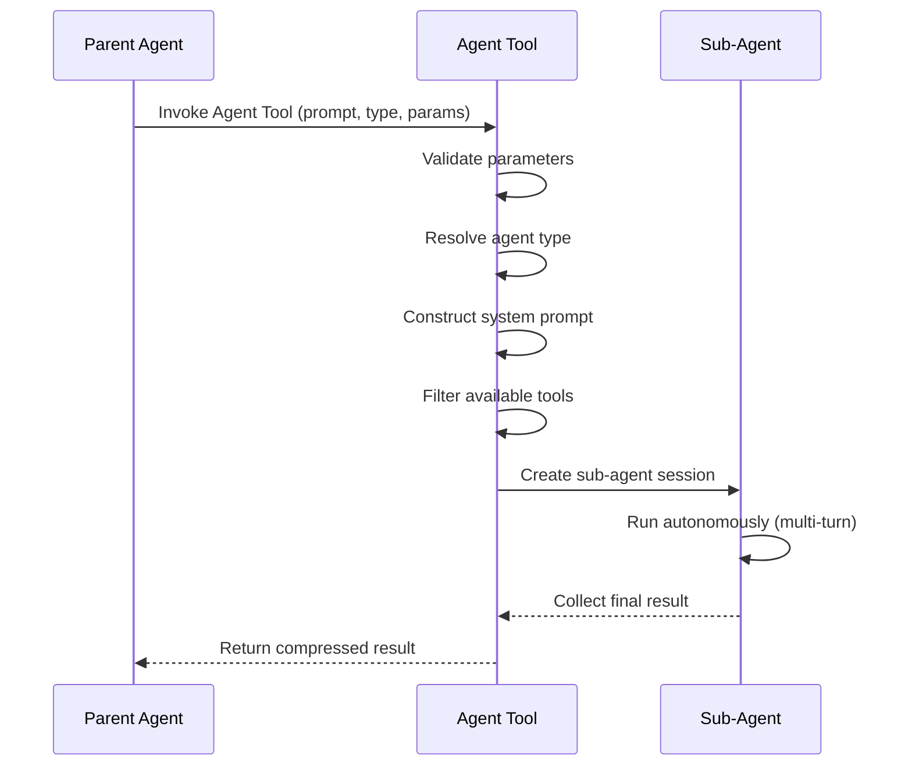
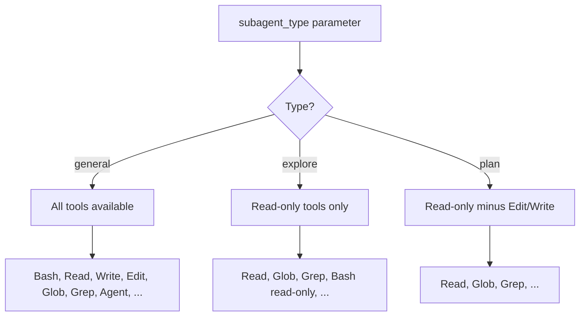

# Agent Lifecycle

The Agent Tool follows a precise lifecycle from the moment a parent agent requests a sub-agent to the moment the compressed result is returned. Understanding this lifecycle is essential for reasoning about sub-agent behavior, prompt construction, and resource management.

## Lifecycle Overview



The parent never directly controls the sub-agent's execution. Once launched, the sub-agent operates autonomously until it completes or hits a resource limit.

## Prompt Construction

The sub-agent's system prompt is built in layers:

1. **Inherited base**: The parent's system prompt is carried forward, preserving project context, memory files, and environment details.
2. **Agent-specific instructions**: Additional instructions are appended based on the agent type (e.g., read-only constraints for Explore agents).
3. **Task prompt**: The caller-provided `prompt` parameter becomes the sub-agent's initial user message.

```ts
// Simplified prompt construction
const systemPrompt = [
  parentSystemPrompt,       // inherited context
  agentTypeInstructions,    // type-specific rules
  isolationInstructions,    // worktree/CWD context
].join("\n");
```

The sub-agent shares the parent's **prompt cache**, which means common system prompt fragments are not re-tokenized. This significantly reduces latency for the first sub-agent turn.

## Tool Filtering

Available tools are filtered based on the resolved agent type:



| Agent Type | Tools Included | Use Case |
|-----------|---------------|----------|
| `general` | All parent tools | Full autonomous work |
| `explore` | Read-only subset | Code investigation, search |
| `plan` | Read-only minus edit/write | Planning, analysis |

Tool filtering ensures sub-agents cannot exceed their intended scope. An Explore agent physically cannot call the Write tool -- it is removed from its tool set before the session begins.

## Context Isolation

Each sub-agent gets its own **conversation history**. The parent's conversation messages are not visible to the sub-agent, and the sub-agent's internal turns are not visible to the parent.

Key isolation properties:

- **Conversation**: Independent message history per sub-agent
- **Prompt cache**: Shared with parent (performance optimization)
- **Working directory**: Shared or isolated (see [Isolation & Worktrees](/en/tools/agent-tool/isolation-and-worktrees))
- **Token budget**: Independent per sub-agent

## Result Handling

When a sub-agent completes, its entire multi-turn conversation is **compressed into a single message** returned to the parent:

```
Sub-agent result:
  - Found 3 files matching the pattern
  - src/utils/parser.ts contains the target function
  - The function accepts two parameters: input (string) and options (object)
```

The parent never sees:
- The sub-agent's intermediate tool calls
- The sub-agent's internal reasoning
- How many turns the sub-agent took

This compression acts as a **Facade** -- the parent interacts with a simple result interface regardless of the sub-agent's internal complexity.

## Resource Limits

Sub-agents operate under independent resource constraints:

- **Token budget**: Each sub-agent has its own token limit. Exceeding it terminates the agent and returns whatever partial result is available.
- **Turn limit**: A maximum number of conversation turns prevents runaway execution.
- **Time**: Background agents may run for extended periods, but foreground agents block the parent.

When a sub-agent is terminated due to resource limits, the parent receives a truncated result with an indication that the agent did not complete normally.

## Design Patterns

The Agent Tool lifecycle employs several well-known design patterns:

### Factory Pattern
The agent type parameter acts as a factory selector. The same Agent Tool creates different configurations based on the type:

```
AgentTool.invoke({ type: "explore" })  → ReadOnlyAgentConfig
AgentTool.invoke({ type: "general" }) → FullAgentConfig
```

### Facade Pattern
The compressed single-message result hides the sub-agent's multi-turn internal execution behind a simple interface. The parent sees one result regardless of whether the sub-agent took 2 or 20 turns.

### Strategy Pattern
Different agent types implement different strategies for the same "investigate and report" task. The Explore strategy restricts tools; the General strategy provides full access. The lifecycle mechanics remain identical -- only the tool set and prompt differ.

---

The lifecycle design ensures sub-agents are predictable, bounded, and composable. A parent can launch multiple sub-agents of different types, each operating under clear constraints, and receive uniform results.
