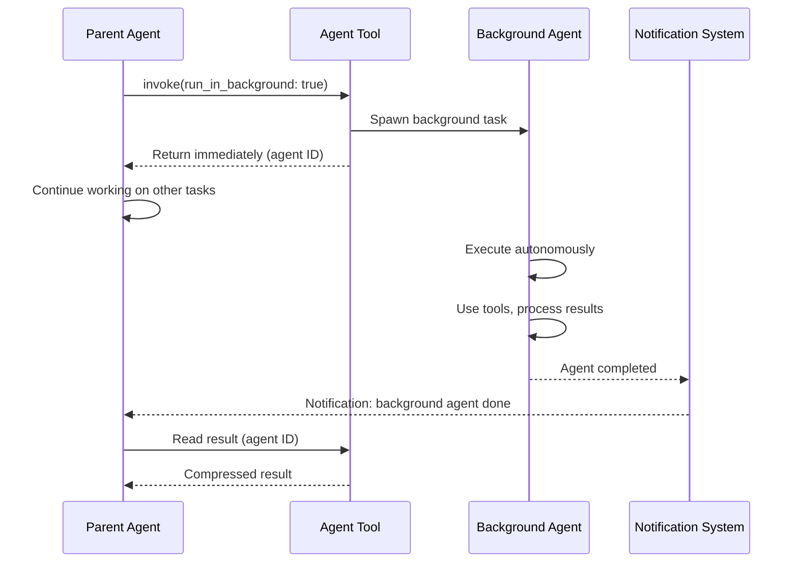
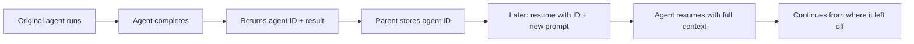

# Background Execution

The Agent Tool supports launching sub-agents as background tasks. This allows the parent agent to continue working while one or more sub-agents operate independently, reporting results upon completion.

## Background Agent Lifecycle



The key difference from foreground execution: the parent does **not** block. It receives an agent ID immediately and can proceed with other work.

## Launch Mechanism

Setting `run_in_background: true` changes the Agent Tool's behavior:

1. The sub-agent session is created as an **async task**
2. An agent ID is returned to the parent immediately
3. The background agent runs in its own execution context
4. The parent's conversation continues without waiting

```ts
// The Agent Tool returns a result containing the agentId
const result = await agentTool.invoke({
  prompt: "Refactor the authentication module",
  run_in_background: true,
});
// result.agentId — unique identifier for the background agent
// Parent continues immediately without waiting for completion
```

Background agents inherit the same tool set and prompt construction as foreground agents.

## Notification System

When a background agent completes, the parent is notified through the notification system:

- **Idle notification**: If the parent REPL is idle (not mid-query), the notification is delivered immediately
- **Queued notification**: If the parent is mid-execution, the notification is queued and delivered at the next idle point
- **Terminal notification**: A visible notification appears in the terminal

Notifications include the agent ID and a brief status (completed, failed, or terminated). The parent can then retrieve the full result using the agent ID.

## Parallel Execution

Multiple background agents can run simultaneously:

```
Parent launches Agent A (background) → receives ID-A
Parent launches Agent B (background) → receives ID-B
Parent launches Agent C (background) → receives ID-C
Parent continues working...

Agent B completes → notification
Agent A completes → notification
Agent C completes → notification

Parent reads results for ID-A, ID-B, ID-C
```

Each background agent has:
- **Independent state**: Own conversation history, tool invocations, and context
- **Independent token budget**: One agent exhausting its budget does not affect others
- **Independent CWD or worktree**: Isolation rules apply per-agent

There is no hard limit on concurrent background agents, but each consumes tokens and memory independently.

## Result Retrieval

The parent accesses background agent results after completion:

1. **By agent ID**: The parent uses the returned agent ID to fetch the compressed result
2. **Compressed format**: The same single-message compression applies as with foreground agents
3. **Availability**: Results remain available for the duration of the parent session

If the parent attempts to read results before the agent completes, it receives a status indicating the agent is still running.

## Resumption

Agents support resumption through the `resume` parameter. This enables multi-turn workflows where an agent's full conversation context is preserved across invocations.

### Resume Flow



When resuming:
- The agent's **full conversation history** is restored
- The new prompt is appended as a follow-up message
- Tool state, CWD, and worktree context are preserved
- The agent continues as if it never stopped

```ts
// First invocation
const result1 = await agentTool.invoke({
  prompt: "Analyze the payment module architecture",
});

// Later: resume with follow-up using result1.agentId
const result2 = await agentTool.invoke({
  resume: "agent-xyz",
  prompt: "Now refactor the parts you identified as problematic",
});
```

## Resource Management

Background agents require careful resource management:

- **Token consumption**: Each background agent consumes tokens independently. Multiple concurrent agents multiply token usage.
- **Memory**: Conversation history is held in memory until the parent session ends or results are retrieved.
- **Cleanup**: Completed agent state is eligible for cleanup after result retrieval. Worktrees follow the same cleanup rules as foreground agents.

## Design Patterns

### Async/Await Pattern
Background execution follows the async/await model. The parent "awaits" results at its convenience rather than at launch time. The agent ID serves as the equivalent of a Promise or Future handle.

### Observer Pattern
The notification system implements the Observer pattern. The parent registers interest by launching the agent, and completion events are pushed when they occur. The parent does not poll.

### Memento Pattern
Agent resumption uses the Memento pattern. The full conversation state is preserved as a snapshot. When `resume` is called, this snapshot is restored, allowing the agent to continue exactly where it left off.

---

Background execution transforms the Agent Tool from a synchronous subroutine into an asynchronous orchestration primitive.
