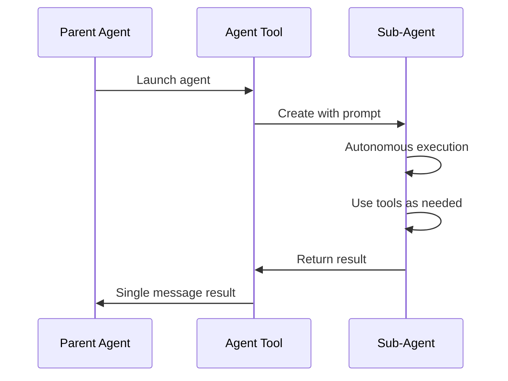

# Agent Tool

**Source**: `src/tools/AgentTool/`

## Overview

The Agent Tool enables Claude Code to spawn sub-agents — independent Claude instances that handle complex, multi-step tasks autonomously. This is the foundation of the multi-agent architecture.

## Parameters

- **prompt** — Task description for the sub-agent
- **description** — Short (3-5 word) summary
- **subagent_type** — Agent specialization (optional)
- **run_in_background** — Run asynchronously (optional)
- **isolation** — Isolation mode, e.g., `"worktree"` (optional)
- **resume** — Agent ID to resume (optional)

## Agent Types

| Type | Tools Available | Use Case |
|------|----------------|----------|
| `general-purpose` | All tools | Complex multi-step tasks |
| `Explore` | Read-only tools | Codebase exploration |
| `Plan` | Read-only tools | Implementation planning |
| `statusline-setup` | Read, Edit | Status line configuration |

## Execution Model

## Isolation Modes

### Default
Sub-agent works in the same directory as the parent.

### Worktree
`isolation: "worktree"` creates a temporary git worktree, giving the sub-agent an isolated copy of the repository. Changes can be kept or discarded.

## Background Execution

Agents can run in the background while the parent continues working:

- Launch with `run_in_background: true`
- Parent is notified when agent completes
- Multiple agents can run in parallel

## Resuming Agents

Agents can be resumed using their ID, continuing with full previous context preserved. This enables iterative workflows across multiple turns.

## Deep Dive

- [Agent Lifecycle](./agent-lifecycle) — Full lifecycle from spawn to completion: prompt construction, tool filtering, execution context
- [Isolation & Worktrees](./isolation-and-worktrees) — Git worktree creation, cleanup, and file system isolation mechanics
- [Background Execution](./background-execution) — Async agent execution, notification system, parallel coordination, and resumption
