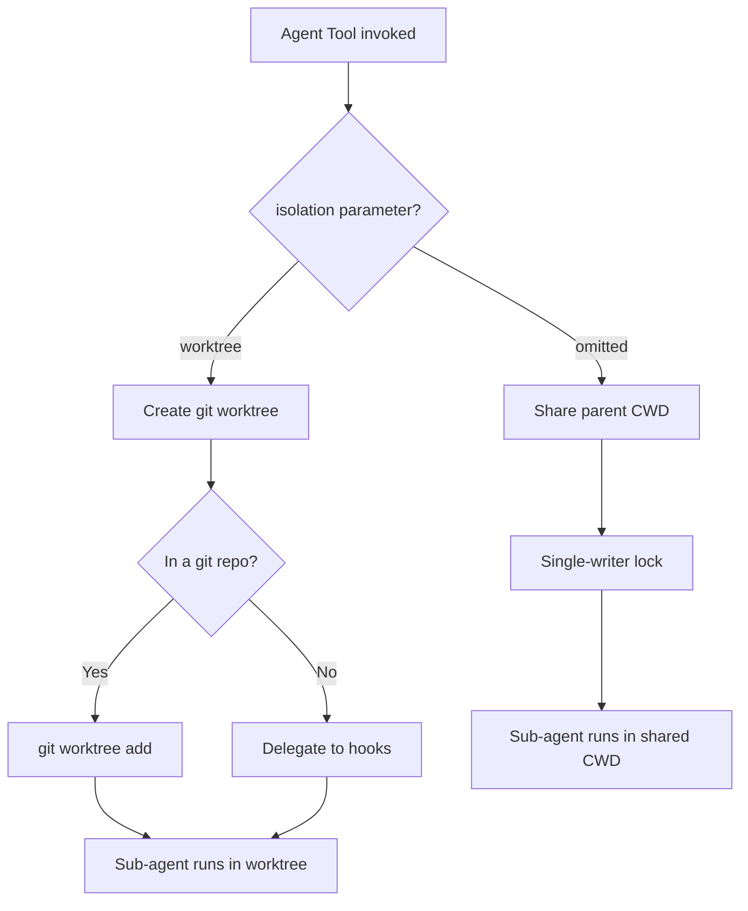
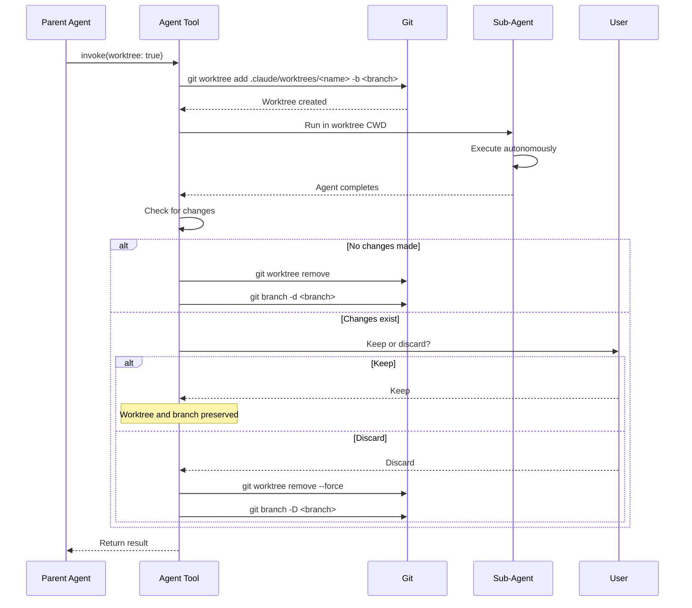

# Isolation & Worktrees

Sub-agents must be isolated from the parent and from each other to prevent file conflicts and unintended side effects. Claude Code provides two isolation modes: shared CWD (default) and git worktree isolation.

## Isolation Mode Selection



The choice depends on the task. Read-only operations (Explore, Plan agents) work fine in shared CWD. Write-heavy operations benefit from worktree isolation.

## Default Mode: Shared CWD

In the default mode, the sub-agent inherits the parent's working directory. This is simple and fast but carries risk when multiple agents write to the same files.

**Advantages:**
- Zero setup overhead
- Sub-agent sees the exact same file state as the parent
- No branch or worktree cleanup needed

**Risks:**
- Concurrent writes can cause conflicts
- Sub-agent changes are immediately visible to the parent
- No rollback mechanism beyond git

To mitigate write conflicts, Claude Code uses a **single-writer lock**. When a sub-agent is performing write operations in shared CWD mode, other agents are prevented from writing to the same files simultaneously.

## Worktree Mode

When `worktree: true` is specified, the Agent Tool creates a temporary git worktree with a dedicated branch. The sub-agent operates in complete file system isolation.

### Worktree Lifecycle



### Worktree Creation

The worktree is created under `.claude/worktrees/` with a generated or user-specified name:

```bash
git worktree add .claude/worktrees/fix-auth-bug -b claude/fix-auth-bug
```

Key details:
- **Location**: `.claude/worktrees/<name>` inside the repo root
- **Branch**: A new branch based on the current HEAD
- **Naming**: Auto-generated if not specified, or uses the `name` parameter
- **Failure handling**: If worktree creation fails (e.g., dirty state, path conflict), the agent falls back to shared CWD with a warning

### File System Isolation

The worktree provides a **full copy of the working tree** while sharing the `.git` directory with the main repo:

| Aspect | Main Working Directory | Worktree |
|--------|----------------------|----------|
| Files | Original | Independent copy |
| `.git` | Shared | Shared |
| Branch | Current branch | New dedicated branch |
| Index | Independent | Independent |
| Changes | Not affected by worktree | Not affected by main |

This means changes made in the worktree do not appear in the parent's working directory. The parent can continue operating on its files without interference.

## Cleanup

Cleanup behavior depends on whether the sub-agent made changes:

**No changes detected:**
- Worktree is automatically removed
- Branch is automatically deleted
- No user interaction required

**Changes detected:**
- User is prompted to keep or discard
- Keeping preserves both the worktree directory and the branch
- Discarding force-removes the worktree and deletes the branch
- If the session ends while still in a worktree, the user is prompted

## Conflict Prevention

The single-writer model prevents multiple agents from editing the same file, even without worktree isolation:

1. **Write lock**: When an agent begins a write operation, it acquires a lock on the target file path.
2. **Queue**: Other agents attempting to write to the same path are queued until the lock is released.
3. **Worktree bypass**: Agents in separate worktrees operate on independent file copies and never conflict.

For maximum safety with write-heavy parallel agents, worktree isolation is the recommended approach.

## Design Patterns

### Template Method Pattern
The worktree lifecycle follows a fixed sequence (create → execute → check → cleanup) with the sub-agent's actual work as the customizable step. Every worktree-based agent goes through the same create/cleanup ceremony regardless of what it does inside.

### RAII (Resource Acquisition Is Initialization)
The worktree is treated as a managed resource. It is acquired at agent start and released at agent completion. If the agent crashes or is terminated, cleanup hooks ensure the worktree is not orphaned indefinitely. This mirrors the RAII pattern where resource lifetime is tied to scope lifetime.

---

Isolation ensures that sub-agents can work in parallel without stepping on each other's changes. Shared CWD is fast and simple for read-heavy tasks; worktree isolation provides full safety for write-heavy parallel work.
