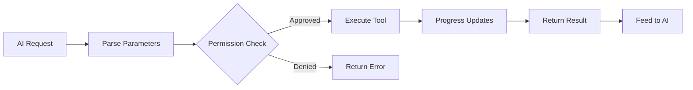

# Tool System

**Source**: `src/Tool.ts` (792 lines) and `src/tools/` (45+ subdirectories)

## Overview

Tools are the primary mechanism through which Claude Code interacts with the user's environment. Each tool has a defined interface, input schema, and execution behavior.

## Tool Interface

Every tool implements a standard interface defined in `src/Tool.ts`:

- **name** — Unique identifier (e.g., `"Bash"`, `"Read"`, `"Edit"`)
- **description** — Natural language description for the AI
- **inputSchema** — JSON Schema defining accepted parameters
- **execute** — Async function that performs the tool's action
- **permissions** — Required permission level

## Tool Lifecycle

## Tool Categories

| Category | Tools | Description |
|----------|-------|-------------|
| **File Operations** | Read, Edit, Write, Glob, Grep | File system interaction |
| **Execution** | Bash, PowerShell, REPL | Command execution |
| **AI Agents** | Agent, Coordinator | Multi-agent delegation |
| **Extensions** | MCP, Skill | External tool integration |
| **Tasks** | TaskCreate, TaskUpdate, TaskGet, TaskList, TaskStop | Task management |
| **Planning** | EnterPlanMode, ExitPlanMode | Structured planning workflow |
| **Workspace** | EnterWorktree, ExitWorktree | Git worktree isolation |
| **Notebook** | NotebookEdit | Jupyter notebook support |
| **Other** | AskUserQuestion, Sleep, ScheduleCron | Utility tools |

## Input Schema

Tools define their parameters using JSON Schema (`ToolInputJSONSchema`). This schema is sent to the AI as part of the tool definition, enabling the AI to construct valid tool calls.

## Progress Tracking

Tools emit progress events during execution via `ToolProgressData`. Different tool types have specialized progress types:

- `BashProgress` — Shell command output streaming
- `MCPProgress` — MCP server communication status
- `SkillToolProgress` — Skill execution steps
