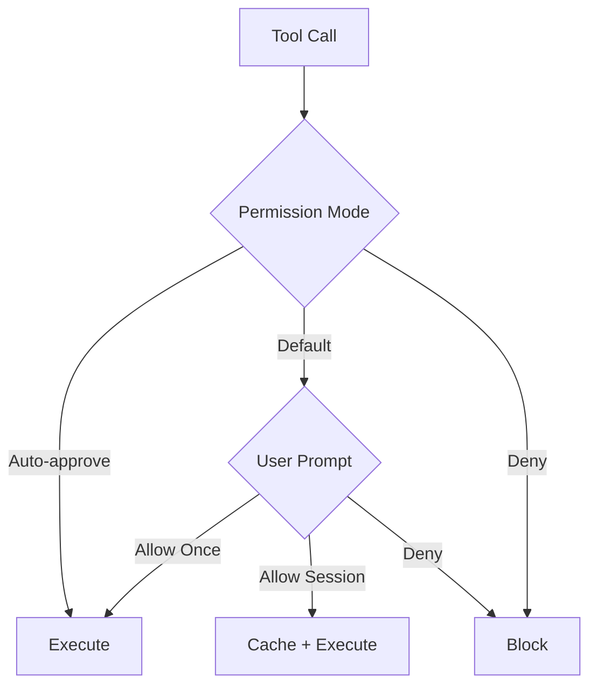

# Tool Permissions

**Source**: `src/types/permissions.ts` and `src/hooks/toolPermission/`

## Overview

Claude Code implements a fine-grained permission system that controls which tools can execute and under what conditions. This ensures user safety while maintaining productivity.

## Permission Modes

| Mode | Behavior |
|------|----------|
| **Default** | Ask for approval on each tool use |
| **Auto-approve** | Approve matching tools automatically |
| **Deny** | Block tool execution |

## Permission Flow

## Permission Context

Each permission check includes a `ToolPermissionContext` with:

- Tool name and parameters
- Whether the tool is read-only or write
- The specific action being performed
- Previous permission decisions

## Permission Hooks

The `src/hooks/toolPermission/` directory contains React hooks for permission management:

- **useCanUseTool** — Check if a tool can be used
- **useToolPermission** — Request and cache permissions
- Permission state stored in AppState

## Hooks-based Permissions

Users can configure permission hooks — shell commands that execute in response to tool calls. These hooks can:

- Approve or deny tool execution
- Modify tool parameters
- Log tool usage
- Enforce custom policies

## Safety Rules

The permission system enforces built-in safety rules:

- Destructive operations (rm -rf, git reset --hard) require explicit approval
- File writes outside the project directory are flagged
- Secret files (.env, credentials) are protected
- Remote operations (push, deploy) need confirmation
