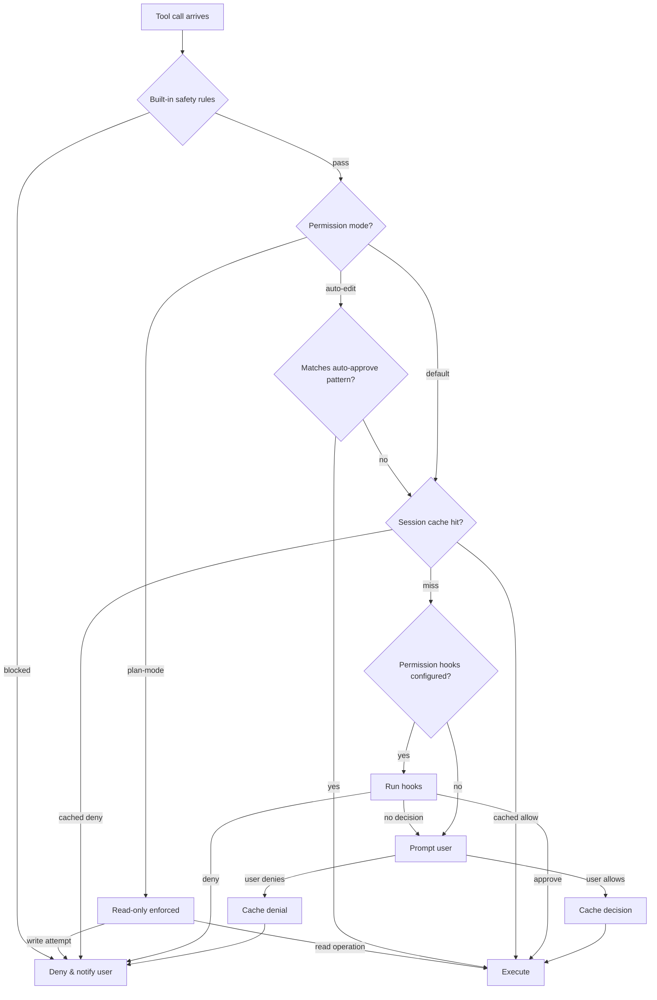
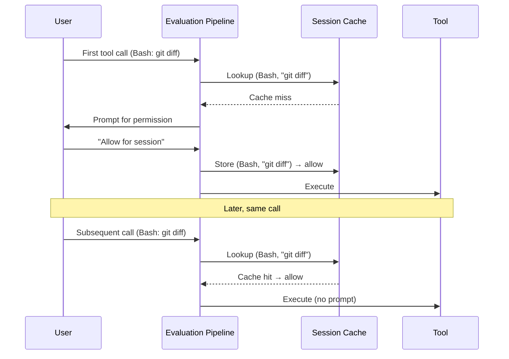

# Permission Evaluation

Every tool call in Claude Code passes through a multi-stage evaluation pipeline before execution. This pipeline combines built-in safety rules, user-configured permission modes, session caches, and optional hooks to produce a final decision: **allow**, **deny**, or **prompt the user**.

## Decision Tree

The following flowchart illustrates the full evaluation path for an incoming tool call:

## Permission Modes

Claude Code supports four distinct permission modes, each suited to different workflows.

| Mode | CLI Flag | Behavior | Use Case |
|------|----------|----------|----------|
| **Default** | _(none)_ | Prompt on every uncached tool call | Normal interactive usage |
| **Auto-approve** | `--auto-approve` | Pattern-match tool name and params; approve silently if matched | Repetitive workflows with known-safe operations |
| **Plan mode** | `--plan` | Enforce read-only; block all write operations | Exploring and planning without side effects |
| **YOLO mode** | `--dangerously-skip-permissions` | Approve everything except hard-blocked safety rules | Fully automated pipelines in sandboxed environments |

### Mode Resolution Priority

When multiple sources specify a permission mode, the following priority order applies (highest first):

1. **CLI flags** passed at invocation (`--plan`, `--dangerously-skip-permissions`)
2. **Environment variables** (`CLAUDE_PERMISSION_MODE`)
3. **Project settings** (`.claude/settings.json` in the project root)
4. **User settings** (`~/.claude/settings.json`)
5. **Built-in default** (Default mode)

## Rule Matching

Permission rules map tool calls to decisions. Each rule specifies a **tool name pattern** and optional **parameter constraints**.

### Pattern Types

- **Exact match** -- `Bash` matches only the Bash tool
- **Glob pattern** -- `Edit*` matches `Edit`, `EditFile`, etc.
- **Regex on parameters** -- `Bash(command=/^git status/)` matches Bash calls whose `command` parameter starts with `git status`

Rules are evaluated in order. The first matching rule wins. If no rule matches, evaluation proceeds to the next pipeline stage.

## Session Cache

To avoid repeated prompts for identical operations, Claude Code maintains a session-scoped permission cache.

### Cache Key Structure

Each cache entry is keyed on:

- **Tool name** (e.g., `Bash`)
- **Normalized parameters** (sorted keys, trimmed whitespace)

This means `Bash(command="git status")` and `Bash(command="git status ")` resolve to the same cache entry after normalization.

### Cache Lifecycle

Cache entries are never persisted to disk. They are discarded when the session ends. A user can also select **"Allow once"** instead of **"Allow for session"**, which skips caching entirely.

### Cache Invalidation

The cache is invalidated when:

- The session ends or restarts
- The user explicitly resets permissions via `/permissions-reset`
- The permission mode changes mid-session

## Permission Context

During evaluation, each stage receives a `ToolPermissionContext` object containing:

| Field | Type | Description |
|-------|------|-------------|
| `toolName` | `string` | Canonical tool name (e.g., `Bash`, `Edit`) |
| `params` | `Record<string, unknown>` | Tool parameters as key-value pairs |
| `mode` | `PermissionMode` | Active permission mode |
| `sessionId` | `string` | Current session identifier |
| `workingDirectory` | `string` | Resolved CWD for the session |
| `previousDecisions` | `Decision[]` | Decisions made earlier in the same turn |

The `previousDecisions` field enables contextual evaluation -- for example, a hook could auto-approve a file write if the same file was already read earlier in the conversation.

## Design Patterns

The permission evaluation system employs several established design patterns:

- **Chain of Responsibility** -- Each stage (safety rules, mode check, cache, hooks, user prompt) is a handler in a chain. A stage either produces a final decision or passes control to the next stage.
- **Strategy** -- Permission modes are interchangeable strategies that alter how the pipeline behaves without changing its structure.
- **Cache-Aside** -- The session cache sits beside the evaluation logic. On a miss, the pipeline evaluates normally and writes the result back to the cache for future lookups.
