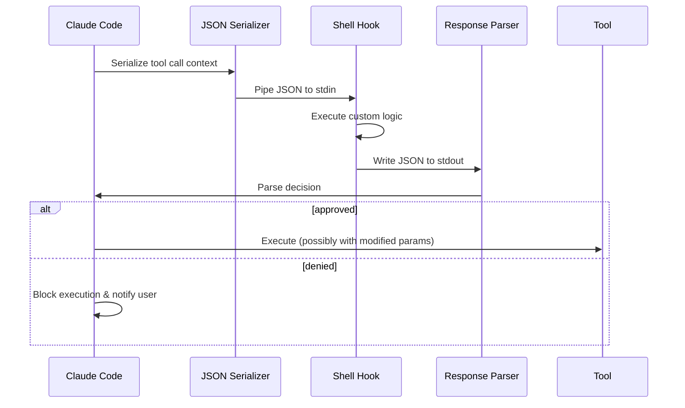

# Permission Hooks

Permission hooks are user-configurable shell commands that Claude Code invokes at defined points in the tool-call lifecycle. They enable custom permission policies, audit logging, parameter sanitization, and integration with external approval systems -- all without modifying Claude Code itself.

## Hook Execution Flow



## Hook Configuration

Hooks are defined in `.claude/settings.json` (project-level) or `~/.claude/settings.json` (user-level) under the `hooks` key. Each entry specifies a `command` (shell command to run) and an optional `timeout` in milliseconds (default: 5000):

```json
{
  "hooks": {
    "tool_call": [{ "command": "/path/to/policy-hook.sh", "timeout": 5000 }],
    "pre_execute": [{ "command": "node /path/to/audit-logger.js", "timeout": 3000 }]
  }
}
```

## Hook Event Types

Hooks fire at three distinct points in the tool-call lifecycle:

| Event | Timing | Can Block? | Can Modify Params? | Use Case |
|-------|--------|------------|---------------------|----------|
| `tool_call` | Before permission evaluation | Yes | Yes | Custom approval policies, parameter rewriting |
| `pre_execute` | After approval, before execution | Yes | Yes | Last-chance validation, audit logging |
| `post_execute` | After execution completes | No | No | Logging results, triggering follow-up actions |

Multiple hooks can be registered for the same event. They execute in the order they are defined. For `tool_call` and `pre_execute`, any hook returning `deny` short-circuits the chain.

## Hook Input and Output

Each hook receives a JSON object on **stdin** containing the event type, tool name, parameters, session context, and previous decisions from the same turn. It writes a JSON response to **stdout**:

```json
// stdin (input)
{ "event": "tool_call", "tool": "Bash", "params": { "command": "rm -rf ./build" },
  "context": { "sessionId": "abc-123", "workingDirectory": "/home/user/project" },
  "previousDecisions": [{ "tool": "Bash", "decision": "allow" }] }

// stdout (output)
{ "decision": "approve", "modifiedParams": { "command": "rm -rf ./build --interactive" },
  "message": "Added --interactive flag for safety" }
```

| Output Field | Required | Description |
|-------|----------|-------------|
| `decision` | Yes | `"approve"` or `"deny"` |
| `modifiedParams` | No | Replacement parameters (only for `tool_call` and `pre_execute`) |
| `message` | No | Human-readable explanation shown to the user |

If `modifiedParams` is present with an `approve` decision, the tool executes with the modified parameters.

## Parameter Modification

Hooks can rewrite tool parameters before execution. Common use cases include:

- **Path sanitization** -- Rewriting relative paths to absolute paths, blocking path traversal attempts
- **Safety flag injection** -- Adding `--dry-run` or `--interactive` flags to destructive commands
- **Command wrapping** -- Wrapping commands in monitoring tools (`strace`, `timeout`)

The modified parameters must conform to the same schema as the original tool expects. Claude Code validates the modified parameters before proceeding.

## Error Handling

When a hook fails, Claude Code defaults to **deny** for safety:

| Failure Mode | Behavior |
|-------------|----------|
| Hook exits with non-zero code | Decision = deny, error logged |
| Hook exceeds timeout | Process killed, decision = deny |
| Hook writes invalid JSON | Decision = deny, parse error logged |
| Hook writes no output | Decision = deny |
| Hook command not found | Decision = deny, configuration error surfaced |

All failures are logged with the hook command, exit code, and any stderr output. The user sees a message explaining that a hook blocked the operation.

## Hook Examples

**Logging hook** -- logs all tool calls without blocking:

```bash
#!/bin/bash
cat >> /tmp/claude-code-audit.log
echo '{"decision": "approve"}'
```

**Path restriction hook** -- denies operations outside the project directory:

```bash
#!/bin/bash
INPUT=$(cat)
CMD=$(echo "$INPUT" | jq -r '.params.command // empty')
if echo "$CMD" | grep -qE '\.\./|^/'; then
  echo '{"decision": "deny", "message": "Path outside project dir"}'
else
  echo '{"decision": "approve"}'
fi
```

**Approval policy hook** -- auto-approves read-only git commands only:

```bash
#!/bin/bash
INPUT=$(cat)
CMD=$(echo "$INPUT" | jq -r '.params.command // empty')
if echo "$CMD" | grep -qE '^git (status|log|diff|show|branch)'; then
  echo '{"decision": "approve"}'
else
  echo '{"decision": "deny", "message": "Only read-only git commands allowed"}'
fi
```

## Security Considerations

- Hooks run with the **same privileges** as the Claude Code process (i.e., the current user). They are not sandboxed.
- A malicious or misconfigured hook can approve dangerous operations or exfiltrate context data. Only configure hooks from trusted sources.
- Project-level hooks (`.claude/settings.json`) take effect when you open the project. Review hook configurations in any project you clone from an untrusted source.
- User-level hooks always execute before project-level hooks, allowing personal safeguards that projects cannot override.

## Design Patterns

- **Interceptor** -- Hooks intercept tool calls at well-defined points, inspecting and optionally transforming the request before it reaches the tool.
- **Chain of Responsibility** -- Multiple hooks for the same event form a chain. Each hook either decides or passes through, and a deny from any hook halts the chain.
- **Middleware** -- The hook system mirrors middleware stacks in web frameworks: ordered functions that receive a request, optionally modify it, and pass it along or short-circuit.