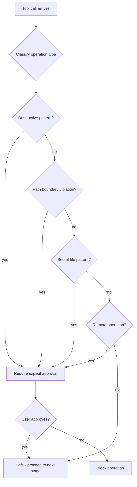

# Safety Rules

Safety rules are Claude Code's last line of defense. Unlike permission modes and hooks, which users can configure or disable, safety rules enforce hard boundaries that protect against destructive, boundary-violating, or sensitive operations. Even in YOLO mode, certain safety rules remain active.

## Safety Rule Evaluation



Each incoming tool call is classified and checked against all rule categories. If any rule matches, the operation is flagged and requires explicit user approval before proceeding.

## Destructive Operation Detection

Claude Code maintains a pattern list of commands and operations known to cause irreversible data loss. When a Bash tool call matches any of these patterns, it is flagged as destructive.

**Matched patterns include:**

- `rm -rf` / `rm -r` -- Recursive file deletion
- `git reset --hard` -- Discarding uncommitted changes
- `git clean -f` -- Removing untracked files
- `git push --force` -- Overwriting remote history
- `DROP TABLE` / `DROP DATABASE` -- Database destruction
- `truncate` -- File content erasure
- `mkfs` / `dd if=` -- Disk-level operations
- `chmod 777` / `chmod -R` -- Broad permission changes
- `> file` (redirect overwrite on critical paths)

Pattern matching is applied to the full command string after shell expansion. The system uses case-insensitive matching and handles common shell quoting styles.

## Path Boundary Protection

File operations are restricted to the project's working directory by default. The boundary checker resolves all paths to their canonical form before comparison.

**Checks performed:**

1. **CWD containment** -- The resolved absolute path must be a descendant of the session's working directory
2. **Symlink resolution** -- Symbolic links are resolved to their real targets; a symlink inside the project that points outside it is still flagged
3. **Parent traversal** -- Paths containing `../` sequences that escape the project root are blocked
4. **Allowed paths list** -- Users can explicitly allow additional directories in settings (e.g., `/tmp`, a shared assets folder)

```json
{
  "permissions": {
    "allowedPaths": [
      "/tmp/build-artifacts",
      "/shared/assets"
    ]
  }
}
```

Paths in `allowedPaths` are treated as additional roots for the boundary check.

## Secret File Protection

Claude Code recognizes patterns associated with sensitive files and blocks or warns on write operations targeting them.

| Pattern | Examples | Action |
|---------|----------|--------|
| Environment files | `.env`, `.env.local`, `.env.production` | Block writes, warn on reads |
| Credential files | `credentials.json`, `service-account.json` | Block writes |
| Private keys | `*.pem`, `*.key`, `id_rsa`, `id_ed25519` | Block reads and writes |
| SSH directory | `.ssh/*` | Block all operations |
| Token files | `*token*`, `.npmrc`, `.pypirc` | Block writes |
| Cloud configs | `.aws/credentials`, `.gcp/credentials` | Block writes |

Read operations on most secret files produce a warning rather than a hard block, since Claude may need to understand project configuration. Write operations are always blocked unless explicitly overridden.

## Remote Operation Rules

Operations that affect shared or remote state always require confirmation, regardless of permission mode. These operations cannot be auto-approved.

| Operation | Tool | Why It Requires Confirmation |
|-----------|------|------------------------------|
| `git push` | Bash | Modifies shared repository history |
| `git push --force` | Bash | Destructive + remote (double-flagged) |
| `npm publish` | Bash | Publishes a package to a public registry |
| `docker push` | Bash | Pushes an image to a container registry |
| Deploy commands | Bash | Affects production infrastructure |
| `curl -X POST/PUT/DELETE` | Bash | Mutates external API state |

Remote operation rules are intentionally strict. Even a session-cached "allow" for `git push` does not carry over if the branch or remote changes.

## Rule Categories

| Category | Trigger | Severity | Default Action | Overridable? |
|----------|---------|----------|----------------|--------------|
| **Destructive** | Pattern match on destructive commands | High | Prompt user | Yes, per-session |
| **Boundary** | Path resolves outside project root | High | Block | Yes, via `allowedPaths` |
| **Secret** | Path matches sensitive file pattern | Critical | Block writes | Yes, explicit flag |
| **Remote** | Command affects shared/remote state | Medium | Prompt user | No auto-approve |

Severity determines the UI treatment: **Critical** rules show a prominent warning banner, **High** rules show a confirmation dialog, and **Medium** rules show a standard prompt.

## Override Mechanism

Safety rules can be overridden through several mechanisms, ordered by specificity:

1. **Per-prompt override** -- The user approves a specific flagged operation in the confirmation dialog
2. **Per-session override** -- The user selects "Allow for this session" on a flagged operation
3. **Settings configuration** -- Adding patterns to `allowedPaths` or `safePatterns` in settings
4. **CLI flag** -- `--dangerously-skip-permissions` overrides most rules (but not Critical-severity ones like secret file writes)

Overrides are logged to the session audit trail for traceability.

## Rule Composition

When a single tool call triggers multiple safety rules, the **most restrictive** outcome wins.

For example, `rm -rf ~/.ssh/id_rsa`:
- **Destructive** rule matches (`rm -rf`) -- Severity: High
- **Boundary** rule matches (outside project root) -- Severity: High
- **Secret** rule matches (`.ssh/*`) -- Severity: Critical

The final severity is **Critical** (the maximum), and the action is **Block** (the most restrictive). The user sees all three reasons in the confirmation dialog.

## False Positive Handling

Some operations match safety patterns but are not actually dangerous. Claude Code mitigates false positives in several ways:

- **Context-aware matching** -- `rm -rf ./node_modules` inside the project root is treated as lower risk than `rm -rf /`
- **Parameter inspection** -- `git push origin feature-branch` (non-force push to a feature branch) is treated differently from `git push --force origin main`
- **User feedback loop** -- If a user repeatedly approves a flagged operation, the system surfaces a suggestion to add it to `safePatterns`
- **Dry-run detection** -- Commands containing `--dry-run`, `--no-op`, or `--what-if` flags are de-escalated

## Design Patterns

- **Policy** -- Each safety rule is a self-contained policy object with a `matches(call)` predicate and a `severity` level. Rules are registered in a policy registry and evaluated uniformly.
- **Whitelist / Blocklist** -- The system combines a blocklist of dangerous patterns with a whitelist of allowed paths and safe patterns. The blocklist is checked first; the whitelist can exempt specific cases.
- **Defense in Depth** -- Safety rules form one layer in a multi-layered permission system. Even if hooks and permission modes are misconfigured, safety rules provide a backstop that prevents the most harmful operations.
