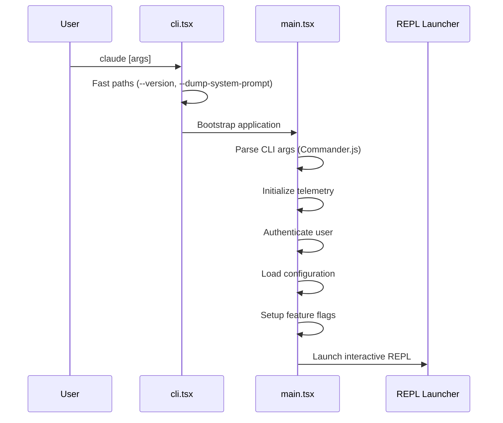

# 入口点

**源码**: `src/main.tsx` (4,683 行) 和 `src/entrypoints/cli.tsx`

## 引导流程

## CLI 入口 (`src/entrypoints/cli.tsx`)

最外层入口点处理：

- `--version` — 打印版本号并立即退出
- `--dump-system-prompt` — 输出系统提示词用于调试
- MCP 服务器模式 — 作为 MCP 服务器启动
- 守护进程工作模式 — 作为后台守护进程运行
- 默认 — 进入完整应用引导流程

## 主入口 (`src/main.tsx`)

主入口点（4,683 行）负责编排：

### 1. CLI 参数解析
使用 Commander.js 定义命令行接口，选项包括：
- 模型选择
- 权限模式
- 会话恢复
- 输出格式
- 特性标志覆盖

### 2. 服务初始化
- **遥测** — 分析和错误报告设置
- **认证** — API 密钥或 OAuth 令牌验证
- **配置** — 从 `~/.claude/` 加载设置
- **特性标志** — 评估编译时和运行时标志

### 3. REPL 启动
交互式读取-求值-打印循环通过 `src/replLauncher.tsx` 启动，初始化 React/Ink 渲染树并进入交互模式。

### 4. 命令执行
如果提供了特定命令（如 `claude commit`），命令注册表（`src/commands.ts`）会直接解析并执行，而不进入 REPL。

## 其他入口点

| 入口 | 路径 | 用途 |
|------|------|------|
| MCP 服务器 | `src/entrypoints/mcp.ts` | 作为 MCP 工具服务器运行 |
| 初始化 | `src/entrypoints/init.ts` | 首次初始化序列 |
| REPL 启动器 | `src/replLauncher.tsx` | 交互式 UI 引导 |
