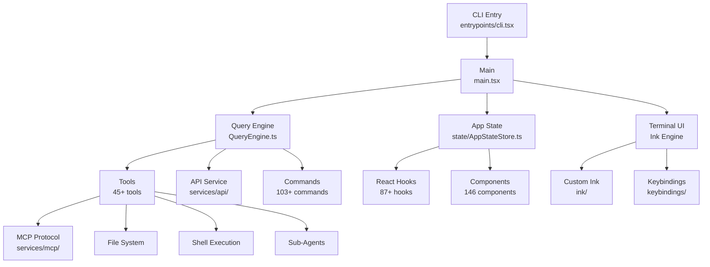

# 架构概述

Claude Code 是一个大型 TypeScript 应用，使用基于 React 的终端 UI。代码库在 `src/` 下组织为 39 个顶层模块。

## 高层架构

## 核心模块

| 模块 | 路径 | 描述 |
|------|------|------|
| 入口点 | `src/main.tsx` | CLI 解析、初始化、REPL 启动 |
| 查询引擎 | `src/QueryEngine.ts` | 核心 AI 查询执行和工具编排 |
| 状态 | `src/state/` | 中央应用状态（AppState，23K+ 行） |
| 终端 UI | `src/ink/` | 自定义 Ink 渲染引擎（50+ 文件） |
| 命令 | `src/commands/` | 103+ CLI 命令 |
| 工具 | `src/tools/` | 45+ 开发工具 |
| 服务 | `src/services/` | API、MCP、分析、LSP、OAuth |
| Hooks | `src/hooks/` | 87+ React hooks |
| 组件 | `src/components/` | 146 个 React 终端 UI 组件 |
| 工具函数 | `src/utils/` | 298+ 工具模块 |

## 数据流

1. 用户输入由基于 Ink 的终端 UI 捕获
2. 输入由查询引擎处理，发送到 Claude API
3. AI 响应可能包含工具调用，由工具系统执行
4. 工具结果反馈给 AI 进行进一步处理
5. 最终输出通过 Ink 渲染管线呈现
6. 状态变更通过 AppState 集中管理

## 关键设计决策

- **自定义 Ink 引擎**：对 Ink 的 fork/重新实现，以精确控制终端渲染
- **特性标志**：编译时代码消除，为不同功能集生成不同构建
- **MCP 协议**：通过 Model Context Protocol 标准实现扩展性
- **React 状态模型**：集中式 AppState 配合 hooks 供组件访问
