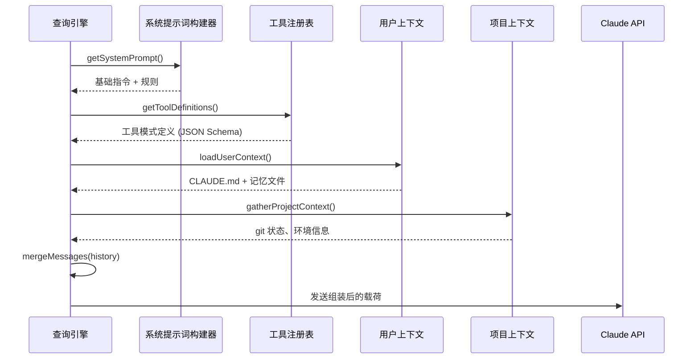
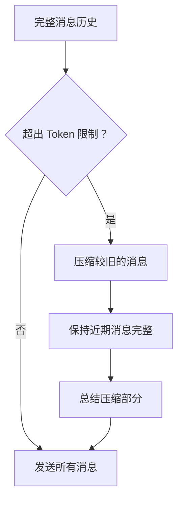

# 上下文组装

**源码**：`src/query.ts` — `assembleContext()` 及相关函数

## 概述

在每次 API 调用之前，查询引擎会从多个来源组装丰富的上下文载荷。这个过程决定了 Claude 在每一轮对话中"知道"什么——系统提示词、可用工具、对话历史和项目特定的上下文。

## 组装流程



## 系统提示词构成

系统提示词不是一个静态字符串——它由多个层级动态组合而成：

```
┌─────────────────────────────┐
│  基础系统提示词               │  ← src/constants/systemPrompt.ts
│  (核心 Agent 指令)            │
├─────────────────────────────┤
│  工具指令                     │  ← 每个工具的使用指南
├─────────────────────────────┤
│  项目上下文                   │  ← CLAUDE.md, .claude/ 配置
├─────────────────────────────┤
│  环境信息                     │  ← 操作系统、Shell、Git 分支、工作目录
├─────────────────────────────┤
│  活跃特性                     │  ← 特性标志、实验功能
└─────────────────────────────┘
```

每个层级根据当前会话状态和配置条件性地被包含。

## 工具定义注入

工具使用 JSON Schema 参数定义进行注册。在上下文组装过程中：

1. **过滤** — 仅包含当前权限模式下可用的工具
2. **转换** — 将内部工具规格转换为 Claude API 格式
3. **标注** — 添加缓存控制标记以优化提示缓存
4. **排序** — 将常用工具放在前面以提高缓存效率

## 用户上下文加载

用户上下文文件通过优先级链加载：

| 来源 | 优先级 | 作用域 |
|------|--------|--------|
| `~/.claude/CLAUDE.md` | 1（最低） | 全局 |
| 项目根目录 `CLAUDE.md` | 2 | 项目级 |
| `.claude/settings.json` | 3 | 项目配置 |
| 记忆文件 (`~/.claude/memory/`) | 4（最高） | 会话持久化 |

文件在会话开始时读取并缓存。会话期间的变更通过文件监听器检测。

## 消息历史管理

对话历史需要仔细管理以保持在上下文限制之内：



关键行为：
- 近期消息永远不会被压缩——它们包含活跃上下文
- 工具结果在消息文本之前被截断
- 系统提醒在压缩边界处被注入

## 缓存控制策略

上下文组装会为特定内容块标记 `cache_control` 以利用 Claude 的提示缓存：

- 系统提示词 → 缓存（很少变化）
- 工具定义 → 缓存（会话内静态不变）
- 用户上下文 → 缓存（变化不频繁）
- 对话历史 → 不缓存（每轮都会变化）

这可以在后续轮次中将缓存内容的 API 成本降低高达 90%。

## 设计模式

- **构建器模式** — 上下文通过构建器链逐步组装
- **优先级链** — 多个上下文来源按优先级合并解析
- **延迟加载** — 项目上下文仅在需要时获取，不进行预计算

## 相关页面

- [概述](./index) — 查询引擎概述
- [流式处理管道](./streaming-pipeline) — 上下文发送到 API 后的处理流程
