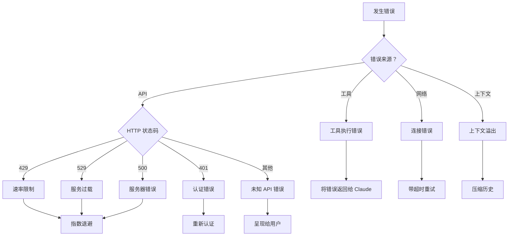
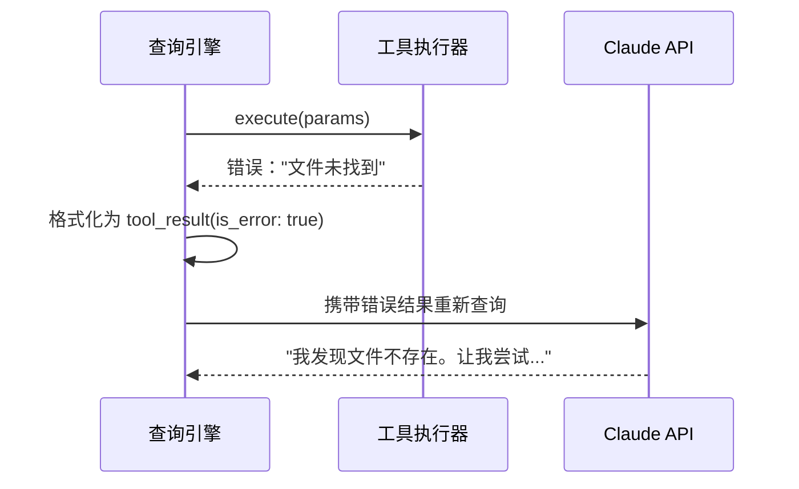
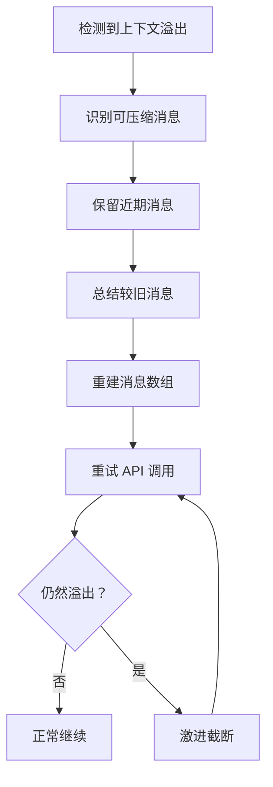

# 错误恢复

**源码**：`src/query.ts` — 错误处理和 `src/services/claude.ts` — API 错误分类

## 概述

查询引擎在多个层级处理错误——API 故障、速率限制、工具执行错误和上下文溢出。恢复策略因错误类型而异，目标是尽可能维持对话流程的连续性。

## 错误分类



## API 错误处理

### 速率限制 (429 / 529)

速率限制错误触发指数退避重试策略：

```typescript
// 简化的重试逻辑
const retryDelays = [1000, 2000, 4000, 8000, 16000]; // 毫秒

async function retryWithBackoff(fn, maxRetries = 5) {
  for (let i = 0; i < maxRetries; i++) {
    try {
      return await fn();
    } catch (err) {
      if (!isRetryable(err)) throw err;
      const delay = retryDelays[i] + jitter();
      await sleep(delay);
    }
  }
  throw new MaxRetriesError();
}
```

关键行为：
- 存在 `Retry-After` 头时会尊重该值
- 随机抖动防止惊群效应
- 用户在退避期间会看到"重试中..."提示
- 超过最大重试次数后，错误会呈现给用户

### 认证错误 (401)

认证失败会触发：
1. Token 刷新尝试（OAuth 流程）
2. 如果刷新失败，提示用户重新认证
3. 会话状态被保留以便认证后重试

### 服务器错误 (500)

服务器错误被视为瞬态故障，使用退避策略重试。对话状态在重试期间被保留。

## 工具执行错误

当工具失败时，错误**不是**致命的——它成为对话的一部分：



这是一个关键的设计决策：工具错误是**传递给 Claude 的信息**，而不是程序崩溃。Claude 可以：
- 尝试替代方案
- 向用户请求澄清
- 跳过失败的操作继续执行

## 上下文溢出恢复

当对话超出上下文窗口时：



压缩优先级（优先移除的内容）：
1. 大型工具结果（文件内容、命令输出）
2. 较旧的助手消息
3. 较旧的用户消息
4. 系统上下文（最后手段）

## 网络错误恢复

连接故障（超时、DNS 错误等）的处理方式：

- 对瞬态错误立即重试
- 重试前进行连接健康检查
- 向用户显示优雅降级消息
- 保留会话状态

## 错误边界

查询引擎使用错误边界防止级联故障：

| 边界 | 捕获的错误 | 恢复方式 |
|------|-----------|----------|
| API 调用 | HTTP 错误、超时 | 带退避重试 |
| 工具执行 | 运行时错误、崩溃 | 将错误返回给 Claude |
| 流处理 | 解析错误、格式异常事件 | 跳过事件，继续处理流 |
| 上下文组装 | 文件读取错误、配置缺失 | 使用默认值，警告用户 |

## 面向用户的错误消息

错误被转换为用户友好的消息：

- 技术细节会被记录日志但不展示
- 尽可能提供可操作的建议
- 用户始终能知道发生了什么错误以及下一步该怎么做

## 设计模式

- **断路器** — 重复失败会触发冷却期，防止 API 滥用
- **优雅降级** — 非关键路径中的错误不会导致会话崩溃
- **错误即数据** — 工具错误成为对话上下文，而非异常

## 相关页面

- [概述](./index) — 查询引擎概述
- [工具调用循环](./tool-call-loop) — 产生工具错误的循环
- [流式处理管道](./streaming-pipeline) — 流级别的错误处理
