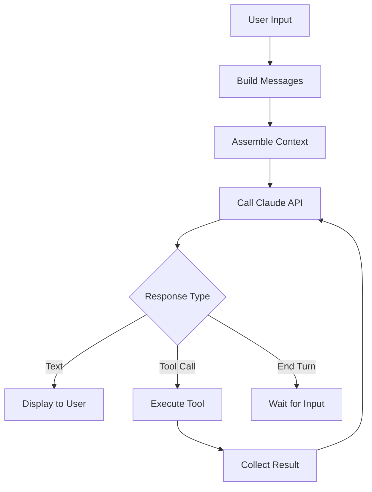

# 查询引擎

**源码**: `src/QueryEngine.ts` (1,295 行) 和 `src/query.ts` (1,729 行)

查询引擎是管理用户、Claude AI 和工具之间对话循环的核心编排层。

## 职责

1. **消息管理** — 构建和维护对话历史
2. **API 通信** — 以流式方式向 Claude API 发送查询
3. **工具调用处理** — 执行 AI 响应中的工具调用并将结果反馈
4. **上下文组装** — 收集系统提示词、用户上下文和工具定义
5. **错误恢复** — 处理 API 错误、速率限制和工具失败

## 查询生命周期

## 上下文组装

查询引擎从多个来源组装上下文：

- **系统提示词** — Claude 的基础指令（来自 `src/constants/`）
- **用户上下文** — CLAUDE.md 文件、记忆文件
- **工具定义** — 可用工具及其 JSON Schema
- **对话历史** — 会话中的先前消息
- **项目上下文** — Git 状态、文件结构、环境信息

## 流式传输

Claude API 的响应逐 token 流式传输。查询引擎处理流式事件以：

- 实时渲染部分文本响应
- 检测流式传输中的工具调用块
- 跟踪 token 使用量以估算成本
- 处理停止原因（end_turn、tool_use、max_tokens）

## 工具调用循环

当 AI 响应包含工具调用时：

1. 从响应中解析工具调用参数
2. 检查权限（可能提示用户）
3. 执行工具
4. 收集结果（成功或错误）
5. 将工具结果追加到对话中
6. 使用更新后的对话重新查询 API

此循环持续进行，直到 AI 产生不含工具调用的最终文本响应。

## 关键类型

查询系统使用在 `src/types/message.ts` 中定义的类型：

- `UserMessage` — 用户文本输入
- `AssistantMessage` — AI 响应（文本和/或工具调用）
- `SystemMessage` — 系统级上下文
- `ProgressMessage` — 工具执行进度更新

## 深入阅读

- [上下文组装](./context-assembly) — 系统 prompt、工具和用户上下文如何组装为单一 API 调用
- [流式处理管道](./streaming-pipeline) — 逐 token 流式传输、事件分派和停止原因处理
- [工具调用循环](./tool-call-loop) — 完整的权限检查 → 执行 → 收集 → 重新查询循环
- [错误恢复](./error-recovery) — API 错误处理、速率限制、重试逻辑和工具失败恢复
