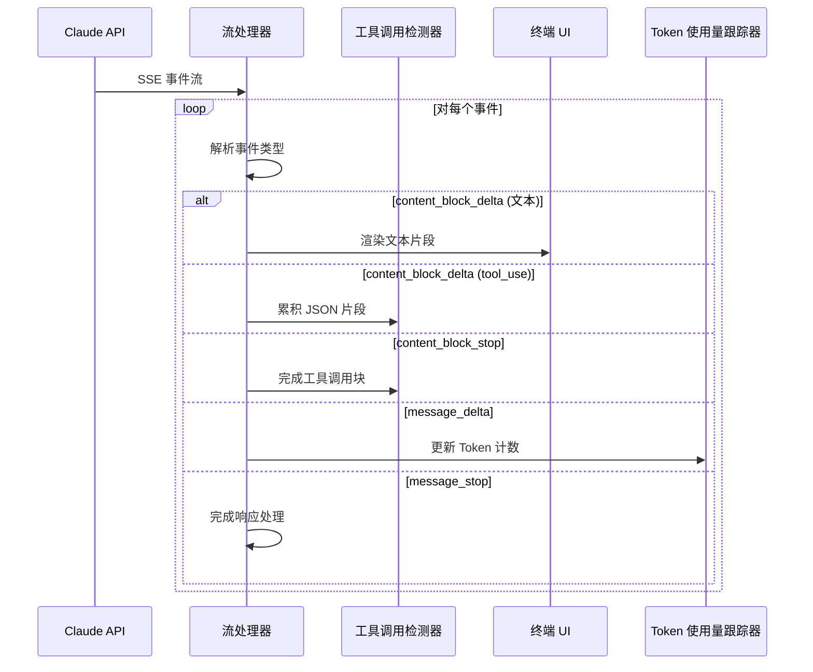
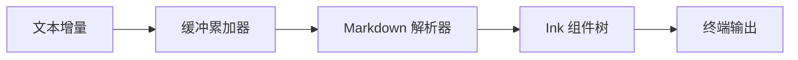
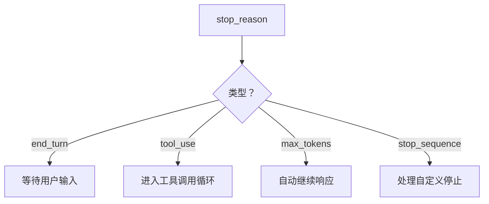

# 流式处理管道

**源码**：`src/query.ts` — 流式事件处理器和 `src/services/claude.ts`

## 概述

Claude Code 将 API 响应作为实时流进行处理，而不是等待完整响应。这使得即时文本渲染、渐进式工具调用检测和响应式取消操作成为可能——对于交互式终端 Agent 而言至关重要。

## 流事件处理流程



## 事件类型

Claude API 发送的 Server-Sent Events (SSE) 包含以下关键事件类型：

| 事件 | 用途 | 处理器动作 |
|------|------|------------|
| `message_start` | 开始新响应 | 初始化响应缓冲区 |
| `content_block_start` | 新的文本或工具块 | 创建块累加器 |
| `content_block_delta` | 增量内容 | 追加到当前块 |
| `content_block_stop` | 块完成 | 完成并分发 |
| `message_delta` | 停止原因 + 用量 | 记录停止原因 |
| `message_stop` | 响应完成 | 触发后处理 |

## 文本渲染管道

文本增量在到达终端之前会经过一个渲染管道：



关键行为：
- 文本会短暂缓冲，以避免在快速增量时过度重新渲染
- Markdown 以增量方式解析——部分加粗/代码块可以优雅地处理
- Ink 渲染引擎批量更新以减少终端闪烁

## 工具调用检测

工具调用作为增量 JSON 片段出现在 `content_block_delta` 事件中：

1. **累积** — JSON 片段被拼接到缓冲区
2. **类型检测** — `content_block_start` 标识该块为 `tool_use` 类型
3. **参数解析** — 当 `content_block_stop` 触发时，完整 JSON 被解析
4. **校验** — 参数根据工具的 JSON Schema 进行校验
5. **分发** — 有效的工具调用进入[工具调用循环](./tool-call-loop)

```typescript
// 简化的工具调用累加器
interface ToolCallAccumulator {
  id: string;
  name: string;
  inputJson: string; // 累积的 JSON 片段
}
```

## 停止原因

`message_delta` 事件携带一个 `stop_reason`，决定接下来的操作：



- `end_turn` — Claude 自然完成了响应
- `tool_use` — Claude 想要执行一个或多个工具
- `max_tokens` — 响应达到 Token 限制；可能需要继续
- `stop_sequence` — 触发了配置的停止序列

## Token 使用量跟踪

每个响应都包含 Token 使用量数据，用于：

- **成本估算** — 向用户显示运行成本
- **上下文窗口管理** — 确定何时需要压缩历史
- **缓存命中跟踪** — 监控提示缓存的有效性

```typescript
interface TokenUsage {
  input_tokens: number;
  output_tokens: number;
  cache_creation_input_tokens: number;
  cache_read_input_tokens: number;
}
```

## 取消操作

用户可以使用 Ctrl+C 取消流式响应：

1. SSE 连接被中止
2. 部分文本保留在对话历史中
3. 任何进行中的工具调用被丢弃
4. 会话返回输入模式

## 设计模式

- **观察者模式** — 流事件被分发到多个处理器（UI、Token 跟踪器、工具检测器）
- **累加器模式** — 部分 JSON 片段被累积直至完整
- **背压** — 文本渲染缓冲增量数据以防止终端过载

## 相关页面

- [概述](./index) — 查询引擎概述
- [上下文组装](./context-assembly) — 流开始之前的准备工作
- [工具调用循环](./tool-call-loop) — 检测到工具调用后的处理流程
