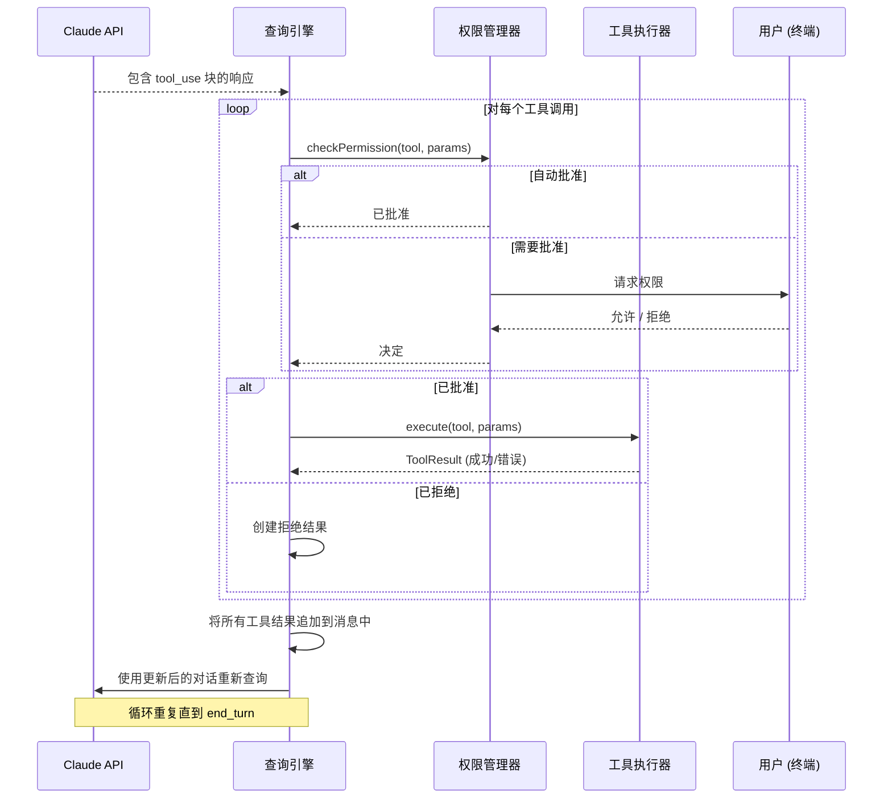
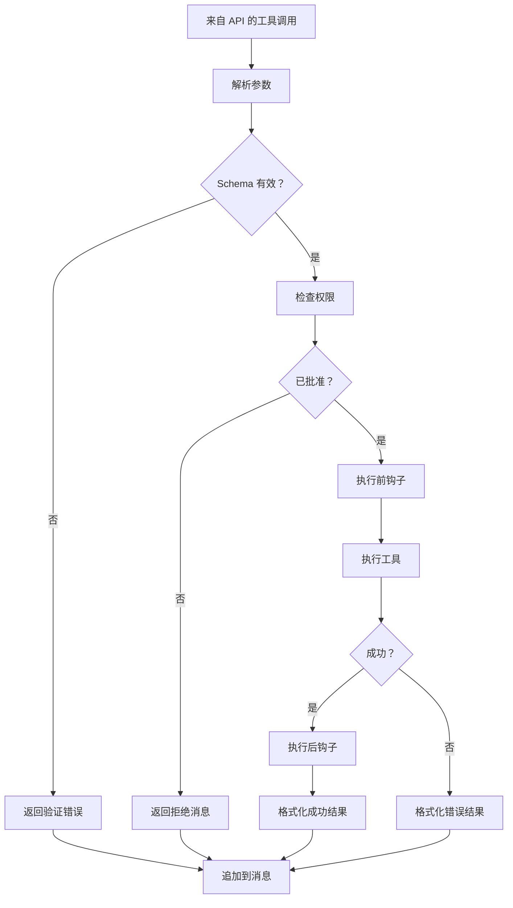

# 工具调用循环

**源码**：`src/query.ts` — 主循环和 `src/tools/` — 工具执行

## 概述

工具调用循环是 Claude Code Agent 行为的核心。当 Claude 的响应包含工具调用时，该循环负责权限检查、执行、结果收集和重新查询——不断重复直到 Claude 产生最终的文本响应。

## 完整循环序列



## 工具执行管道

每个工具调用经过多阶段管道处理：



## 并发模型

Claude Code 使用**单写/多读**模型进行工具执行：

- **写工具**（Edit、Write、Bash）顺序执行——同一时间只执行一个
- **读工具**（Read、Glob、Grep）可以并行执行
- 当一个响应中包含多个工具调用时，它们会被批量处理：

```
响应包含：[Read A, Read B, Edit C, Read D]
执行顺序：
  1. Read A + Read B（并行）  ← 读工具批量执行
  2. Edit C（顺序）           ← 写工具等待
  3. Read D（顺序）           ← 在写操作之后
```

## 工具结果格式

工具结果作为 `tool_result` 内容块追加到对话中：

```typescript
interface ToolResult {
  type: "tool_result";
  tool_use_id: string;  // 匹配工具调用 ID
  content: string | ContentBlock[];
  is_error?: boolean;
}
```

关键行为：
- 成功结果包含工具的输出（文件内容、命令输出等）
- 错误结果包含带有 `is_error: true` 的错误消息
- 大型结果会被截断以防止上下文溢出
- 二进制输出（图片）编码为 base64 内容块

## 重新查询决策

收集所有工具结果后，查询引擎必须决定是否重新查询：

| 停止原因 | 动作 |
|----------|------|
| `tool_use` | 始终携带工具结果重新查询 |
| `end_turn` | 停止——已收到最终响应 |
| `max_tokens` | 重新查询以继续响应 |

## 循环终止

循环在以下情况下终止：
1. Claude 以 `end_turn` 响应且没有工具调用
2. 用户使用 Ctrl+C 取消
3. 发生不可恢复的错误
4. 达到最大迭代次数限制（安全保护）

## 性能优化

- **提示缓存** — 工具结果不会使缓存的系统提示词失效
- **并行读取** — 多个只读工具同时执行
- **流式重新查询** — 工具结果就绪后立即开始下一次 API 流式调用
- **结果截断** — 大型工具输出被智能截断

## 设计模式

- **命令模式** — 每个工具调用是一个封装了执行/结果的命令
- **管道模式** — 工具调用流经 解析 → 校验 → 授权 → 执行 → 格式化
- **批处理** — 来自同一响应的多个工具调用按类型分组以优化执行

## 相关页面

- [概述](./index) — 查询引擎概述
- [流式处理管道](./streaming-pipeline) — 流中如何检测工具调用
- [错误恢复](./error-recovery) — 工具失败时的处理
