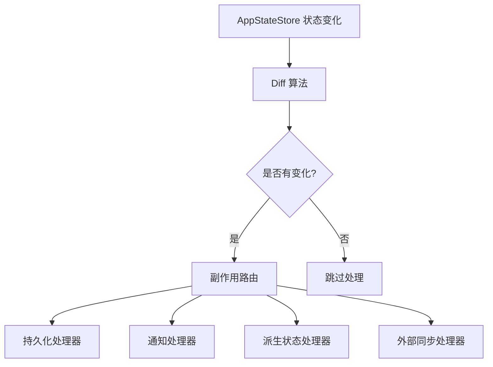
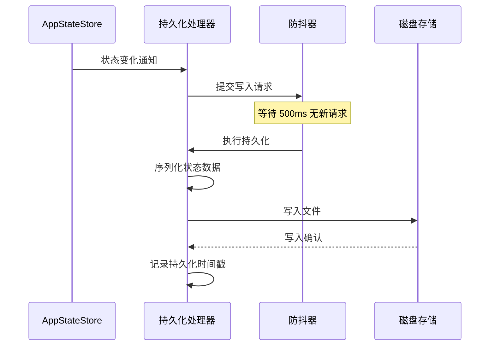

# 变化检测

**源码**: `src/state/onChangeAppState.ts`

## 概述

`onChangeAppState` 实现了一套响应状态变化的副作用系统。当 `AppStateStore` 中的状态发生变更时，该系统通过对比新旧状态差异，有选择性地触发持久化、通知和外部同步等副作用操作。

## 变化检测管道



## 处理器注册

副作用处理器在应用初始化时注册，每个处理器声明其关注的状态路径：

```typescript
registerChangeHandler({
  // 监听的状态路径
  paths: ["messages", "tasks"],
  // 处理函数
  handler: (newState, prevState) => {
    // 仅在 messages 或 tasks 变化时调用
  },
  // 可选：防抖配置
  debounce: 500,
});
```

这种声明式注册机制使处理器与 store 保持松耦合。新增副作用只需注册新处理器，无需修改 store 代码。

## Diff 算法

变化检测使用高效的浅比较策略：

1. **顶层属性比较** — 比较状态对象的顶层属性引用
2. **路径匹配** — 仅检查已注册处理器关注的路径
3. **引用相等性** — 使用 `===` 判断，利用不可变更新模式确保变化的切片产生新引用

```typescript
function detectChanges(newState, prevState, paths) {
  return paths.filter((path) => newState[path] !== prevState[path]);
}
```

## 副作用分类

| 类别 | 描述 | 示例 |
|------|------|------|
| 持久化 | 将状态保存到磁盘 | 对话历史写入文件系统 |
| 通知 | 触发用户通知 | 任务完成提示 |
| 派生状态 | 计算并更新依赖状态 | 从消息列表派生未读计数 |
| 外部同步 | 与外部服务同步 | 分析数据上报 |

## 持久化流程



持久化处理器将关键状态写入磁盘，以便应用重启后恢复。并非所有状态都需要持久化 — 仅保存对话历史、权限决策等长期数据。

## 防抖

高频状态更新（如流式消息接收）会触发频繁的变化通知。防抖机制合并短时间内的多次变化，避免过度的 I/O 操作：

```typescript
// 防抖配置
const PERSIST_DEBOUNCE_MS = 500;    // 持久化延迟
const SYNC_DEBOUNCE_MS = 1000;      // 外部同步延迟
const NOTIFY_DEBOUNCE_MS = 100;     // 通知延迟
```

不同类别的副作用使用不同的防抖时间：
- **持久化** — 500ms，平衡数据安全与 I/O 性能
- **外部同步** — 1000ms，减少网络请求频率
- **通知** — 100ms，保证用户感知的即时性

## 错误处理

副作用执行过程中的错误被隔离处理，不会影响主状态流：

- 单个处理器失败不会阻止其他处理器执行
- 持久化失败会触发重试机制
- 错误被记录到日志系统供后续排查
- 关键错误（如磁盘空间不足）会触发用户通知

## 设计模式

- **观察者模式** — 处理器观察状态变化并做出响应
- **发布/订阅模式** — 处理器通过路径声明订阅特定状态切片
- **防抖模式** — 合并高频变化，控制副作用执行频率

## 相关页面

- [Store 架构](./store-architecture) — 触发变化检测的状态 store
- [React 集成](./react-integration) — 另一个主要的状态变化消费者
- [选择器](./selectors) — 派生状态计算的详细设计
