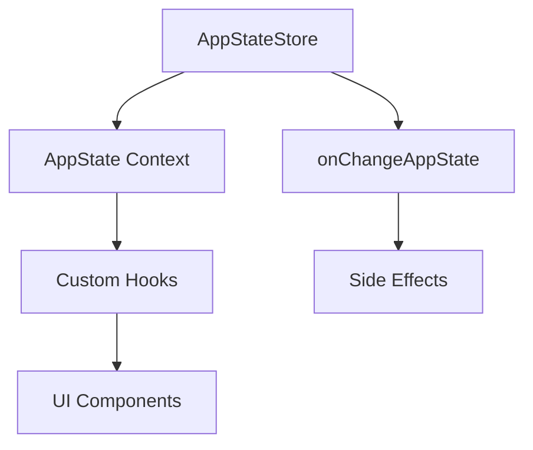

# 状态管理

**源码**: `src/state/AppState.tsx` (23,480 行) 和 `src/state/AppStateStore.ts` (21,847 行)

## 概述

Claude Code 使用基于 React context 和自定义 store 实现的集中式状态管理模式。`AppState` 是代码库中最大的模块之一。

## 架构



## AppStateStore

中央 store（`src/state/AppStateStore.ts`）管理：

- **消息** — 完整的对话历史
- **任务** — 后台任务状态和进度
- **代理** — 子代理定义和状态
- **权限** — 工具权限决策
- **通知** — 用户通知队列
- **覆盖层** — 模态框和覆盖层状态
- **UI 状态** — 侧边栏、输入焦点、滚动位置

## React 集成

`AppState.tsx` 将 store 包装在 React context provider 中：

```
AppStateProvider
  └── 提供 AppState context
      └── 通过 useAppState() hook 消费
```

组件通过自定义 hooks 访问状态，而不是直接读取 store。这种模式确保状态变化时 React 正确重新渲染。

## 变化检测

`src/state/onChangeAppState.ts` 实现了变化检测系统，在特定状态属性变化时触发副作用。用于：

- 将状态持久化到磁盘
- 触发通知
- 更新派生状态
- 与外部服务同步

## 关键状态切片

| 切片 | 描述 |
|------|------|
| `messages` | 对话历史（用户、助手、系统消息） |
| `tasks` | 后台任务（bash、代理、远程会话） |
| `permissions` | 工具权限缓存和待审批项 |
| `agents` | 子代理定义及其状态 |
| `notifications` | 通知队列和显示状态 |
| `overlays` | 模态对话框、菜单和覆盖层 |

## 选择器

`src/state/selectors.ts` 提供记忆化的选择器，用于从状态派生计算值，避免渲染周期中不必要的重复计算。

## 深入阅读

- [Store 架构](./store-architecture) — AppStateStore 内部结构、切片组织和 mutation 模式
- [React 集成](./react-integration) — Context providers、useAppState hook 和重新渲染优化
- [变化检测](./change-detection) — onChangeAppState 系统、副作用触发和持久化
- [选择器](./selectors) — 记忆化选择器、派生状态计算和性能模式
