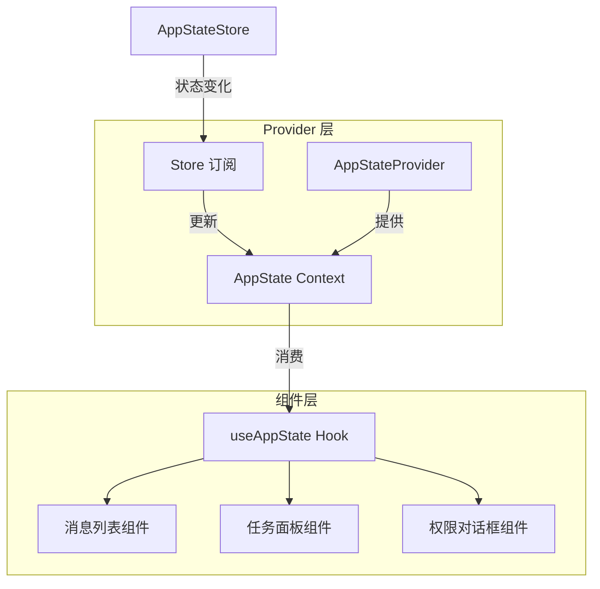
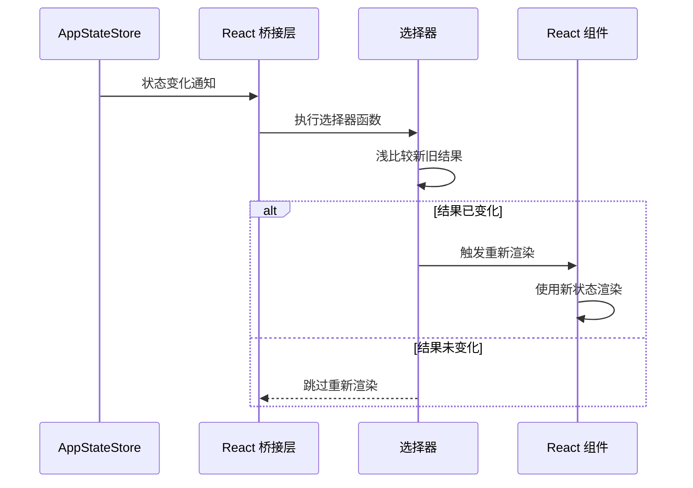

# React 集成

**源码**: `src/state/AppState.tsx` (23,480 行)

## 概述

`AppState.tsx` 是连接命令式 `AppStateStore` 与声明式 React 组件树的桥接层。它通过 Context Provider 将 store 状态暴露给组件，并利用选择性订阅和浅比较等策略优化重新渲染性能。

## Provider 架构



## Context 结构

`AppState.tsx` 定义了多个 Context，将相关状态分组以减少不必要的重新渲染：

```typescript
// 核心状态 context
const AppStateContext = createContext<AppState>(initialState);

// 操作 context（分离以避免重新渲染）
const AppDispatchContext = createContext<AppDispatch>(initialDispatch);
```

将状态与操作（dispatch）分离到不同的 context 中，使得仅调用操作的组件不会因状态变化而重新渲染。

## useAppState Hook

`useAppState` 是组件访问状态的主要接口：

```typescript
function MessageList() {
  const { messages } = useAppState((state) => ({
    messages: state.messages,
  }));

  return <>{messages.map(renderMessage)}</>;
}
```

该 Hook 接受一个选择器函数，仅在选中的状态片段变化时触发组件重新渲染。

## 重新渲染优化



核心优化策略：

| 策略 | 说明 |
|------|------|
| 选择性订阅 | 组件仅订阅所需的状态切片 |
| 浅比较 | 使用 `shallowEqual` 比较选择器结果，避免引用变化触发的假更新 |
| 记忆化 | 选择器结果被缓存，相同输入返回相同引用 |
| Context 分割 | 状态和操作使用独立 context，减少无关重新渲染 |

## Hook 组合

常见的 Hook 组合模式用于构建复杂的状态消费逻辑：

```typescript
function TaskPanel() {
  // 组合多个状态切片
  const { tasks, activeTaskId } = useAppState((state) => ({
    tasks: state.tasks,
    activeTaskId: state.ui.activeTaskId,
  }));

  // 使用 dispatch context 发送操作
  const dispatch = useAppDispatch();

  const activeTask = useMemo(
    () => tasks.get(activeTaskId),
    [tasks, activeTaskId]
  );

  return <TaskDetail task={activeTask} onCancel={() => dispatch.cancelTask(activeTaskId)} />;
}
```

## 性能考量

- **避免在选择器中创建新对象** — 每次返回新引用会导致不必要的重新渲染
- **使用稳定的选择器函数** — 在组件外部定义选择器或使用 `useCallback` 包装
- **拆分大型组件** — 将需要不同状态切片的逻辑拆分到子组件中
- **批量更新** — 多个连续的 store mutations 会被 React 批量处理为单次渲染

## 设计模式

- **Provider 模式** — 通过 React Context 向组件树注入状态
- **Hook 组合模式** — 通过组合 hooks 构建复杂的状态消费逻辑
- **派生状态模式** — 选择器从原始状态计算派生值，避免冗余存储

## 相关页面

- [Store 架构](./store-architecture) — 底层 store 的内部实现
- [选择器](./selectors) — 记忆化选择器的详细设计
- [变化检测](./change-detection) — 状态变化后的副作用系统
