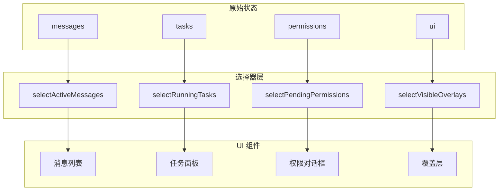
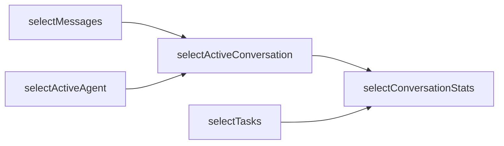

# 选择器

**源码**: `src/state/selectors.ts`

## 概述

选择器是一组记忆化函数，负责从 `AppStateStore` 的原始状态中派生计算值。它们通过缓存计算结果避免重复运算，是连接原始状态与 UI 组件之间的高效数据转换层。

## 选择器架构



## 为何需要选择器

直接在组件中计算派生值存在以下问题：

- **重复计算** — 多个组件可能执行相同的计算逻辑
- **引用不稳定** — 每次计算生成新的对象/数组引用，触发不必要的重新渲染
- **逻辑分散** — 业务逻辑散落在各组件中，难以维护和测试

选择器通过集中定义和记忆化缓存解决这些问题。

## 选择器组合

复杂选择器可以组合简单选择器构建：



```typescript
// 基础选择器
const selectMessages = (state: AppState) => state.messages;
const selectActiveAgent = (state: AppState) => state.agents.find((a) => a.active);

// 组合选择器
const selectActiveConversation = createSelector(
  [selectMessages, selectActiveAgent],
  (messages, agent) => messages.filter((m) => m.agentId === agent?.id)
);

// 更高层的组合
const selectConversationStats = createSelector(
  [selectActiveConversation, selectTasks],
  (messages, tasks) => ({
    messageCount: messages.length,
    toolCalls: messages.filter((m) => m.type === "tool_use").length,
    activeTasks: tasks.filter((t) => t.status === "running").size,
  })
);
```

## 常用选择器

| 选择器 | 输入 | 输出 |
|--------|------|------|
| `selectActiveMessages` | `messages` | 过滤系统消息后的活跃对话 |
| `selectRunningTasks` | `tasks` | 当前正在执行的任务列表 |
| `selectPendingPermissions` | `permissions` | 等待用户批准的权限请求 |
| `selectVisibleOverlays` | `overlays` | 当前可见的模态框和覆盖层 |
| `selectConversationTokens` | `messages` | 当前对话的 token 使用量估算 |
| `selectToolResults` | `messages` | 从消息中提取的工具执行结果 |

## 记忆化策略

选择器使用 `createSelector` 模式实现记忆化：

```typescript
function createSelector<TInput, TResult>(
  inputSelectors: Array<(state: AppState) => TInput>,
  resultFn: (...inputs: TInput[]) => TResult
): (state: AppState) => TResult {
  let lastInputs: TInput[];
  let lastResult: TResult;

  return (state: AppState) => {
    const inputs = inputSelectors.map((sel) => sel(state));
    // 输入未变化时直接返回缓存结果
    if (lastInputs && shallowEqual(inputs, lastInputs)) {
      return lastResult;
    }
    lastInputs = inputs;
    lastResult = resultFn(...inputs);
    return lastResult;
  };
}
```

记忆化的核心要点：
- **输入比较** — 使用浅比较检测输入选择器的结果是否变化
- **缓存大小** — 默认仅缓存最近一次的结果（缓存大小为 1）
- **引用稳定** — 输入不变时返回完全相同的引用，避免下游重新渲染

## 性能影响

选择器对整体性能的影响：

- **减少渲染次数** — 记忆化确保仅在实际数据变化时触发重新渲染
- **降低计算开销** — 避免在每个渲染周期中重复执行复杂计算
- **优化内存使用** — 共享计算结果，避免每个组件维护独立副本
- **提升响应速度** — 缓存命中时近乎零成本获取结果

## 设计模式

- **记忆化模式** — 缓存函数结果，相同输入返回相同输出
- **选择器模式** — 定义可复用的状态查询函数
- **派生状态模式** — 从原始状态计算而非冗余存储

## 相关页面

- [Store 架构](./store-architecture) — 选择器读取的原始状态来源
- [React 集成](./react-integration) — 选择器在 useAppState hook 中的使用
- [变化检测](./change-detection) — 派生状态更新的另一种机制
