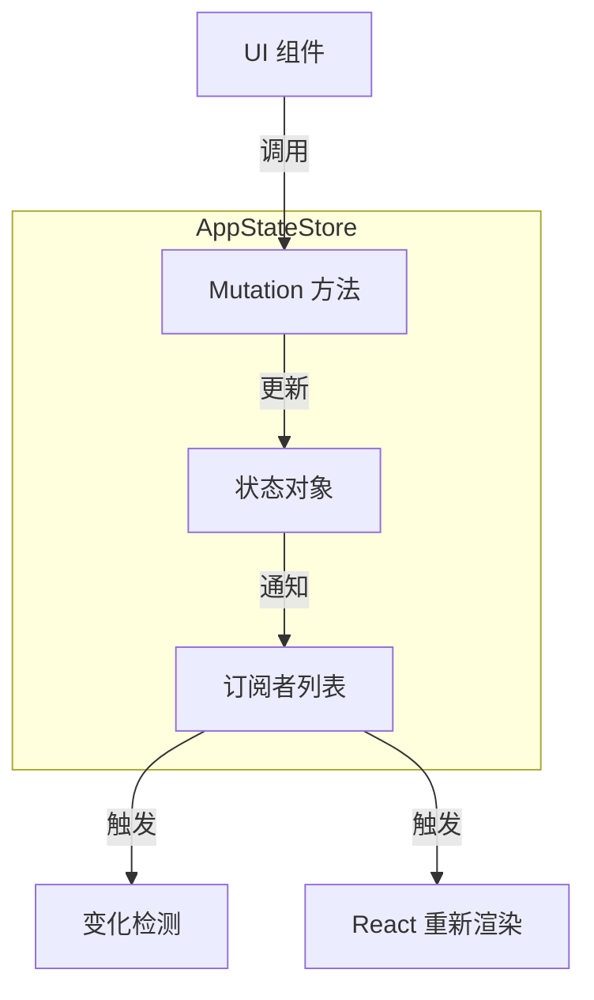
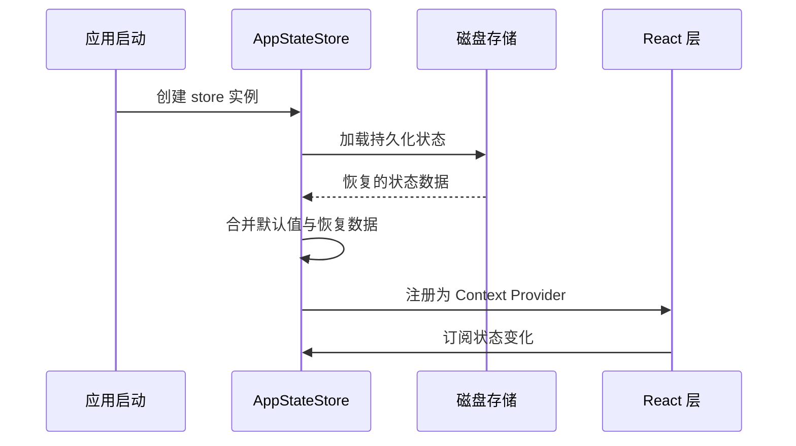

# Store 架构

**源码**: `src/state/AppStateStore.ts` (21,847 行)

## 概述

`AppStateStore` 是 Claude Code 的核心状态容器。它采用命令式 store 模式，通过直接方法调用执行 mutations，并通过订阅机制通知变化。该 store 独立于 React 运行，由 `AppState.tsx` 负责桥接到 React 生态系统。

## 内部结构



## 状态形状

Store 维护一个类型化的状态对象：

```typescript
interface AppState {
  messages: Message[];
  tasks: Map<string, Task>;
  agents: AgentDefinition[];
  permissions: PermissionCache;
  notifications: Notification[];
  overlays: OverlayState;
  ui: UIState;
  // ... 其他切片
}
```

## Mutation 模式

`AppStateStore` 使用直接方法调用进行状态变更，而非 Redux 风格的 action/reducer 模式：

```typescript
// 直接 mutation 方法
store.addMessage(message);
store.updateTask(taskId, updates);
store.setPermission(tool, decision);
```

每个 mutation 方法内部执行以下步骤：

1. 验证输入参数
2. 更新内部状态
3. 通知所有订阅者
4. 触发变化检测管道

## 切片组织

| 切片 | 职责 | 更新频率 |
|------|------|----------|
| `messages` | 对话历史记录 | 高 — 每次 LLM 响应 |
| `tasks` | 后台任务状态 | 中 — 任务生命周期事件 |
| `agents` | 子代理定义 | 低 — 会话初始化时 |
| `permissions` | 工具权限缓存 | 低 — 用户授权时 |
| `notifications` | 通知队列 | 中 — 系统事件 |
| `overlays` | 模态框/覆盖层 | 低 — 用户交互 |
| `ui` | 界面状态 | 高 — 用户交互 |

## 订阅模型

Store 实现了经典的观察者模式，允许多个消费者监听状态变化：

```typescript
// 订阅状态变化
const unsubscribe = store.subscribe((newState, prevState) => {
  // 对比新旧状态，执行相应逻辑
});

// 取消订阅
unsubscribe();
```

订阅者按注册顺序同步调用。关键订阅者包括：

- **React 桥接层** — 触发 context 更新和组件重新渲染
- **变化检测系统** — 执行副作用（持久化、通知等）
- **日志系统** — 记录状态变更用于调试

## 初始化流程



Store 在应用启动时创建单一实例，并尝试从磁盘恢复上一次会话的持久化状态。未找到持久化数据时使用默认初始值。

## 设计模式

- **单例模式** — 全局唯一 store 实例，确保状态一致性
- **观察者模式** — 订阅/通知机制解耦 store 与消费者
- **中介者模式** — Store 作为中介协调各状态切片之间的交互

## 相关页面

- [React 集成](./react-integration) — Store 如何桥接到 React
- [变化检测](./change-detection) — 状态变化后的副作用处理
- [选择器](./selectors) — 从原始状态派生计算值
