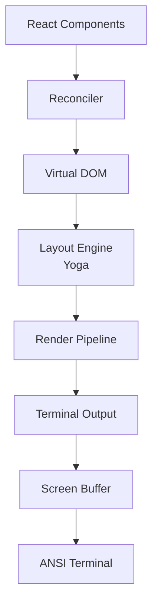

# 终端 UI

**源码**: `src/ink/`（50+ 文件）

Claude Code 使用基于 Ink（React for CLIs）的自定义终端 UI 引擎。`src/ink/` 目录包含用于构建丰富终端界面的完整渲染系统。

## 架构

## 核心组件

### 渲染器 (`ink/renderer.ts`)
主渲染协调器，管理 React reconciler 并触发布局/绘制周期。

### Reconciler (`ink/reconciler.ts`)
自定义 React reconciler，将 React 元素映射到终端 DOM 节点。

### DOM (`ink/dom.ts`)
终端元素的虚拟 DOM 实现。每个节点代表一个终端 UI 元素，具有文本内容、样式和布局约束等属性。

### 布局引擎 (`ink/layout/`)
- `engine.ts` — 布局计算协调器
- `yoga.ts` — 集成 Yoga（Facebook 的 flexbox 布局引擎）
- `geometry.ts` — 位置和尺寸计算
- `node.ts` — 布局节点抽象

### 渲染管线 (`ink/render-node-to-output.ts`、`ink/render-to-screen.ts`)
将布局后的 DOM 树转换为 ANSI 转义文本用于终端显示。

### 文本处理
- `wrap-text.ts` — 按终端宽度进行换行
- `measure-text.ts` — 文本尺寸测量
- `stringWidth.ts` — Unicode 感知的字符宽度计算
- `widest-line.ts` — 多行宽度计算

## 终端 I/O (`ink/termio/`)

低层终端通信：

- **ANSI 解析** — 解析输入中的 ANSI 转义序列
- **CSI** — 控制序列引导器处理
- **OSC** — 操作系统命令序列
- **SGR** — 选择图形再现（颜色、样式）
- **分词** — 输入流分词

## 功能特性

- **搜索高亮** (`searchHighlight.ts`) — 带高亮的文本搜索
- **选择** (`selection.ts`) — 文本选择支持
- **命中测试** (`hit-test.ts`) — 点击/光标位置映射
- **按键解析** (`parse-keypress.ts`) — 原始输入到按键事件的转换
