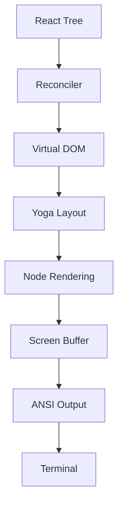

# Ink 渲染引擎

**源码**: `src/ink/`（50+ 文件）

## 概述

Claude Code 使用基于 Ink 的自定义渲染引擎作为终端 UI。这不是标准的 Ink 库 — 而是为 Claude Code 需求量身定制的全面重新实现。

## 渲染管线

## 核心模块

### Reconciler (`reconciler.ts`)
自定义 React reconciler，将 React 元素转换为终端 DOM 节点。

### 虚拟 DOM (`dom.ts`)
轻量级终端元素 DOM 实现，支持文本节点、盒子/框架元素和样式属性。

### 布局 (`layout/`)
- **engine.ts** — 布局计算协调器
- **yoga.ts** — Yoga flexbox 集成
- **geometry.ts** — 位置和尺寸计算
- **node.ts** — 布局树节点抽象

### 渲染
- **render-node-to-output.ts** — 将 DOM 节点转换为输出单元
- **render-to-screen.ts** — 组装单元到屏幕缓冲区
- **output.ts** — 最终输出组装

## 文本处理

| 模块 | 用途 |
|------|------|
| `wrap-text.ts` | 按终端宽度换行 |
| `measure-text.ts` | 文本尺寸测量 |
| `stringWidth.ts` | Unicode 感知的字符宽度 |
| `widest-line.ts` | 多行宽度计算 |

## 终端 I/O (`termio/`)

低层终端输入/输出：ANSI 解析、CSI、OSC、SGR（颜色/样式）、分词器。
