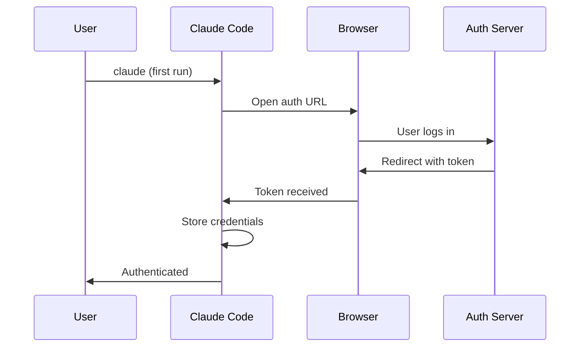

# OAuth 认证

**源码**: `src/services/oauth/`

## 概述

OAuth 服务处理 Claude Pro、Team 或 Enterprise 订阅用户的基于浏览器的认证流程。

## 流程

## 认证方式

| 方式 | 使用场景 |
|------|---------|
| API Key | 通过 `ANTHROPIC_API_KEY` 直接 API 访问 |
| OAuth | Claude Pro/Team/Enterprise 用户 |
| Bedrock | AWS Bedrock 凭证 |
| Vertex | Google Cloud 凭证 |

## 命令

- `/login` — 发起认证流程
- `/logout` — 清除存储的凭证
