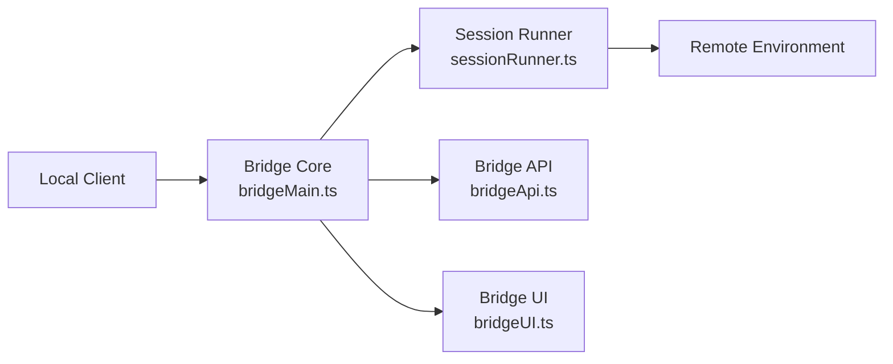

# 远程桥接

**源码**: `src/bridge/`（32 个文件）

## 概述

桥接系统支持远程会话管理，允许 Claude Code 将会话转发到云执行环境。此功能通过 `BRIDGE_MODE` 特性标志门控。

## 架构

## 关键文件

| 文件 | 用途 |
|------|------|
| `bridgeMain.ts` | 主桥接协调器 |
| `bridgeApi.ts` | 桥接通信 API |
| `createSession.ts` | 会话创建 |
| `sessionRunner.ts` | 会话执行管理 |
| `RemoteSessionManager.ts` | 远程会话生命周期 |

## 安全性

桥接实现了多层安全：

- **JWT 令牌**（`jwtUtils.ts`）— 会话认证
- **可信设备**（`trustedDevice.ts`）— 设备验证
- **工作密钥**（`workSecret.ts`）— 加密会话数据
- **HTTPS 传输** — 加密通信
