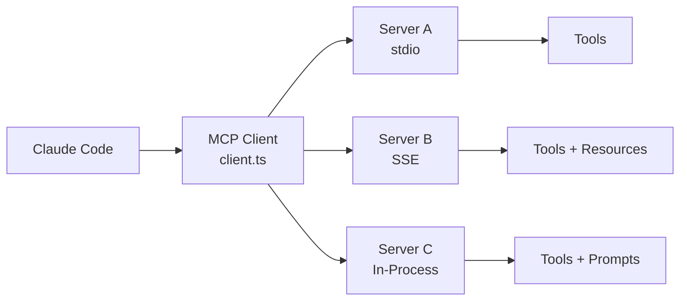

# MCP 集成

**源码**: `src/services/mcp/`（24 个文件）

## 概述

Model Context Protocol (MCP) 是 AI 工具互操作的开放标准。Claude Code 实现了完整的 MCP 客户端，连接到外部 MCP 服务器以扩展其工具能力。

## 架构



## 关键文件

| 文件 | 用途 |
|------|------|
| `client.ts` | 核心 MCP 客户端实现 |
| `config.ts` | 服务器配置加载 |
| `auth.ts` | 认证处理 |
| `channelPermissions.ts` | MCP 工具的权限管理 |
| `elicitationHandler.ts` | MCP 服务器的交互式提示 |

## 服务器配置

MCP 服务器在设置中定义：

```json
{
  "mcpServers": {
    "server-name": {
      "command": "npx",
      "args": ["-y", "@org/mcp-server"],
      "env": { "API_KEY": "..." }
    }
  }
}
```

## 能力

MCP 服务器可以提供：

- **Tools** — 带 JSON Schema 参数的可执行函数
- **Resources** — 可读数据源（文件、API、数据库）
- **Prompts** — 常见任务的预定义提示模板

## 连接生命周期

1. **发现** — 从设置加载服务器配置
2. **启动** — 启动服务器进程（或连接到运行中的服务器）
3. **握手** — 通过 MCP 协议交换能力
4. **注册** — 将服务器工具注册为可用的 Claude Code 工具
5. **执行** — 将工具调用转发到服务器，返回结果
6. **清理** — 退出时优雅关闭服务器
