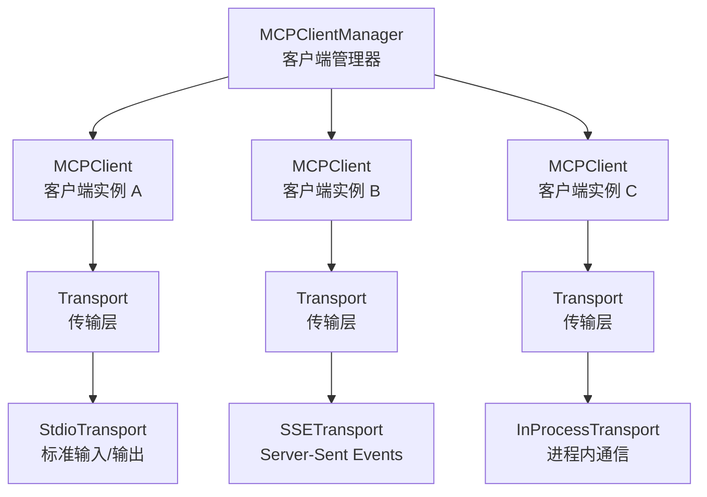
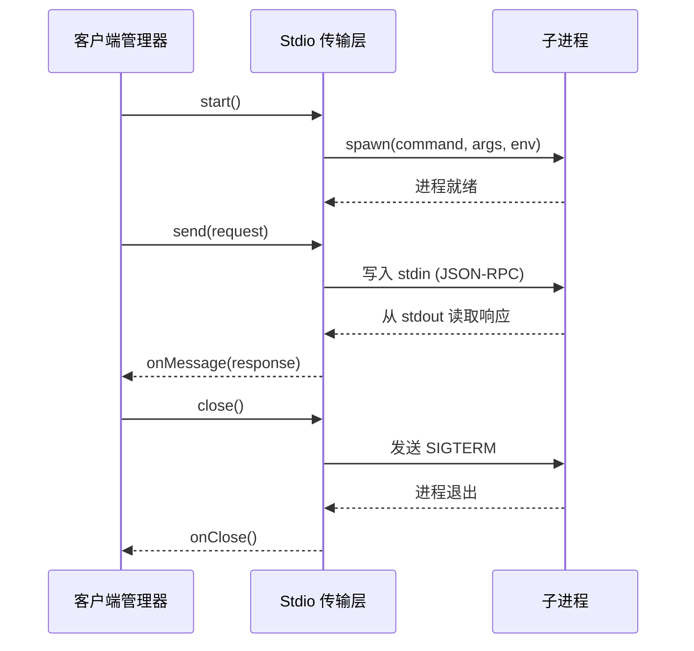

# 客户端架构

**源码**：`src/services/mcp/client.ts`

## 概述

MCP 客户端负责管理与多个 MCP 服务器的并发连接。它通过传输抽象层屏蔽底层通信细节，使上层代码无需关心每个服务器使用的具体传输协议。

## 客户端架构图



`MCPClientManager` 是顶层入口，维护所有活跃的 `MCPClient` 实例。每个 `MCPClient` 封装一个到 MCP 服务器的连接，通过统一的 `Transport` 接口进行通信。

## 传输抽象

所有传输类型都实现同一接口，提供统一的消息发送/接收语义：

```typescript
interface Transport {
  start(): Promise<void>;
  send(message: JSONRPCMessage): Promise<void>;
  close(): Promise<void>;
  onMessage: (message: JSONRPCMessage) => void;
  onError: (error: Error) => void;
  onClose: () => void;
}
```

这种设计使上层代码完全不知道底层是通过进程管道、HTTP 还是进程内调用通信。

## 传输类型

| 传输类型 | 协议 | 适用场景 | 说明 |
|----------|------|----------|------|
| Stdio | 标准输入/输出 | 本地 CLI 工具 | 通过子进程的 stdin/stdout 通信，最常用 |
| SSE | Server-Sent Events | 远程服务器 | 基于 HTTP 的单向事件流 + POST 请求 |
| Streamable HTTP | HTTP 流 | 远程服务器（新协议） | 使用可流式传输的 HTTP 请求/响应 |
| In-Process | 函数调用 | 内置服务器 | 直接在同一进程内通信，零序列化开销 |

## Stdio 传输详解

Stdio 是最常见的传输方式，用于连接以子进程方式运行的本地 MCP 服务器：



客户端向子进程的标准输入写入 JSON-RPC 消息，从标准输出读取响应。每条消息以换行符分隔。标准错误流用于日志输出，不参与协议通信。

## SSE 传输

SSE（Server-Sent Events）传输用于连接远程 MCP 服务器：

- **接收消息**：通过 HTTP SSE 连接持续接收服务器推送的事件
- **发送消息**：通过 HTTP POST 请求发送 JSON-RPC 消息到服务器端点
- **自动重连**：连接断开时自动尝试重新建立 SSE 连接

SSE 传输适用于服务器运行在远程主机或容器中的场景，不需要直接的进程管理。

## 连接多路复用

`MCPClientManager` 管理与多个服务器的并发连接：

- **独立连接**：每个服务器拥有独立的 `MCPClient` 实例和传输通道
- **并行初始化**：启动时并发连接所有已配置的服务器，使用 `Promise.allSettled` 容忍单个失败
- **隔离失败**：单个服务器的连接失败不影响其他服务器
- **统一聚合**：从所有已连接服务器收集工具、资源和提示，合并为统一列表

```typescript
// 并行连接所有服务器
const results = await Promise.allSettled(
  configs.map(config => this.connectServer(config))
);
// 收集所有可用工具
const tools = this.clients
  .flatMap(client => client.getTools());
```

## 错误处理

客户端在多个层级处理错误：

| 错误类型 | 处理策略 |
|----------|----------|
| 连接失败 | 记录错误，跳过该服务器，不阻塞其他服务器 |
| 传输错误 | 触发 `onError` 回调，尝试重连或标记为不可用 |
| 协议错误 | 返回 JSON-RPC 错误响应给调用方 |
| 超时 | 设置请求超时，超时后取消请求并返回错误 |
| 进程崩溃 | 检测子进程退出，触发重启或清理 |

## 设计模式

### 适配器模式

`Transport` 接口是经典的适配器模式——将 stdio、SSE、HTTP 等不同通信机制适配为统一接口，使 `MCPClient` 可以透明地与任何传输方式协作。

### 工厂模式

根据服务器配置中的 `type` 字段（或启发式推断），自动创建对应的传输实例：

```typescript
function createTransport(config: ServerConfig): Transport {
  if (config.type === "sse" || config.url) {
    return new SSETransport(config.url);
  }
  if (config.type === "inprocess") {
    return new InProcessTransport(config.module);
  }
  return new StdioTransport(config.command, config.args, config.env);
}
```

### 连接池

`MCPClientManager` 维护一个客户端连接池，避免重复创建连接。每个服务器只会维持一个活跃连接，所有工具调用复用该连接。
