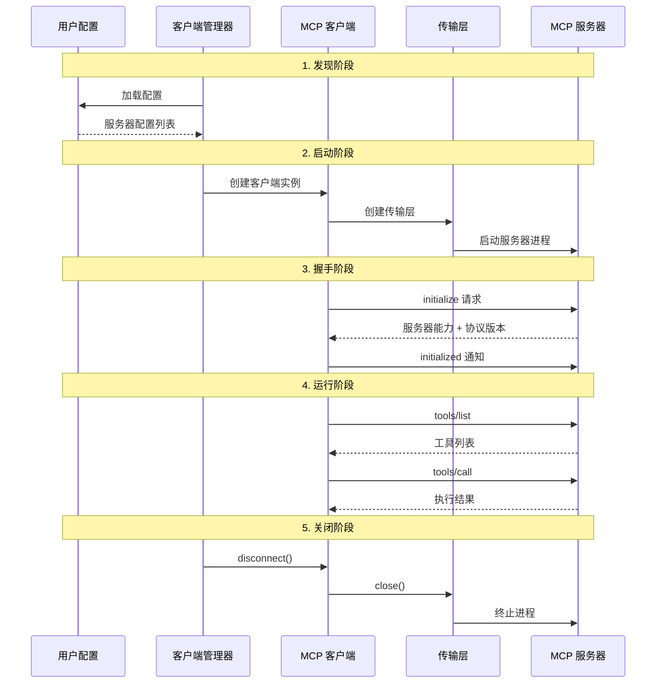
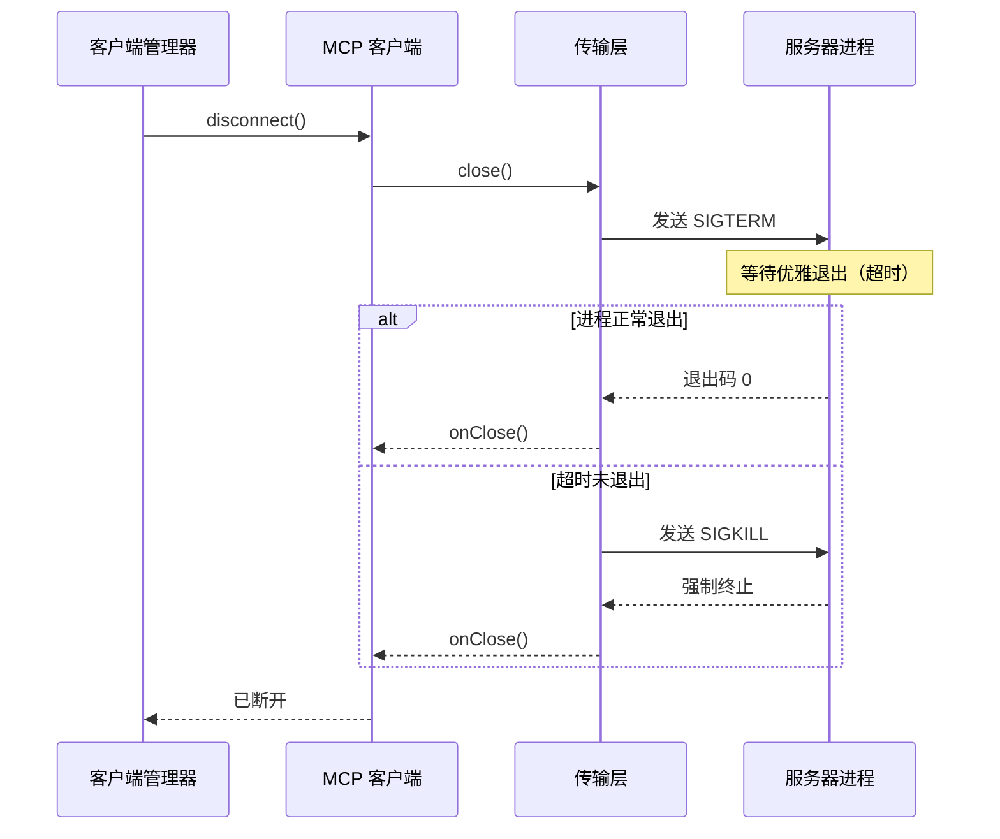

# 服务器生命周期

**源码**：`src/services/mcp/client.ts` 和 `src/services/mcp/config.ts`

## 概述

每个 MCP 服务器连接都经历完整的生命周期：从配置发现到优雅关闭。理解这个生命周期对于调试连接问题和配置自定义服务器至关重要。

## 全生命周期



## 发现阶段

配置加载遵循层级合并策略，从多个来源读取并合并服务器配置：

```typescript
// 配置加载优先级（后者覆盖前者）
const configs = mergeConfigs([
  loadGlobalConfig(),      // ~/.claude/settings.json
  loadProjectConfig(),     // .claude/settings.json
  loadProjectLocalConfig() // .claude/settings.local.json
]);
```

每个配置源可以定义 `mcpServers` 字段。合并时，相同名称的服务器配置会被后加载的覆盖。项目本地配置（`.local.json`）优先级最高，且不应提交到版本控制。

## 启动阶段

根据服务器配置启动进程或建立连接：

| 配置字段 | 说明 | 示例 |
|----------|------|------|
| `command` | 可执行命令 | `"npx"`, `"node"`, `"python"` |
| `args` | 命令参数 | `["-y", "@org/server"]` |
| `env` | 环境变量 | `{ "API_KEY": "sk-..." }` |
| `url` | 远程服务器地址 | `"http://localhost:3001/sse"` |
| `type` | 传输类型覆盖 | `"sse"`, `"streamable-http"` |

对于 Stdio 传输，客户端会使用 `child_process.spawn` 启动子进程，传入指定的命令、参数和环境变量。

## 握手阶段

连接建立后，客户端和服务器通过 MCP 协议进行握手：

1. **客户端发送 `initialize` 请求**——包含客户端支持的协议版本和能力声明
2. **服务器返回 `initialize` 响应**——包含服务器支持的能力和协议版本
3. **客户端发送 `initialized` 通知**——确认握手完成，进入正常通信状态

## 能力交换

握手过程中交换的能力决定了后续可用的功能：

| 能力 | 方向 | 说明 |
|------|------|------|
| `tools` | 服务器 → 客户端 | 服务器提供可调用的工具 |
| `resources` | 服务器 → 客户端 | 服务器提供可读取的资源 |
| `prompts` | 服务器 → 客户端 | 服务器提供预定义提示模板 |
| `logging` | 服务器 → 客户端 | 服务器支持日志级别控制 |
| `roots` | 客户端 → 服务器 | 客户端告知服务器工作目录 |
| `sampling` | 客户端 → 服务器 | 客户端支持 LLM 采样请求 |
| `elicitation` | 客户端 → 服务器 | 客户端支持交互式用户提示 |

只有双方都声明支持的能力才会在后续通信中使用。

## 健康监控

客户端持续监控服务器连接的健康状态：

- **进程监控**：监听子进程的 `exit` 事件，检测意外退出
- **传输监控**：检测传输层断开、错误等异常状态
- **超时检测**：请求超时未响应时标记服务器为不健康
- **心跳（可选）**：部分传输层支持定期心跳以检测连接活性

## 优雅关闭

当 Claude Code 退出时，所有 MCP 服务器按顺序优雅关闭：



关闭顺序确保服务器有机会执行清理操作（如关闭数据库连接、保存状态）。如果服务器在超时时间内未退出，会被强制终止。

## 重启恢复

当服务器意外崩溃时，客户端支持自动恢复：

- **崩溃检测**：子进程非零退出码触发崩溃处理
- **退避重试**：使用指数退避策略（1s → 2s → 4s → ...）避免快速重启循环
- **最大重试次数**：超过重试上限后停止重启，标记服务器为不可用
- **状态恢复**：重连后重新执行握手，重新获取工具列表

## 设计模式

### 状态机

服务器连接遵循明确的状态机模型：

```
断开 → 连接中 → 握手中 → 已连接 → 关闭中 → 已断开
                                  ↓
                              错误 → 重连中 → 握手中
```

每次状态变迁都会触发相应的事件通知，上层代码可以监听这些状态变化。

### 观察者模式

客户端管理器使用观察者模式通知状态变化——当服务器连接、断开、工具列表更新时，已注册的监听器会收到通知，触发 UI 更新或工具列表刷新。

### 退避重试

重连使用指数退避策略，避免在服务器持续不可用时产生大量无效连接尝试。每次失败后等待时间翻倍，直到达到最大等待时间上限。
