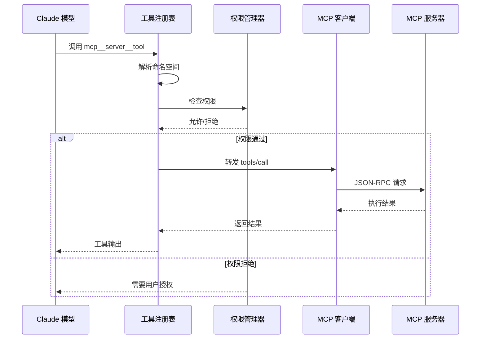

# 工具注册

**源码**：`src/services/mcp/`

## 概述

MCP 服务器提供的工具需要注册到 Claude Code 的工具系统中才能被 AI 模型调用。这个过程涉及 Schema 映射、命名空间管理和权限集成，将外部 MCP 工具无缝融入内部工具体系。

## 注册管道


当 MCP 服务器连接完成后，客户端调用 `tools/list` 获取服务器提供的所有工具定义。每个工具经过 Schema 转换、命名空间化和权限绑定后，注册到 Claude Code 的全局工具注册表中。

## Schema 映射

MCP 工具使用 JSON Schema 定义参数，需要映射到 Claude Code 的内部工具格式：

| MCP 字段 | Claude Code 字段 | 说明 |
|----------|-----------------|------|
| `name` | `name`（加前缀） | 添加命名空间前缀 |
| `description` | `description` | 直接传递，用于模型理解工具用途 |
| `inputSchema` | `inputSchema` | JSON Schema 参数定义，直接兼容 |
| — | `isReadOnly` | 默认为 `false`，MCP 工具被视为有副作用 |
| — | `userFacingName` | 显示用名称，包含服务器标识 |

```typescript
// MCP 工具定义示例
{
  name: "query",
  description: "Query the database",
  inputSchema: {
    type: "object",
    properties: {
      sql: { type: "string", description: "SQL query" }
    },
    required: ["sql"]
  }
}
```

## 工具命名

MCP 工具使用三段式命名规范，确保全局唯一性：

```
mcp__<serverName>__<toolName>
```

例如：
- `mcp__github__create_issue` — GitHub 服务器的 create_issue 工具
- `mcp__database__query` — 数据库服务器的 query 工具
- `mcp__slack__send_message` — Slack 服务器的 send_message 工具

命名空间机制解决了多个服务器可能提供同名工具的冲突问题。服务器名称来源于配置中的键名（`mcpServers` 对象的 key）。

## 权限集成

MCP 工具被纳入 Claude Code 的权限系统，与内置工具遵循相同的规则：

- **默认需要确认**：首次调用 MCP 工具时需要用户确认
- **允许列表**：用户可在设置中将特定 MCP 工具添加到允许列表
- **权限范围**：支持通配符模式，例如 `mcp__github__*` 允许所有 GitHub 工具
- **通道权限**：`channelPermissions.ts` 管理 MCP 工具的细粒度访问控制

```json
{
  "permissions": {
    "allow": [
      "mcp__github__*",
      "mcp__database__query"
    ],
    "deny": [
      "mcp__database__drop_table"
    ]
  }
}
```

## 工具执行流程

当 Claude 模型调用 MCP 工具时，请求经过完整的执行管道：



注册表根据命名空间前缀找到对应的 MCP 客户端，将工具名还原为原始名称后转发到服务器。

## 资源注册

除了工具，MCP 服务器还可以提供资源（Resources）：

- **资源列表**：通过 `resources/list` 获取可用资源
- **资源读取**：通过 `resources/read` 读取资源内容
- **资源模板**：支持 URI 模板，动态生成资源标识
- **上下文注入**：资源内容可以作为上下文注入到对话中

资源为 AI 模型提供了对外部数据源的只读访问能力。

## Prompt 注册

MCP 服务器提供的提示模板（Prompts）注册为可用的上下文模板：

- **提示列表**：通过 `prompts/list` 获取可用提示
- **提示获取**：通过 `prompts/get` 获取包含参数的完整提示
- **参数化**：提示模板支持参数，由用户或系统在使用时填充
- **Slash 命令集成**：提示可以作为斜杠命令暴露给用户

## 动态更新

工具列表不是静态的——MCP 协议支持运行时动态更新：

- **工具变更通知**：服务器可以发送 `notifications/tools/list_changed` 通知
- **客户端监听**：客户端收到通知后重新调用 `tools/list`
- **热更新**：新增或移除的工具立即反映在可用工具列表中
- **无需重启**：整个过程不需要重新建立连接或重启服务器

```typescript
// 监听工具列表变更
client.on("notifications/tools/list_changed", async () => {
  const { tools } = await client.request("tools/list", {});
  registry.updateTools(serverName, tools);
});
```

## 设计模式

### 注册表模式

全局工具注册表是典型的注册表模式——所有工具（内置和 MCP）统一注册、统一查找。模型不需要区分工具来源。

### 适配器模式

MCP 工具到内部工具的转换是适配器模式的应用。Schema 映射层将 MCP 协议定义的工具格式转换为 Claude Code 内部的工具接口。

### 命名空间模式

三段式命名 `mcp__server__tool` 是命名空间模式，通过前缀隔离实现了多服务器工具的共存，避免名称冲突的同时保持了全局唯一的工具标识。
