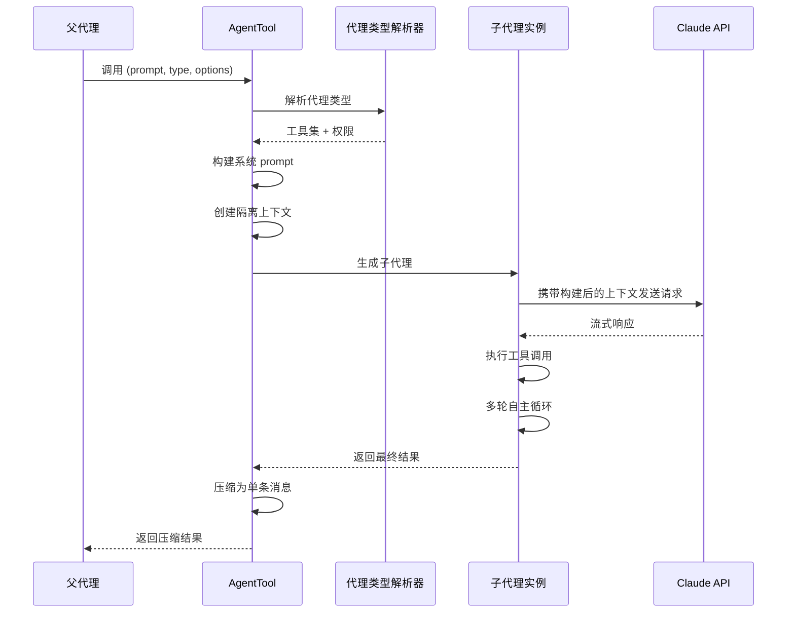
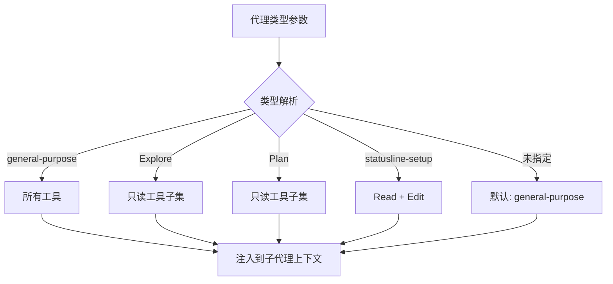

# 代理生命周期

**源码**：`src/tools/AgentTool/`

## 概述

子代理拥有完整的生命周期：从父代理发起调用开始，经过 prompt 构建、工具过滤、独立执行，最终将结果压缩为单条消息返回。理解这个生命周期是掌握多代理架构的关键。

## 生命周期序列图



## Prompt 构建

子代理的系统 prompt 基于父代理的系统 prompt 构建，但有重要差异：

1. **继承** — 基础系统指令从父代理继承
2. **过滤** — 移除与子代理无关的工具指令
3. **注入** — 添加子代理特定的任务描述（用户传入的 `prompt` 参数）
4. **上下文** — 附加当前工作目录、git 状态等环境信息

```
┌──────────────────────────────┐
│  父代理系统 prompt（继承）      │
├──────────────────────────────┤
│  过滤后的工具指令              │  ← 仅包含该类型可用的工具
├──────────────────────────────┤
│  子代理任务描述               │  ← prompt 参数内容
├──────────────────────────────┤
│  环境上下文                   │  ← CWD, git 分支, OS 信息
└──────────────────────────────┘
```

Prompt 缓存在此过程中发挥关键作用——继承的系统 prompt 和工具定义部分会被标记 `cache_control`，使得多个子代理可以共享同一份缓存内容，大幅降低 API 成本。

## 工具过滤

不同代理类型拥有不同的工具集合，通过工具过滤机制实现：



工具过滤的核心逻辑：

| 代理类型 | 包含工具 | 排除工具 |
|----------|---------|---------|
| `general-purpose` | 全部 | 无 |
| `Explore` | Read, Glob, Grep, Bash（受限） | Write, Edit, Agent |
| `Plan` | Read, Glob, Grep | Write, Edit, Bash, Agent |
| `statusline-setup` | Read, Edit | Bash, Agent, Write |

## 上下文隔离

每个子代理拥有独立的执行上下文：

- **独立对话历史** — 子代理从空白对话开始，不继承父代理的消息历史
- **共享 prompt 缓存** — 系统 prompt 和工具定义通过缓存控制与父代理共享
- **独立工具状态** — 子代理有自己的工具执行状态跟踪
- **共享文件系统** — 默认模式下与父代理共享 CWD（除非使用 worktree 隔离）

这种设计确保子代理不会被父代理的历史上下文干扰，同时通过 prompt 缓存降低成本。

## 结果处理

子代理执行完成后，其所有对话历史（可能包含数十条消息和多次工具调用）被压缩为一条单独的消息返回给父代理：

1. **提取最终回复** — 取子代理的最后一条助手消息
2. **截断超长内容** — 对超出长度限制的结果进行截断
3. **格式化** — 将结果格式化为工具调用的返回值
4. **注入父对话** — 作为单条 `tool_result` 消息加入父代理的对话历史

这种压缩策略防止了父代理上下文的膨胀——无论子代理内部执行了多少轮对话。

## 资源限制

子代理受以下限制约束：

- **最大轮次** — 子代理有独立的最大对话轮次限制
- **Token 限制** — 继承全局的上下文窗口限制
- **超时** — 长时间运行的子代理会被超时机制终止
- **嵌套深度** — 子代理可以再次生成子代理，但深度受限

## 设计模式

- **工厂模式** — `AgentTool` 根据参数创建不同配置的子代理实例
- **外观模式** — 将复杂的代理创建过程（prompt 构建、工具过滤、上下文隔离）封装为简单的工具调用接口
- **策略模式** — 代理类型决定了工具过滤和权限策略，运行时可切换

## 相关页面

- [概述](./index) — Agent 工具概述
- [隔离与 Worktree](./isolation-and-worktrees) — 文件系统隔离和 worktree 机制
- [后台执行](./background-execution) — 异步执行和恢复机制
